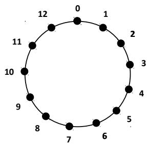
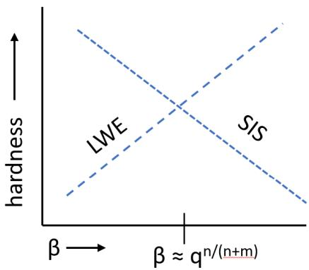
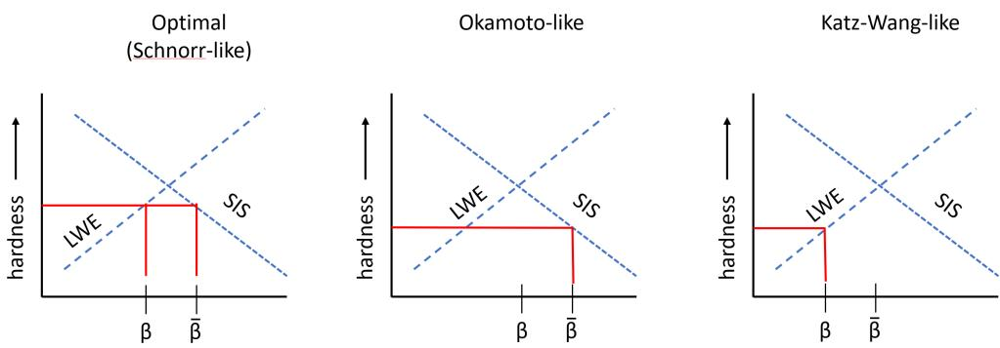

# 基础格密码学：Kyber（ML-KEM）与 Dilithium（ML-DSA）背后的概念

Vadim Lyubashevsky（Vadim Lyubashevsky 是 ML-KEM 和 ML-DSA 前身方案的核心共同设计者之一）

IBM 欧洲研究院，苏黎世
vad@zurich.ibm.com

（本文源自Vadim Lyubashevsky论文 [Basic Lattice Cryptography: The concepts behind Kyber (ML-KEM) and Dilithium (ML-DSA)](https://eprint.iacr.org/2024/1287.pdf)，该论文最后更新：2025 年 6 月 18 日）

## 1 序言

通往 NIST 标准之路。现代格密码学的起源可以追溯到 20 世纪 90 年代中期的两项工作。第一项是 Ajtai 的成果 \[[Ajt96](#ref-ajt96)\]：求解某随机实例的小整数解（SIS，Small Integer Solution）问题，与在任意格上求解某些被认为困难的问题一样困难。第二项是 NTRU \[[HPS98](#ref-hps98)\]，这是一种高效的公钥密码系统，其基础是多项式环上一个新的、可能很困难的格问题。\[[Ajt96](#ref-ajt96)\] 还启发了一种具有类似强安全保证的加密方案 \[[AD97](#ref-ad97)\]，但遗憾的是，这些工作的具体实例完全不具备实用性。另一方面，NTRU 密码系统非常实用，却缺乏理论支撑。事实上，有许多沿用 NTRU 思路或采用其他技巧来提高效率的构造 \[[GGH97](#ref-ggh97), [Sil01](#ref-sil01), [HPS01](#ref-hps01), [HHGP+03](#ref-hhgp-plus-03)\]，后来都被证明安全性有所削弱，甚至完全不安全 \[[Ngu99](#ref-ngu99), [Gen01](#ref-gen01), [GS02](#ref-gs02), [NR06](#ref-nr06)\]。

在随后的十年里，格密码学研究中的理论与实践两条线索逐渐交织在一起。\[[Mic02](#ref-mic02), [PR06](#ref-pr06), [LM06](#ref-lm06)\] 提炼出了相应的代数结构，使基于格的密码原语既能达到 NTRU 的效率，[^1] 又能享有与 Ajtai 原始构造同类的理论保证。[^2] 与此同时，Regev 提出了用途极为广泛的带误差学习（LWE，Learning with Errors）问题 \[[Reg05](#ref-reg05)\]，大大扩展了可以构造的基于格的密码原语的范围。在该工作中，Regev 还证明，求解 LWE 的随机实例，与（借助量子计算 [^3]）求解 \[[Ajt96](#ref-ajt96)\] 中相同的最坏情况格问题一样困难。再加上对格问题具体困难性的进一步理解 \[[GN08](#ref-gn08)\]，研究人员得以构造具有坚实理论基础的高效加密、签名和基于身份的加密方案，至少在渐近意义上如此 \[[Reg05](#ref-reg05), [LM08](#ref-lm08), [GPV08](#ref-gpv08), [Lyu09](#ref-lyu09), [SSTX09](#ref-sstx09), [LPR10](#ref-lpr10)\]。

[^1]: 采用支持数论变换的多项式环，甚至可以获得更高的效率 \[[LMPR08](#ref-lmpr08)\]（见[第 4.6 节](#46)）——具体而言，就是环 $\mathbb{Z}_q[X]/(X^{2^k}+1)$。如今，这个环已广泛用于实用的格构造，包括 NIST 的三个格密码标准。一个有趣的插曲是，早期有人曾建议通过使用支持数论变换（NTT）的多项式环来加速 NTRU。然而，在出现利用所提议环的结构进行的攻击 \[[Gen01](#ref-gen01)\] 后，建议却变成了不要使用支持 NTT 的环 \[[Sil01](#ref-sil01)\]，因为支持 NTT 所需的结构看起来与 \[[Gen01](#ref-gen01)\] 所利用的结构相似。不过，\[[PR06](#ref-pr06), [LM06](#ref-lm06)\] 的理论结果准确刻画了代数环需要具备哪些性质，才能与最坏情况格问题建立联系（\[[Gen01](#ref-gen01)\] 中遭到攻击的环并不具备所需的性质），而这些要求并不排除使用支持 NTT 的环。我们可以将这段插曲视为理论工作提升实际方案效率的一个好例子。

[^2]: 具体而言，这些工作证明，在多项式环上求解 SIS 问题的随机实例，与在具有某种相关代数结构的格上求解最坏情况格问题一样困难。

[^3]: 后来，\[[Pei09](#ref-pei09)\] 去除了对量子计算的要求。

在 2010 年代初，格密码学获得了进一步的发展动力。一方面，人们首次在某种假设下实现了全同态加密方案 \[[Gen09](#ref-gen09)\]；另一方面，旨在构建量子计算机的研究迅速增多，而这样的计算机将能够攻破所有基于整数分解和离散对数的密码方案 \[[Sho97](#ref-sho97)\]。在 2010 年代中期，一系列改进与增强（如 \[[GLP12](#ref-glp12), [BG14](#ref-bg14), [DLP14](#ref-dlp14), [LS15](#ref-ls15), [DP16](#ref-dp16), [ADPS16](#ref-adps16)\]）使格构造从仅具有渐近效率发展到了拥有真正实用的具体实例。到 2017 年 NIST 后量子密码标准化进程启动时 \[[NIS17](#ref-nis17)\]，基于格的方案已经跻身速度最快、最紧凑的抗量子密码原语之列，甚至在原始性能上超过了其数论对应方案。

本教程的范围。本教程重点介绍 NIST 标准化并纳入 CNSA 2.0 算法套件 \[[Age24](#ref-age24)\] 的两个“主要”格方案所使用的基本数学概念与设计决策。这两个方案分别是 KEM／加密方案 CRYSTALS-Kyber（ML-KEM）\[[BDK+18](#ref-bdk-plus-18), [NIS24b](#ref-nis24b)\] 和签名方案 CRYSTALS-Dilithium（ML-DSA）\[[DKL+18](#ref-dkl-plus-18), [NIS24a](#ref-nis24a)\]。此外，本文还将介绍其他基于格的 KEM 的主要思想，如 Frodo \[[BCD+16](#ref-bcd-plus-16)\] 和 NTRU \[[HPS98](#ref-hps98)\]；它们的某些版本也曾提交至 NIST 标准化进程 \[[ABD+17](#ref-abd-plus-17), [CDH+17](#ref-cdh-plus-17)\]。

本文面向已经熟悉公钥密码学基础，以及通过归约论证证明密码方案安全性的读者。因此，本文假设不可区分性、混合论证、CPA 安全加密、随机预言机、Fiat-Shamir 变换等概念对读者而言并不十分陌生。熟悉这些概念的读者，很可能最初是在学习基于离散对数问题或 RSA 问题困难性的公钥密码原语时接触到它们的。事实上，记住 ElGamal 加密和 Schnorr 签名等离散对数构造，将非常有助于理解格构造的高层思想。

许多人注意到，基于整数分解或离散对数的经典密码学与格密码学之间有一个区别：格密码学显得“杂乱”。其安全性并非由单一参数决定，而是有多个参数以不同方式影响安全性。此外，还有许多优化技巧涉及舍弃若干低位、舍入等技术，使得方案看起来更加复杂。好的一面是，许多格构造只需要很少的“深奥”数学概念——从零开始理解并实现 Kyber 和 Dilithium，所需的数学背景比许多椭圆曲线构造还少。[^4] 要习惯格构造带来的这些问题，需要一些练习和耐心。因此，建议读者阅读本文时准备纸笔，亲手推导细节，逐步适应这些繁杂之处。如果你刚弄清这些繁杂细节，它们就几乎立刻从记忆中消失，也不必担心。关键是理解高层概念；既然你曾经能够弄清这些细节，就意味着在需要时应当能够再次做到。

[^4]: 这并不是说格密码学不涉及数学。密码分析需要用到数的几何和代数数论中相当深入的概念；即使只是理解涉及陷门采样的构造，如 FALCON \[[PFH+17](#ref-pfh-plus-17)\] 数字签名方案，也需要一些相当复杂的数论知识。不过，本教程只关注理解 Kyber 和 Dilithium 所需的数学，因此不需要这些知识。

本文并未涵盖格的许多方面。如，本文不会讨论加密或签名之外更“高级”的构造，其中一些构造的良好综述可见 \[[Pei16](#ref-pei16)\]。本文对精确的密码分析，以及格密码学中对理解某些更高级构造至关重要的几何方面，也着墨不多。关于格的几何基础，\[[MG02](#ref-mg02)\] 和讲义 \[[Mic19](#ref-mic19)\] 是很好的参考资料。针对基于格的 NIST 标准化候选方案所依赖的问题，近期有关算法与密码分析的一些论文包括 \[[ACD+18](#ref-acd-plus-18), [AM18](#ref-am18), [ADH+19](#ref-adh-plus-19), [DP23](#ref-dp23)\]。另一个显著未被涵盖的方案，是 NIST 选定进行标准化的另一种基于格的签名方案——FALCON \[[PFH+17](#ref-pfh-plus-17)\]。理解它需要更深入地研究格的几何性质，可以从开创性工作 \[[GPV08](#ref-gpv08), [Pei10](#ref-pei10), [MP12](#ref-mp12)\] 入手；这些工作解释了如何构造在许多格构造中普遍使用的基于格的陷门采样算法，然后再理解如何针对 FALCON 的具体实例优化这些技术 \[[DLP14](#ref-dlp14), [DP16](#ref-dp16), [PP19](#ref-pp19)\]。

尽管人们对基于格的加密和签名感兴趣，主要是因为它们被认为能够抵抗量子攻击，但本文不会探讨这一主题。在随机预言机模型（ROM，random oracle model）的安全性证明中，具体的密码哈希函数被替换为一个完美随机函数，攻击者只能通过预言机访问该函数。量子环境中也存在对应的模型（QROM），其中允许攻击者额外对该函数进行量子查询，即以输入的叠加态查询预言机。虽然 ROM 中的安全性证明不能直接移植到QROM 环境中，但近期已有许多工作拉近了二者之间的距离（如 \[[HHK17](#ref-hhk17), [SXY18](#ref-sxy18), [KLS18](#ref-kls18), [DFMS19](#ref-dfms19), [LZ19](#ref-lz19), [JMW24](#ref-jmw24)\]），剩下的差别仅在于安全归约的紧致性或其中使用的具体参数。截至撰写本文时，只要将所有密码函数替换为具有所需量子安全性的对应函数，那么对于已在 ROM 中证明安全的实际方案，即使赋予攻击者以输入叠加态查询随机预言机的额外量子能力，也没有已知的更有效攻击。

内容安排。本文并不沿着最短路径介绍 Kyber 和 Dilithium，而是会适当绕行，以触及格密码学中广泛使用的相关主题。[第 2 节](#2)介绍环 $\mathbb{Z}_{q}$ 上基于 LWE 问题困难性的格加密框架。该框架源自 Regev 的原始工作 \[[Reg09](#ref-reg09)\]，并结合了 \[[PVW08](#ref-pvw08), [ACPS09](#ref-acps09), [LPS10](#ref-lps10), [LPR10](#ref-lpr10), [LP11](#ref-lp11)\] 中的一些变体和优化。本文还将讨论许多细小却关键的密文压缩技巧。其中一些技巧相当通用，在后续章节介绍的构造中也会派上用场。[第 3 节](#3-lwe)将格作为几何对象引入，并说明 LWE 和 SIS 问题与求解格问题的困难性之间的联系。[第 4 节](#4)回顾多项式环，并将[第 2 节](#2)加密方案的对应版本具体化，从而得到 Kyber（ML-KEM）加密方案。该节还介绍数论变换算法，用于加速某些特定多项式环上的运算。最后，[第 5 节](#5-sigma)介绍构造经过优化的、基于格的 Schnorr 签名对应方案所需的全部技术，Dilithium（ML-DSA）\[[DKL+18](#ref-dkl-plus-18)\] 就是其中一个实例。该方案通过对基于格的 $\Sigma$ 协议应用 Fiat-Shamir 变换得到。后者也为理解零知识证明等更高级的格构造提供了入口。

## 2 加密

首先从构造一个 CPA 安全（即选择明文攻击安全，Chosen Plaintext Attack Secure）的公钥加密方案开始学习格密码学。回顾一下，CPA 安全的加密方案由三个算法组成：密钥生成、加密和解密。密钥生成算法输出一对公钥和私钥。加密算法以公钥和消息为输入，生成密文。解密算法则以密文和私钥为输入，输出消息。如果对于攻击者选择的任意两条消息，它们的加密结果在计算上不可区分，就称该方案是 CPA 安全的。

本节只讨论 CPA 安全加密，因为存在通用变换（如 Fujisaki-Okamoto 变换 \[[FO99](#ref-fo99)\]），能够将 CPA 安全的加密方案转换为 CCA 安全的方案（其中攻击者还可以访问解密预言机），以及能够抵抗主动攻击者的密钥交换协议（[第 4.8 节](#48-cpa-cca-kem)）。

需要指出的是，与基于离散对数和整数分解的对应方案不同，本章方案最高效的具体实现方式会带来解密错误。也就是说，即使密钥生成算法和加密算法都正确运行，生成的密文仍有极小概率无法解密出原先加密的消息。一般来说，足够小的解密错误概率（如约为 $2^{-150}$）似乎不会损害方案的实际安全性；只需在相关变换的证明中考虑这些错误即可（如 \[[HHK17](#ref-hhk17), [SXY18](#ref-sxy18)\]）。[^5]

[^5]: 如果处理“得当”，解密错误不会造成任何安全问题。另一方面，如果忽视它们的存在，那么原本满足 CPA 安全性的方案在 CCA 安全模型下就会很容易被攻破。在某些场景中，例如只满足 CPA 安全性的全同态加密方案（FHE），还需要留意解密错误在实践中带来的安全影响（参见 \[[LM21](#ref-lm21)\]）。

### 2.1 符号约定

本节的所有运算都在环 $(\mathbb{Z}_{q}, +, \times)$ 中进行，采用通常的模 $q$ 整数加法和乘法。对于集合 $S$，用 $a \leftarrow S$ 表示从集合 $S$ 中均匀随机选取 $a$。对于任意正整数 $\beta$，定义集合

$$
[ \beta ] = \{- \beta , \dots - 1, 0, 1, \dots , \beta \}.\tag{1}
$$

这个记号可以自然地推广到向量（和矩阵）。如，用 $[\beta]^{n\times m}$ 表示一个系数属于 $[\beta]$ 的 $n\times m$ 矩阵。默认情况下，本文中的所有向量都是列向量。也可以用 $\|\mathbf{v}\|_{\infty}\leq\beta$ 表示向量 $\mathbf{v}$ 属于 $[\beta]^{m}$。对于实数（有理数） $x$，用 $\lceil x\rfloor$ 表示与 $x$ 最接近的整数，距离相同时向上舍入。

在后续章节中，当处理固定阶数的多项式 $a = \sum_{i=0}^{d-1} a_i X^i \in \mathbb{Z}[X]$ 时，用 $a \leftarrow [\beta]$ 表示所有整数系数 $a_i$ 都从 $[\beta]$ 中均匀选取。同样，对于向量 $\mathbf{a} \in \mathbb{Z}[X]^m$，用 $\mathbf{a} \leftarrow [\beta]^m$ 表示这样的分布：向量 $\mathbf{a}$ 中的每个多项式 $a_i$ 都按 $a_i \leftarrow [\beta]$ 选取。有时，希望从某个分布 $\psi$ 采样，而不是从集合 $[\beta]$ 中均匀采样。在这种情况下，同样写作 $a \leftarrow \psi$ 或 $\mathbf{a} \leftarrow \psi^m$，其中 $a$ 是整数或多项式，而 $\mathbf{a}$ 是由整数或多项式组成的向量。

### 2.2 引例

在此暂且假设，对于正整数 $q, n \geq m$ 和 $\beta \ll q$，下面两个分布在计算上不可区分（安全参数与 $m$ 相关）：

1. $(\mathbf{A},\mathbf{A}\mathbf{s})$，其中 $\mathbf{A} \leftarrow \mathbb{Z}_q^{n \times m}$ 且 $\mathbf{s} \leftarrow [\beta]^m$

2. $(\mathbf{A},\mathbf{u})$，其中 $\mathbf{A} \leftarrow \mathbb{Z}_q^{n \times m}$ 且 $\mathbf{u} \leftarrow \mathbb{Z}_q^n$。

也就是说，假设不存在高效算法，能够判断给定样本来自第一个分布还是第二个分布。这个不可区分性假设显然是错误的，因为可以使用高斯消元求出 $\mathbf{A}$（或 $\mathbf{A}$ 的一个 $m \times m$ 子矩阵）的逆，并检查是否确实存在满足 $\mathbf{A}\mathbf{s} = \mathbf{u}$ 的 $\mathbf{s} \in [\beta]^m$。先暂且接受这个例子，因为稍加修改后的这一假设构成了大部分格密码学的基础。现在用这个假设构造一个简单的 CPA 安全公钥加密方案，它与基于离散对数的 ElGamal 加密方案非常相似。该方案的私钥和公钥为

$$
\mathrm{sk}: \mathbf{s} \leftarrow [ \beta ] ^ {m}, \mathrm{pk}: (\mathbf {A} \leftarrow \mathbb {Z} _ {q} ^ {m \times m}, \mathbf {t} = \mathbf {A} \mathbf{s}).\tag{2}
$$

为了加密某消息 $\mu\in \mathbb{Z}_{q}$，加密者选取随机向量 $\mathbf{r}\leftarrow[\beta]^{m}$，并输出密文 $(\mathbf{u},v)\in\mathbb{Z}_{q}^{m}\times\mathbb{Z}_{q}$，其中

$$
(\mathbf {u} ^ {T} = \mathbf {r} ^ {T} \mathbf {A}, v = \mathbf {r} ^ {T} \mathbf {t} + \mu).\tag{3}
$$

解密时，只需计算

$$
\mu = v - \mathbf {u} ^ {T} \mathbf {s}.\tag{4}
$$

该方案的正确性由下式得到[^6]：

$$
v - \mathbf {u} ^ {T} \mathbf {s} = \mathbf {r} ^ {T} \mathbf {t} + \mu - \mathbf {r} ^ {T} \mathbf {A} \mathbf {s} = \mathbf {r} ^ {T} \mathbf {A} \mathbf {s} + \mu - \mathbf {r} ^ {T} \mathbf {A} \mathbf {s} = \mu .\tag{5}
$$

[^6]: 不妨将其与 ElGamal 加密方案比较！在 ElGamal 中，私钥为 $s$，公钥为 $A,t=A^s$。密文为 $u=A^r,v=t^r\cdot\mu$，解密计算为 $v/u^s=A^{sr}\cdot\mu/A^{rs}=\mu$。解密之所以成立，其原理完全相同；只是在这里的例子中，乘法不满足交换律，因此需要在左侧乘以向量 $\mathbf{r}^T$，在右侧乘以 $\mathbf{s}$。

该方案的安全性由上述假设和混合论证得到。根据假设，式[（2）](#eq-2)中的公钥 $(\mathbf{A},\mathbf{t})$ 与均匀分布不可区分。因此，公钥矩阵 $\mathbf{A}^{\prime}=[\mathbf{A}\mid\mathbf{t}]\in\mathbb{Z}_{q}^{m\times(m+1)}$ 也与均匀分布不可区分。再次使用这一假设，可以得到分布 $(\mathbf{A}^{\prime},\mathbf{r}^{T}\mathbf{A}^{\prime})$ 同样与均匀分布不可区分，所依据的仍是同一个假设（只是将 $n$ 和 $m$ 互换）【因为转置运算$\boxed{(\mathbf r^T\mathbf A')^T=(\mathbf A')^T\mathbf r}$会将行列互换】。因此，$(\mathbf{A},\mathbf{t},\mathbf{u},v)$ 的分布与均匀分布不可区分，从而该方案是 CPA 安全的。

注意，在此使用了两次不可区分性假设：一次用于论证公钥看起来是随机的，另一次用于论证密文看起来是随机的。除了选择 $\mathbf{A} \leftarrow \mathbb{Z}_q^{m \times m}$，也可以在 $m \neq n$ 时从 $\mathbb{Z}_q^{n \times m}$ 中随机选取它。如果设定 $m \gg n$，就可以证明公钥 $(\mathbf{A}, \mathbf{t})$ 实际上与均匀分布统计接近（见[第 2.5.5 节](#255-lwe)）。但是，构造密文时仍然需要使用那个荒谬的不可区分性假设。因此，至少使用一次该假设是无法避免的。【详细解释见[附录A](#a)】

### 2.3 LWE 问题

现在，对上一节中的假设做一个“小小的”调整，使其可能成立，同时仍能按同样的思路构造密码系统。下面定义带误差学习问题（LWE，Learning with Errors Problem）\[[Reg09](#ref-reg09)\] 的一个简单版本，大量格密码学构造都建立在它的基础之上。

定义 1。对于正整数 $m$、$n$、$q$ 以及 $\beta < q$，$LWE_{n,m,q,\beta}$ 问题要求区分以下两个分布：

1. $(\mathbf{A},\mathbf{A}\mathbf{s} + \mathbf{e})$，其中 $\mathbf{A}\leftarrow \mathbb{Z}_q^{n\times m}$、$\mathbf{s}\leftarrow [\beta ]^m$、$\mathbf{e}\leftarrow [\beta ]^n$

2. $(\mathbf{A},\mathbf{u})$，其中 $\mathbf{A} \leftarrow \mathbb{Z}_q^{n \times m}$ 且 $\mathbf{u} \leftarrow \mathbb{Z}_q^n$。

使 $LWE_{n,m,q,\beta}$ 困难的关键，是额外“误差”向量 $\mathbf{e}$ 的存在，它使高斯消元攻击不再适用。该问题的确切困难性取决于参数 $n$、$m$、$q$ 和 $\beta$，将在[第 3 节](#3-lwe)更详细地讨论这一点。目前，只需知道问题会随着 $m$ 和 $\beta/q$ 的增大而变得更困难。已知参数 $n$ 通常不会显著影响问题的困难性，除非在极端情况下，$n$ 大到约为 $m^{2\beta+1}$，此时可以借助线性化技术在约 $m^{2\beta}$ 的时间内构造区分器 \[[AG11](#ref-ag11)\]。本章将介绍的各个构造都不需要使 $n$ 如此之大。由于参数 $n$ 不特别重要，本文在陈述困难性假设时有时会省略它，直接写作 $LWE_{m,q,\beta}$。

还要说明的是，对秘密量和误差项采用均匀分布并没有什么特别之处——它只是使表述更简单，因此本文选择这个分布用于说明。在 LWE 的原始定义中，误差分布采用经过舍入的高斯分布，即先从以 $0$ 为中心、具有某个标准差的连续高斯分布中生成随机数，再将其舍入到最近的整数。在从平均情况到最坏情况的归约证明 \[[Reg09](#ref-reg09), [Pei09](#ref-pei09)\] 中，这一分布是必需的；这些证明说明 LWE 至少与某些最坏情况格问题一样困难。后来，人们证明了这一限制并非严格必要，如也可以采用均匀分布 \[[DM13](#ref-dm13), [MP13](#ref-mp13)\]。一些实际实现，尤其是 Kyber，使用二项分布生成误差（见[第 4.7 节](#47-crystals-kyberml-kem)），因为在实践中，生成一串比特并将它们相加，有时比在 $[\beta]$ 中生成均匀元素更快。

为了涵盖可能使用的不同分布，可以相对于秘密量的分布 $\psi$ 定义 LWE 问题如下：

定义 2。对于正整数 $m$、$n$、$q$ 和分布 $\psi$，$LWE_{n,m,q,\psi}$ 问题要求区分以下两个分布：

1. $(\mathbf{A},\mathbf{A}\mathbf{s} + \mathbf{e})$，其中 $\mathbf{A}\gets \mathbb{Z}_q^{n\times m},\mathbf{s}\gets \psi^m,\mathbf{e}\gets \psi^n$

2. $(\mathbf{A},\mathbf{u})$，其中 $\mathbf{A} \leftarrow \mathbb{Z}_q^{n \times m}$ 且 $\mathbf{u} \leftarrow \mathbb{Z}_q^n$。

为使讨论具体，主要使用[定义 1](#definition-1) 中的 LWE，但只要考虑 $\psi$ 的具体性质（特别是该分布生成的秘密量的范数期望），本文的全部论述也同样适用于[定义 2](#definition-2) 中的问题。

需要注意的是，在 LWE 的定义中，没有对 $m, n$ 与 $q$ 的相对大小施加任何条件。因此，某些参数选择可能使 LWE 实例以一种平凡的方式成为困难问题。如，如果 $n < m$ 且 $\beta$ 足够大，那么分布 $(\mathbf{A}, \mathbf{As} + \mathbf{e})$ 确实可能与 $(\mathbf{A}, \mathbf{u})$ 统计接近。显然，仅凭这样的假设不应能够构造加密方案，否则就会得到无条件安全的公钥加密方案。等到考虑解密正确性时，就会明白这种做法为什么行不通。当然，也可以将参数设置为使 LWE 不再困难。如，当 $m = 1$ 时，判断 $\mathbf{As} + \mathbf{e}$ 是否接近向量 $\mathbf{A}$ 的某个倍数并不困难。本文将在[第 3 节](#3-lwe)讨论 LWE 问题的困难性。另外，也可以定义秘密量 $\mathbf{s}$ 在 $\mathbb{Z}_q^m$ 中均匀选取的 LWE（此时须注意将 $n$ 取得足够大，以免 LWE 问题以平凡的方式成为困难问题）；这实际上就是 \[[Reg09](#ref-reg09)\] 中 LWE 的原始定义。\[[ACPS09](#ref-acps09)\] 表明，将 $\mathbf{s}$ 与 $\mathbf{e}$ 取自同一分布，得到的问题在本质上同样困难。在应用中，取较小的 $\mathbf{s}$ 通常效率更高，因此本文只考虑 LWE 问题的这一版本。

正如上一节已经明确说明的那样，将 $(\mathbf{A},\mathbf{s}^{T}\mathbf{A}+\mathbf{e}^{T})$ 与均匀分布区分开来也是 LWE 问题，只是 $n$ 与 $m$ 互换，即 $LWE_{m,n,q,\psi}$ 问题。类似地，通过混合论证，将

$$
(\mathbf {A}, \mathbf {A} \mathbf {s} _ {1} + \mathbf {e} _ {1}, \dots , \mathbf {A} \mathbf {s} _ {t} + \mathbf {e} _ {t}, \mathbf {s} _ {1} ^ {\prime T} \mathbf {A} + \mathbf {e} _ {1} ^ {\prime T}, \dots , \mathbf {s} _ {t ^ {\prime}} ^ {\prime T} \mathbf {A} + \mathbf {e} _ {t ^ {\prime}} ^ {\prime T})
$$

与均匀分布区分开来的困难性，等同于 $LWE_{n,m,q,\psi}$ 和 $LWE_{m,n,q,\psi}$ 中较容易的那个问题（区分优势至多增大 $(t+t')$ 倍）。

#### 2.3.1 基于 LWE 的加密方案

在本节余下部分，将介绍源自 \[[Reg09](#ref-reg09)\] 原始工作的一些密码系统，它们经过后续多项工作中的一系列观察而得到改进和推广（参见 \[[ACPS09](#ref-acps09), [Pei09](#ref-pei09), [LPS10](#ref-lps10), [LP11](#ref-lp11), [BCD+16](#ref-bcd-plus-16)\]）。本节的方案可以看作[第 2.2 节](#22)加密方案的修改版，不过它基于 $LWE_{m,q,\beta}$ 的困难性，而非那里提出的显然错误的假设。首先修改消息 $\mu$：它不再是 $\mathbb{Z}_{q}$ 中的任意元素，而是来自集合 $\{0,1\}$。式[（2）](#eq-2)中的密钥生成过程改为：

$$
\mathsf {s k}: \mathbf {s} \leftarrow [ \beta ] ^ {m}, \mathsf {p k}: (\mathbf {A} \leftarrow \mathbb {Z} _ {q} ^ {m \times m}, \mathbf {t} = \mathbf {A} \mathbf {s} + \mathbf {e} _ {1}), \text {其中 } \mathbf {e} _ {1} \leftarrow [ \beta ] ^ {m}.\tag{6}
$$

为了加密某消息 $\mu\in\{0,1\}$，加密者选取 $\mathbf{r},\mathbf{e}_{2}\leftarrow[\beta]^{m}$ 和 $e_{3}\leftarrow[\beta]$，并输出

$$
\left(
\mathbf{u}^{T} = \mathbf{r}^{T}\mathbf{A} + \mathbf{e}_{2}^{T},
\quad
v = \mathbf{r}^{T}\mathbf{t} + e_{3}
+ \left\lceil \frac{q}{2} \right\rfloor \mu
\right).
\tag{7}
$$

先讨论一下记号。当前在 $\mathbb{Z}_q$ 中运算，但上式中出现了一个看起来有些奇怪的项 $\lceil q / 2 \rfloor$。这里指的是 $\mathbb{Z}_q$ 中最接近有理数 $q / 2$ 的元素（如，如果 $q = 13$，那么 $\lceil q / 2 \rfloor = 7$）。因此，这里的除法不是 $\mathbb{Z}_q$ 中的运算，也就是说，并不是乘以 $q$ 或 2 的逆元。（如果确实需要在 $\mathbb{Z}_q$ 中做除法，本文会将其写成乘以逆元的形式。）为了便于表述，本文经常省略 $\lceil \cdot \rfloor$ 符号，直接写成 $q / 2$，因为其含义应当是清楚的。

在讨论解密之前，先看一下安全性论证，理解为什么该方案基于 $\mathsf{LWE}_{m,q,\beta}$ 的困难性。论证与[第 2.2 节](#22)相同。公钥 $(\mathbf{A},\mathbf{t})$ 与 $\mathbb{Z}_q^{m\times (m + 1)}$ 上的均匀分布不可区分，这直接来自 $\mathsf{LWE}_{m,q,\beta}$ 假设。将公钥 $(\mathbf{A},\mathbf{t})$ 改写为矩阵 $\mathbf{A}' = [\mathbf{A}\mid \mathbf{t}]$，可以看到 $\mathsf{LWE}_{m,q,\beta}$ 假设再次蕴含分布 $\left(\mathbf{A}',\mathbf{r}^T\mathbf{A}' + \left[ \begin{array}{c}\mathbf{e}_2\\ e_3 \end{array} \right]^T\right)$ 也与均匀分布不可区分。因此，基于 $\mathsf{LWE}_{m,q,\beta}$，对于任意 $\mu \in \{0,1\}$，$(\mathbf{A},\mathbf{t},\mathbf{u},v)$ 都与均匀分布不可区分。注意，在此使用了两次 $\mathsf{LWE}_{m,q,\beta}$ 假设：在论证公钥看起来随机时，参数 $m$ 作为 $\mathbf{A}$ 的列数起作用；在论证密文看起来随机时，它又作为 $\mathbf{A}$ 的行数起作用。从直觉上，这就解释了为什么在公钥加密中，为了最小化公钥与密文的总大小，将 $\mathbf{A}$ 的行数和列数设为相等是合理的。本文将在[第 2.4 节](#24)进一步讨论这一话题，并在[第 2.5.5 节](#255-lwe)讨论一些可能不希望行数等于列数的应用，以及一个略作修改的密码系统。

解密时，计算 $v - \mathbf {u} ^ {T} \mathbf {s}$。但与式[（4）](#eq-4)中直接得到消息 $\mu$ 不同，这次得到

$$
v - \mathbf {u} ^ {T} \mathbf {s} = \mathbf {r} ^ {T} (\mathbf {A} \mathbf {s} + \mathbf {e} _ {1}) + e _ {3} + \frac {q}{2} \mu - \left(\mathbf {r} ^ {T} \mathbf {A} + \mathbf {e} _ {2} ^ {T}\right) \mathbf {s}\tag{8}
$$

$$
= \mathbf {r} ^ {T} \mathbf {e} _ {1} + e _ {3} + \frac {q}{2} \mu - \mathbf {e} _ {2} ^ {T} \mathbf {s}\tag{9}
$$

与式[（5）](#eq-5)一样，上式中的 $\mathbf{r}^{T}\mathbf{A}s$ 项相互抵消，但仍然留下了一些“误差”项的组合。幸运的是，这些误差项的所有系数都以 $\pm\beta$ 为界，因此式[（9）](#eq-9)中的向量乘积 $\mathbf{r}^{T}\mathbf{e}_{1}$ 和 $\mathbf{e}_{2}^{T}\mathbf{s}$ 各自由 $m$ 项组成，每项的绝对值至多为 $\beta^{2}$。于是，式[（9）](#eq-9)可以改写为 $e+\frac{q}{2}\mu$，其中 $e\in[2m\beta^{2}+\beta]$。因此，如果参数满足 $2m\beta^{2}+\beta<q/4$，解密者就能通过观察 $v-\mathbf{u}^{T}\mathbf{s}$ 并检查该值更接近 $0$ 还是 $q/2$，来确定 $\mu$。

#### 2.3.2 精确界定总误差

上面计算的 $2m\beta^{2} + \beta$ 是误差绝对值的上界。然而，由于 $\mathbf{r},\mathbf{s},\mathbf{e}_1$ 和 $\mathbf{e}_2$ 的系数都在以 0 为中心的范围 $[\beta]$ 内随机选取，误差实际上达到如此之大的可能性很小。由于相互抵消，它实际上会更接近 $\mathcal{O}(\sqrt{m}\beta^2)$。一般来说，只要能得到一个误差界，使误差以极高概率（如 $1 - 2^{-150}$）小于 $q/4$，就足够了。这意味着解密错误的概率至多为 $2^{-150}$。在应用中，以及将这个 CPA 加密方案用作其他构造（如 CCA 安全加密）的组成部分时，这样小的错误都是可以容忍的。

虽然可以用渐近方法近似计算这种界，但当处理具体参数且 $\beta$ 不太大时，可以利用简单脚本精确计算

$$
\Pr _ {\mathbf {s}, \mathbf {r}, \mathbf {e} _ {1}, \mathbf {e} _ {2} \leftarrow [ \beta ] ^ {m}, e _ {3} \leftarrow [ \beta ]} \left[ \mathbf {r} ^ {T} \mathbf {e} _ {1} + e _ {3} - \mathbf {e} _ {2} ^ {T} \mathbf {s} \in [ \alpha ] \right]\tag{10}
$$

其依据是：随机变量之和的概率分布可以用多项式之积来建模。假设 $A$ 和 $B$ 是有限集合 $[\gamma]$ 上的随机变量，它们的分布可以不同【注意在此要求 $A$ 和 $B$相互独立】。对于所有 $i \in [\gamma]$，令 $A_{i}$（相应地，$B_{i}$）表示 $A$（相应地，$B$）等于 $i$ 的概率。现在定义多项式

$$
A (X) = \sum_ {i = - \gamma} ^ {\gamma} A _ {i} X ^ {i}, B (X) = \sum_ {i = - \gamma} ^ {\gamma} B _ {i} X ^ {i}.
$$

令

$$
C (X) = A (X) \cdot B (X) = \sum_ {i = - 2 \gamma} ^ {2 \gamma} C _ {i} X ^ {i}
$$

为 $A(X)$ 与 $B(X)$ 的乘积。此时，可以将系数 $C_{i}$ 与 $A + B = i$ 的概率直接联系起来。具体而言，

$$
\Pr [ A + B = i ] = C _ {i}.\tag{11}
$$

这意味着

$$
\Pr [ A + B \in [ \alpha ] ] = \sum_ {i = - \alpha} ^ {\alpha} C _ {i}.\tag{12}
$$

这一方法可以直接用于计算式[（10）](#eq-10)中的概率，因为 $\mathbf{r}^T\mathbf{e}_1 - \mathbf{e}_2^T\mathbf{s}$ 的分布等同于 $2m$ 个独立随机变量 $A$ 之和的分布，其中

$$
A _ {i} = \Pr [ A = i ] = \Pr_ {x, y \leftarrow [ \beta ]} [ x y = i ],
$$

而 $e_3$ 只是 $[\beta]$ 上的均匀随机变量。如，如果 $\beta = 2$，则

$$
A _ {- 4} = A _ {4} = \frac {2}{2 5}, A _ {- 2} = A _ {2} = \frac {4}{2 5}, A _ {- 1} = A _ {1} = \frac {2}{2 5}, A _ {0} = \frac {9}{2 5},
$$

其余所有 $A_{i}$ 均为 0。如果进一步令

$$
\begin{array}{c} C (X) = \left(\frac {2}{2 5} X ^ {- 4} + \frac {4}{2 5} X ^ {- 2} + \frac {2}{2 5} X ^ {- 1} + \frac {9}{2 5} + \frac {2}{2 5} X + \frac {4}{2 5} X ^ {2} + \frac {2}{2 5} X ^ {4}\right) ^ {2 m} \\ \cdot \left(\frac {1}{5} X ^ {- 2} + \frac {1}{5} X ^ {- 1} + \frac {1}{5} + \frac {1}{5} X + \frac {1}{5} X ^ {2}\right), \end{array}
$$

那么式[（10）](#eq-10)中的概率就恰好为 $\sum_{i=-\alpha}^{\alpha} C_{i}$，其中 $C_{i}$ 仍然表示 $C(X)$ 中 $X^{i}$ 的系数。令 $\alpha = q/4 - 1$，便可得到[第 2.3.1 节](#231-lwe)解密算法正确解密的概率。【详细解释见[附录B](#b)】

### 2.4 公钥大小与密文大小之间的权衡

现在，已经知道如何设置参数 $m, q, \beta$ 之间的相对关系，使[第 2.3.1 节](#231-lwe)的加密方案能够以压倒性概率正确解密。至于如何设置参数以保证安全性，目前还没有讨论，将留到稍后。不过，在此仍然可以用参数 $q, m, \beta$ 来计算公钥和密文的大小。

公钥（见式[（6）](#eq-6)）由随机矩阵 $\mathbf{A} \in \mathbb{Z}_q^{m \times m}$ 和向量 $\mathbf{t} \in \mathbb{Z}_q^m$ 组成。由于 $\mathbf{A}$ 是完全随机的，因此不必存储它：如果通过选取一个 256 比特的种子 $\rho$ 来创建 $\mathbf{A}$，再将 $\mathbf{A}$ 定义为使用某个密码伪随机函数 PRF（如基于 SHA-3 函数的 SHAKE）对 $\rho$ 的扩展，那么只需存储 256 比特的 $\rho$，而不必存储 $\mathbf{A}$ 所需的 $m^2 \log q$ 比特。在加密和解密时，需要从 $\rho$ 扩展出 $\mathbf{A}$，但用这种做法代替存储 $\mathbf{A}$ 通常是值得的；特别是将方案用作 KEM 时，传输 $\rho$ 显然比传输整个 $\mathbf{A}$ 更合适。公钥的另一部分 $\mathbf{t}$ 依赖于私钥，无法用类似方式压缩，因此公钥总大小为 $256 + m \log q$ 比特。密文 $(\mathbf{u}, v) \in \mathbb{Z}_q^m \times \mathbb{Z}_q$ 可以用 $(m + 1) \log q$ 比特表示。具体的安全参数设置需要取 $m \approx 700$ 和 $q \approx 2^{13}$，因此仅加密一个明文比特就产生如此大的密文，效率有些低。下面给出 LWE 加密方案的一种推广，以便在公钥大小和密文大小之间进行各种权衡。

当前这个基于 LWE 的加密方案之所以有如此大的密文膨胀，是因为 $\mathbf{u}$ 包含 $m\log q$ 比特。为了减小密文膨胀，在此给出该方案的一个变体，将密文部分 $\mathbf{u}$ \[[PVW08](#ref-pvw08)\] 的开销分摊到多条消息的加密中 \[[MR09](#ref-mr09), [BCD+16](#ref-bcd-plus-16)\]。代价是公钥会更大。假设希望加密 $N = k\ell$ 比特，并将它们排列为矩阵 $\mathbf{M} \in \{0,1\}^{k \times \ell}$。此时，密钥生成过程变为

$$
\mathsf {s k}: \mathbf {S} \leftarrow [ \beta ] ^ {m \times \ell}, \mathsf {p k}: \left(\mathbf {A} \leftarrow \mathbb {Z} _ {q} ^ {m \times m}, \mathbf {T} = \mathbf {A S} + \mathbf {E} _ {1}\right), \text {其中 } \mathbf {E} _ {1} \leftarrow [ \beta ] ^ {m \times \ell}.\tag{13}
$$

注意，与式[（6）](#eq-6)相比，公钥大小现在增至 $256 + \ell m \log q$ 比特。加密算法采用类似的方式：加密者选取 $\mathbf{R}, \mathbf{E}_{2} \leftarrow [\beta]^{k \times m}$ 和 $\mathbf{E}_{3} \leftarrow [\beta]^{k \times \ell}$，并输出密文

$$
\left(\mathbf {U} = \mathbf {R} \mathbf {A} + \mathbf {E} _ {2}, \mathbf {V} = \mathbf {R} \mathbf {T} + \mathbf {E} _ {3} + \frac {q}{2} \mathbf {M}\right).\tag{14}
$$

它由 $km \log q + k\ell \log q$ 比特组成。为了在公钥大小与密文大小之间取得权衡，可以改变参数 $k$ 和 $\ell$，同时保持它们的乘积（总比特数 $N$）不变。若要使公钥与密文的总大小最小，应设定 $k \approx \ell \approx \sqrt{N}$。这样，加密 $N$ 比特需要 $\approx 256 + 2\sqrt{N} m \log q + N \log q$ 比特。在实际中，$2\sqrt{N} m \log q$ 项将占主导，因为通常在切换到对称加密之前，需要使用公钥加密的内容不会超过 $N = 256$ 比特。

这个密码系统的安全性同样直接基于 $LWE_{m,q,\beta}$。注意，公钥 $(\mathbf{A},\mathbf{A}\mathbf{S}+\mathbf{E}_{1})$ 可以改写为 $(\mathbf{A},\mathbf{A}\mathbf{s}_{1}+\mathbf{e}_{1},\ldots,\mathbf{A}\mathbf{s}_{\ell}+\mathbf{e}_{\ell})$，其中 $\mathbf{s}_{i}$ 和 $\mathbf{e}_{i}$ 分别是 $\mathbf{S}$ 和 $\mathbf{E}_{1}$ 的第 $i^{th}$ 列。于是，利用通常的混合论证，便可从 $LWE_{m,q,\beta}$ 直接推出 $(\mathbf{A},\mathbf{T})$ 与均匀分布不可区分，安全性损失为 $\log\ell$ 比特。[^7]

[^7]: 与混合论证的许多应用一样，这里并不清楚究竟存在真实的安全性损失，还是这种损失仅仅由证明方法造成。

令 $\mathbf{A}' = [\mathbf{A} \mid \mathbf{T}]$，再次使用 $\mathsf{LWE}_{m,q,\beta}$ 假设（以及混合论证），得到分布 $(\mathbf{A}', \mathbf{RA}' + [\mathbf{E}_2 \mid \mathbf{E}_3])$ 与均匀分布不可区分，因此

$$
(\mathbf {A}, \mathbf {T}, \mathbf {U}, \mathbf {V}) = \left(\mathbf {A} ^ {\prime}, \mathbf {R} \mathbf {A} ^ {\prime} + [ \mathbf {E} _ {2} \mid \mathbf {E} _ {3} + \frac {q}{2} \mathbf {M} ]\right)\tag{15}
$$

对于任何固定消息 $\mathbf{M}$，都与均匀分布不可区分。

解密方法与本节其他方案采用的方法完全相同。给定密文 $(\mathbf{U},\mathbf{V})$，解密者计算

$$
\mathbf {V} - \mathbf {U} \mathbf {S} = \mathbf {R} (\mathbf {A} \mathbf {S} + \mathbf {E} _ {1}) + \mathbf {E} _ {3} + \frac {q}{2} \mathbf {M} - (\mathbf {R} \mathbf {A} + \mathbf {E} _ {2}) \mathbf {S}\tag{16}
$$

$$
= \mathbf {R} \mathbf {E} _ {1} + \mathbf {E} _ {3} + \frac {q}{2} \mathbf {M} - \mathbf {E} _ {2} \mathbf {S}.\tag{17}
$$

由上式可知，$\mathbf{V} - \mathbf{U}\mathbf{S}$ 的第 $(i,j)^{th}$ 个系数等于

$$
\mathbf {r} ^ {T} \mathbf {e} _ {1} + e _ {3} + \frac {q}{2} \mu - \mathbf {e} _ {2} ^ {T} \mathbf {s},
$$

其中，$\mathbf{r}^{T}$ 和 $\mathbf{e}_{2}^{T}$ 分别是 $\mathbf{R}$ 和 $\mathbf{E}_{2}$ 的第 $i^{th}$ 行，$\mathbf{e}_{1}$ 和 $\mathbf{s}$ 分别是 $\mathbf{E}_{1}$ 和 $\mathbf{S}$ 的第 $j^{th}$ 列，而 $e_{3}$ 和 $\mu$ 分别位于 $\mathbf{E}_{3}$ 和 $\mathbf{M}$ 的第 $(i,j)^{th}$ 个位置。由于所有向量都属于 $\mathbb{Z}_{q}^{m}$，且它们的所有系数均从 $[\beta]$ 中均匀选取，因此情况与式[（9）](#eq-9)完全相同，可以按照与之前完全相同的方法设置参数 $m$、$q$、$\beta$，使解密错误概率很小。[^8]

[^8]: 注意，这里的解密错误概率针对的是 $\mathbf{M}$ 的单个系数（而且各系数的错误事件并不独立），因此应使用并集界来给出总解密错误概率的上界。

### 2.5 一些变体与优化

上一节介绍的方案更像是实际做法的一个通用框架。在用具体参数实现这样的方案时，可以考虑若干种优化，下面将逐一介绍。需要说明的是，如果不实际尝试一些可能的方案并观察得到的安全性和输出大小，就很难确切判断能够使用哪些优化，也很难将参数精确地设置为最优。

#### 2.5.1 通过去除低位部分缩减密文大小

图 1：将 $\mathbb{Z}_{13}$ 表示为圆周上的点。如果定义集合 $S = \{\lceil i \cdot 13/4 \rfloor : 0 \leq i < 4\}$，那么它由 $0$、$3$、$7$、$10$ 这四个点组成。因此，$\mathcal{S}$ 可以用 $2$ 比特表示，且 $\mathbb{Z}_{13}$ 中的每个点到 $\mathcal{S}$ 中某个元素的距离都不超过 $\lceil 13/8 \rceil = 2$。

密文部分 $\mathbf{V}$ 对密文总大小的贡献为 $N\log q$ 比特。假设加密者不想将 $\mathbf{V}$ 每个系数的全部 $\log q$ 比特作为密文的一部分公布，而希望每个系数只传输 $\kappa$ 比特。这是可行的，但会给解密等式增加一个额外误差。将加法群 $\mathbb{Z}_q$ 想象为圆周上的点（参见[图 1](#figure-1)），希望选取一个大小为 $2^{\kappa}$ 的集合 $\mathcal{S}\subset \mathbb{Z}_q$，使 $\mathcal{S}$ 中相邻点之间的最大距离尽可能小，其中距离按两点之间的 $\mathbb{Z}_q$ 点数度量。注意，$q / 2^{\kappa}$ 是所能期望的最小值，因此希望尽量接近这个数。可以将这样的集合定义为

$$
\mathcal {S} = \{\lceil i \cdot q / 2 ^ {\kappa} \rfloor : 0 \leq i <   2 ^ {\kappa} \}.\tag{18}
$$

如果 $2^{\kappa} \mid q$，那么所有相邻点之间的距离都相同。否则，任意两个距离之间的差至多为 1，这已经是能够达到的最佳结果。

集合 $\mathcal{S}$ 的关键性质是，每个 $v \in \mathbb{Z}_q$ 到 $\mathcal{S}$ 中某个元素的距离都不超过 $\lceil q/2^{\kappa+1} \rceil$。现将 $\mathrm{HIGH}_\mathcal{S}(v)$ 定义为 $\mathcal{S}$ 中最接近 $v$ 的元素，并将 $\mathrm{LOW}_\mathcal{S}(v)$ 定义为 $v - \mathrm{HIGH}_\mathcal{S}(v)$。于是，可以传输 $\mathbf{V}'  = \mathrm{HIGH}_\mathcal{S}(\mathbf{V}) \in \mathcal{S}^{k \times \ell}$ 作为密文的一部分，替代原本的 $\mathbf{V} \in \mathbb{Z}_q^{k \times \ell}$。注意，存在 $\mathbf{E}'  = \mathrm{LOW}_\mathcal{S}(\mathbf{V}) \in \left[ \lceil q/2^{\kappa+1} \rceil \right]^{k \times \ell}$，使得 $\mathbf{V} = \mathbf{V}' + \mathbf{E}'$。

如果按照这种方式创建密文 $(\mathbf{U}, \mathbf{V}')$，那么解密 $\mathbf {V} ^ {\prime} - \mathbf {U} \mathbf {S} $ 将得到

$$
\mathbf {V} ^ {\prime} - \mathbf {U} \mathbf {S} = \mathbf {R} \mathbf {E} _ {1} + \mathbf {E} _ {3} - \mathbf {E} ^ {\prime} + \frac {q}{2} \mathbf {M} - \mathbf {E} _ {2} \mathbf {S},\tag{19}
$$

与式[（17）](#eq-17)中的解密相比，唯一的区别是多了 $\mathbf{E}'$ 项。注意，$\mathbf{E}'$ 对解密错误的影响有限，因为其他误差项参与内积运算，会在式[（19）](#eq-19)中产生大得多的系数。实践中，通常可以将 $\kappa$ 设为 $3$ 或 $4$ 这样的小常数，而不会使解密错误概率增加太多。这意味着 $\mathbf{V}$ 对密文大小的贡献从 $N \log q$ 比特降为仅 $\kappa N$ 比特。假设 $\mathbf{V}$ 均匀分布，就可以得到 $\mathbf{E}'$ 的精确分布，再用与[第 2.3.2 节](#232)完全相同的技术计算解密错误概率。

在某些情况下，对密文部分 $\mathbf{U}$ 使用类似的比特缩减过程也可能有意义。不过，此时去除比特会显著增大解密错误，因为加到 $\mathbf{U}$ 上的任何误差都会被乘以 $\mathbf{S}$，因此式[（19）](#eq-19)中会增加一个 $\mathbf{E}''\mathbf{S}$ 项，其中 $\mathbf{E}''$ 的定义与 $\mathbf{E}'$ 类似。但由于 $\mathbf{U}$ 是密文大小的主要来源，即使只减少 $\mathbf{U}$ 的少量比特，也可能带来明显差异。此时的技巧就是通过反复尝试，在解密错误与密文大小之间取得平衡。

#### 2.5.2 模数切换／压缩／解压缩

下面将上一节关于压缩的讨论具体化。首先定义一种将元素从一个集合映射到另一个集合的运算。当目标集合更小时，这种运算可以看作舍入或压缩。当目标集合更大时，则可以看作提升或解压缩。

定义 3。对于元素 $x \in \mathbb{Z}_{q}$ 和某个正整数 p，定义从 $\mathbb{Z}_{q}$ 到 $\mathbb{Z}_{p}$ 的映射为

$$
\left\lceil x \right\rfloor_{q \rightarrow p}
=
\left\lceil \frac{x \cdot p}{q} \right\rfloor
\in \mathbb{Z}_{p}.
$$

可以看到，所得的 $\mathbb{Z}_{p}$ 中的元素，与 $\mathbb{Z}_{q}$ 中具体选择哪个代表元 $x$ 无关。也就是说，集合 $x + q\mathbb{Z}$ 中的所有元素都会在 $\mathbb{Z}_{p}$ 中产生相同的结果（因为 $\left\lceil \frac{(x+q\mathbb{Z})p}{q} \right\rfloor = \left\lceil \frac{xp}{q} + p\mathbb{Z} \right\rfloor = \left\lceil \frac{xp}{q} \right\rfloor + p\mathbb{Z}$），所以上述定义是良定义的。下面证明一个核心引理，说明如何利用上述函数有效地压缩和解压缩数据。具体而言，该引理表明：如果先将 $\mathbb{Z}_{q}$ 中的元素压缩为 $\mathbb{Z}_{p}$ 中的元素（其中 $p < q$），再解压缩回 $\mathbb{Z}_{q}$，那么结果与原元素的距离不会太远。

引理 1。对于整数 $p < q$ 和 $x \in \mathbb{Z}_q$，有

$$
\left\lceil
    \left\lceil x \right\rfloor_{q \to p}
\right\rfloor_{p \to q}
=
x + \eta \in \mathbb{Z}_{q},
$$

其中某个 $\eta \in \mathbb{Z}$ 满足 $|\eta| \leq \frac{q}{2p} + \frac{1}{2}$。

证明。根据舍入的定义，存在 $\delta \in \mathbb{Q}$，满足 $|\delta| \leq \frac{1}{2}$，使得对于 $x \in \mathbb{Z}_q$，有

$$
\left\lceil x \right\rfloor_{q \to p}
=
\left\lceil \frac{x p}{q} \right\rfloor
=
\frac{x p}{q} + \delta
\in \mathbb{Z}_{p}.
$$

因此，

$$
\left\lceil
    \left\lceil x \right\rfloor_{q \rightarrow p}
\right\rfloor_{p \rightarrow q}
=
\left\lceil
    \frac{\left(\frac{x p}{q} + \delta\right) \cdot q}{p}
\right\rfloor
=
\left\lceil
    x + \frac{\delta q}{p}
\right\rfloor
=
x + \frac{\delta q}{p} + \delta^{\prime}
\in \mathbb{Z}_{q},
$$

其中，舍入误差满足 $|\delta'| \leq \frac{1}{2}$，并且 $\frac{\delta q}{p} \leq \frac{q}{2p}$。

为了将[定义 3](#definition-3) 中的模数切换运算与[第 2.5.1 节](#251)的例子联系起来，现将上一节中 $S, \kappa, HIGH_\mathcal{S}, LOW_\mathcal{S}$ 的定义与这里引入的概念对应如下。

1. $2^{\kappa} = p$

2. $\mathcal{S} = \left\{\lceil x\rfloor_{p\to q},\text{ for } x\in \mathbb{Z}_p\right\}$

3. $\mathrm{HIGH}_{\mathcal{S}}(x) = \left\lceil \left\lceil x \right\rfloor_{q \to p} \right\rfloor_{p \to q}$

4. $\mathrm{LOW}_{\mathcal{S}}(x) = x - \mathrm{HIGH}_{\mathcal{S}}(x)$

[引理 1](#lemma-1) 证明了 $\operatorname{LOW}_{\mathcal{S}}(x) \in [\lceil q/2p\rceil]$。在压缩的实现中，当然不会发送元素 $\operatorname{HIGH}_{\mathcal{S}}(x) \in \mathbb{Z}_{q}$，而会发送 $\lceil x \rfloor_{q \to p} \in \mathbb{Z}_{p}$，因为后者的表示更紧凑。可以将 $\operatorname{HIGH}_{\mathcal{S}}(x) \in \mathbb{Z}_{q}$ 理解为先压缩 $x$ 再解压缩得到的结果。

还要指出的是，从式[（9）](#eq-9)那样带噪声的解密输出中恢复消息 $\mu$，也可以通过压缩函数完成。具体而言，对于元素 $x \in \mathbb{Z}_{q}, \lceil x \rfloor_{q \to 2}$，如果 $x$ 更接近 $0$ 而不是 $q/2$，该映射将得到 $0$，否则得到 $1$。因此，可以将解密过程（如式[（8）](#eq-8)）改写为

$$
\left\lceil v - \mathbf{u}^{T}\mathbf{s} \right\rfloor_{q \to 2}.
\tag{20}
$$

另一个值得一提的地方是：当 $\mathcal{S}$ 的大小固定时，在最小化所有 $\mathrm{HIGH}_\mathcal{S}$ 点之间的距离这一意义上，第（2）项中 $\mathcal{S}$ 的定义对于所有 $p$、$q$ 都是最优的。不过，对于某些特定的 $p$、$q$ 值，也可以以不同方式定义集合 $\mathcal{S}$，同时达到相同的最优性。这样做的动机，是避免执行需要除以 $q$（通常是素数）的 $\left\lceil x \right\rfloor_{q \to p}$ 运算。如，若 $p = 4$ 且 $q = 33$，可以定义集合 $S = \{0, 8, 16, 24\}$。注意，对这个集合计算 $\text{HIGH}_\mathcal{S}(x)$，只需要模约减以及关于 $8$ 的除法运算；由于只需进行寄存器移位，这在 CPU 中通常非常高效。

在 Kyber 加密方案（[第 4.7 节](#47-crystals-kyberml-kem)）中，由于模数 $q$ 较小，无法找到一个素数，既满足使乘法效率最优所需的条件（见[第 4.6 节](#46)），又能使集合 $\mathcal{S}$ 的舍入只涉及上述那些便于实现的运算。因此，Kyber 加密方案中使用第（2）项中 $\mathcal{S}$ 的通用定义。在 Dilithium 签名方案（[第 5.7 节](#57-crystals-dilithiumml-dsa)）中，模数 $q$ 更大，所以可以将其设置为既具有便于运算的 $\mathcal{S}$，又能实现快速乘法。

#### 2.5.3 舍入学习（Learning with Rounding）

根据 LWE 假设，当 $\mathbf{s}$ 和 $\mathbf{e}$ 的系数来自 $[\beta ]$ 时，分布 $(\mathbf{A},\mathbf{t} = \mathbf{As} + \mathbf{e})\in \mathbb{Z}_q^{n\times m}\times \mathbb{Z}_q^n$ 看起来与均匀分布不可区分。如果像[第 2.5.1 节](#251)那样，将 $\mathbf{t}$ 的每个系数舍入到某个子集 $\mathcal{S}\subseteq \mathbb{Z}_q$ 中最近的点，那么 $(\mathbf{A},\mathrm{HIGH}_\mathcal{S}(\mathbf{t}))$ 的分布仍然与 $(\mathbf{A},\mathrm{HIGH}_\mathcal{S}(\mathbf{u}))$ 不可区分，其中 $\mathbf{u}$ 是均匀随机的。现在考察 $\mathbf{t} = \mathbf{As} + \mathbf{e}$。由于 $\mathbf{e}$ 的系数位于小子集 $[\beta ]$ 中，它可能完全不影响 $\mathrm{HIGH}_\mathcal{S}(\mathbf{As} + \mathbf{e})$ 的值。具体而言，当 $\mathcal{S}$ 按式[（18）](#eq-18)定义时，$\mathrm{HIGH}_\mathcal{S}(\mathbf{As} + \mathbf{e}) = \mathrm{HIGH}_\mathcal{S}(\mathbf{As})$ 成立的概率（相对于 $\mathbf{A},\mathbf{s},\mathbf{e}$ 的随机性而言）约为 $\left(1 - \frac{\beta|\mathcal{S}|}{2q}\right)^n$。为理解这一点，首先注意到，只有当 $\mathbf{As}$ 到 $\mathcal{S}$ 中两点的中点的距离不超过 $\beta$ 时，才可能有 $\mathrm{HIGH}_\mathcal{S}(\mathbf{As} + \mathbf{e})\neq \mathrm{HIGH}_\mathcal{S}(\mathbf{As})$。更准确地说，如果 $\mathbf{As}$ 的某个系数到 $\mathcal{S}$ 中两点的中点的距离不超过 $\beta -i$，那么 $\mathbf{e}$ 的相应系数有 $i$ 种取值会导致 $\mathrm{HIGH}_\mathcal{S}(\mathbf{As} + \mathbf{e})\neq \mathrm{HIGH}_\mathcal{S}(\mathbf{As})$（这些整数会使和 $\mathbf{As} + \mathbf{e}$ 的该系数越过中点，到达另一侧）。因此，如果假设 $\mathbf{As}$ 的每个系数在 $\mathbb{Z}_q$ 中随机分布，那么某个单独的系数导致 $\mathrm{HIGH}_\mathcal{S}(\mathbf{As} + \mathbf{e})\neq \mathrm{HIGH}_\mathcal{S}(\mathbf{As})$ 的概率为

$$
\frac {2 \cdot | \mathcal {S} |}{q} \cdot \sum_ {i = 1} ^ {\beta} \frac {i}{2 \beta + 1} \approx \frac {\beta \cdot | \mathcal {S} |}{2 q}.
$$

如果进一步假设 $\mathbf{As}$ 的所有系数相互独立，就得到了上述 $\mathrm{HIGH}_\mathcal{S}(\mathbf{As} + \mathbf{e}) = \mathrm{HIGH}_\mathcal{S}(\mathbf{As})$ 成立的概率。

因此，只要 $q$ 相对于 $\beta$ 和 $|\mathcal{S}|$ 足够大，加上 $\mathbf{e}$ 就不会产生影响，也就根本没有必要加上它！对于随机的 $\mathbf{u}$，区分分布 $(\mathbf{A}, \mathrm{HIGH}_\mathcal{S}(\mathbf{As}))$ 与 $(\mathbf{A}, \mathrm{HIGH}_\mathcal{S}(\mathbf{u}))$ 的问题称为舍入学习（LWR，Learning with Rounding）问题。只要加入 $\mathbf{e}$ 不会影响舍入结果，它就至少与 LWE 一样困难 \[[BPR12](#ref-bpr12), [AKPW13](#ref-akpw13), [BGM+16](#ref-bgm-plus-16)\]，也就是说，只要 $(\mathbf{A}, \mathrm{HIGH}_\mathcal{S}(\mathbf{As})) = (\mathbf{A}, \mathrm{HIGH}_\mathcal{S}(\mathbf{As} + \mathbf{e}))$ 以高概率成立即可。有时，即使参数不允许从 LWE 进行归约（即 $q$ 不够大），密码方案的构造也会使用这一假设。在这种情况下，它是一个独立假设，与 LWE 的关系尚不清楚。

截至目前，对 LWR 的攻击没有比直接攻击 LWE 更好的方法，其中 LWE 的噪声向量隐式地为 $\mathbf{e} = -\mathrm{LOW}_{\mathcal{S}}(\mathbf{As})$。也就是说，考虑 LWE 实例 $(\mathbf{A},\mathbf{As} + \mathbf{e})$，其中 $\mathbf{e}$ 被确定性地选为 $-\mathrm{LOW}_{\mathcal{S}}(\mathbf{As})$。根据当前的攻击状况，需要注意，即使存在从 LWE 到 LWR 的归约，这个隐式噪声向量的范数实际上也比归约所得到的 LWE 噪声大得多。因此，LWR 问题很可能比归约中得到的 LWE 问题更困难。从 LWE 到 LWR 的归约只是提供证据，表明至少对于某些参数，LWR 不可能比 LWE 容易很多。这为 LWR 问题的“结构”是可靠的提供了一定依据。

采用 LWR 假设的优点是，由于不再添加误差 $\mathbf{e}$，可以使用更小的参数。以式[（19）](#eq-19)为例：式[（14）](#eq-14)中添加的误差 $\mathbf{E}_3$ 是 LWE 假设所需的项，而误差 $\mathbf{E}'$ 则是舍入自然产生的。既然已经有了 $\mathbf{E}'$，$\mathbf{E}_3$ 就可能不再必要。因此，在 LWR 假设下，舍入同时起到两个作用：添加一个近似均匀的误差向量，以及缩减密文大小。同样，也可以不向密文 $\mathbf{U}$ 添加误差，而只是将其舍入到某个（不同的）集合 $\mathcal{S}$，这相当于向 $\mathbf{U}$ 添加确定性的误差，使式[（14）](#eq-14)中的 $\mathbf{E}_2$ 项可能成为多余的、不再必要的项。

#### 2.5.4 在每个槽位中加密更多比特

本加密方案将 $N$ 比特消息装入矩阵 $M \in \{0, 1\}^{k \times \ell}$。如，也可以改为将其装入矩阵

$$
\mathbf {M} \in \{0, 1, \dots , 2 ^ {b} - 1 \} ^ {(k / \sqrt {b}) \times (\ell / \sqrt {b})}.
$$

为了使解密正常工作，需要对加密算法和解密算法做两处小改动，同时调整参数。在此将加密算法中的 $\frac{q}{2}\mathbf{M}$ 项替换为 $\frac{q}{2^b}\mathbf{M}$。这样，解密算法中计算 $\mathbf{V} - \mathbf{US}$ 的部分，就会使式[（17）](#eq-17)中的 $\frac{q}{2}$ 项相应地替换为 $\frac{q}{2^b}$。这意味着，为了使解密得到正确结果，剩余误差项（即式[（17）](#eq-17)中不涉及 $\mathbf{M}$ 的项）需要位于 $[q / 2^{b + 1}]$ 中，而不再是之前的 $[q / 4]$ 中。

为了让解密再次正常工作，一种简单的参数调整方法就是将 $q$ 增大到原来的约 $2^{b-1}$ 倍。注意，这可能有利于缩减密文和公钥的大小。式[（13）](#eq-13)中公钥的大小为 $256 + \ell m \log q$ 比特。如，如果将 $q$ 增大为原来的 $2^{b-1}$ 倍，同时将 $\ell$ 减半，那么大小就变为 $256 + \frac{\ell m}{2} (\log q + b - 1)$ 比特。当 $b - 1 < \log q$ 时，这个值会更小。但是，在其他参数不变的情况下增大 $q$ 会降低安全性（如[第 2.3 节](#23-lwe)开头所述，问题随着比值 $\beta / q$ 的增大而变得更困难），因此还需要增大 $\beta$ 或 $m$。得到最优参数的方法是尝试若干种可能的选择，更好的做法是编写脚本来完成这项工作。

#### 2.5.5 使用“非方形”公钥的 LWE 加密

在目前介绍的所有公钥加密版本中，安全性证明都先使用 LWE 假设论证公钥与均匀分布计算不可区分，再利用公钥的均匀性和 LWE 假设，论证密文与均匀分布计算不可区分。然而，有时让公钥真正服从均匀分布是有用的。类似地，也可以在公钥均匀这一（计算）假设下，让密文真正服从均匀分布。换句话说，在某些应用中，人们可能希望只应用一次 LWE 假设。下面解释如何构造这样的密码系统，并直观说明这种做法在什么情况下可能具有实际用途。

为了使公钥或密文均匀分布，需要使用剩余哈希引理 \[[IZ89](#ref-iz89), [IN96](#ref-in96)\]。将该引理应用于这里的情形，其大意是：如果 $\mathbf{A} \leftarrow \mathbb{Z}_q^{n \times m}$（其中 $q$ 是素数）且 $\mathbf{s} \leftarrow [\beta]^m$，并满足 $(2\beta + 1)^m \gg q^n$，那么 $(\mathbf{A}, \mathbf{A}\mathbf{s})$ 的分布与 $(\mathbf{A},\mathbf{u})$ 的分布统计接近，其中 $u\leftarrow \mathbb{Z}_{q}^{n}$。换句话说，如果 $\mathbf{s}$ 从某个集合中均匀选取，那么该集合的大小应大于函数 $\mathbf{A}\mathbf{s}$ 的值域大小。有了剩余哈希引理，就很容易看出应当如何修改密钥生成过程[（13）](#eq-13)或加密过程[（14）](#eq-14)，使公钥或密文为随机的。

如果希望公钥均匀随机，就将式[（13）](#eq-13)替换为

$$
\mathrm{sk}: \mathbf {S} \leftarrow [ \beta^ {\prime} ] ^ {m \times \ell}, \mathrm{pk}: \left(\mathbf {A} \leftarrow \mathbb {Z} _ {q} ^ {n \times m}, \mathbf {T} = \mathbf {A S}\right), \text {其中 } (2 \beta^ {\prime} + 1) ^ {m} > q ^ {n}.\tag{21}
$$

注意，由于不再使用两次 LWE 假设，因此没有理由要求密钥生成中的 $\beta$ 与加密中的相同，所以在此为它们使用不同的名称。加密和解密等式可以与式[（14）](#eq-14)和式[（17）](#eq-17)完全相同。在设置参数以保证解密返回正确结果时，应当注意两点：由于 $m$ 和／或 $\beta'$ 比之前更大，式[（17）](#eq-17)中的 $\mathbf{E}_2\mathbf{S}$ 项会变大；此外，由于密钥生成过程中不存在 $\mathbf{E}_1$，式[（17）](#eq-17)中的 $\mathbf{RE}_1$ 项为 0。

如果希望密文均匀随机（在应用 LWE 假设得出式[（13）](#eq-13)中的公钥与随机分布不可区分之后），所需的修改遵循完全相同的原理。具体而言，$\mathbf {A}$ 的维度与 $\mathbf {R}$ 的分布应使 $([\mathbf {A} \mid \mathbf {T}], R[\mathbf {A} \mid \mathbf {T}])$（其中 $[\mathbf {A} \mid \mathbf {T}] \leftarrow \mathbb{Z}_{q}^{n \times m}$）与 $([\mathbf {A} \mid \mathbf {T}], [\mathbf {U} \mid \mathbf {V}])$ 不可区分，其中 $\mathbf {U}$、$\mathbf {V}$ 是均匀的。

下面简要介绍为什么会希望公钥或密文真正均匀分布，而不深入细节。这里的两个例子远非穷举，但可以说明在哪些场景下、出于什么原因，可能需要牺牲一些效率。均匀公钥的主要应用是基于身份的加密的格构造 \[[GPV08](#ref-gpv08)\]。在这种情况下，身份为 $x \in \{0,1\}^{*}$ 的用户的公钥是 $(\mathbf{A},\mathbf{t}_{x})$，其中 $\mathbf{t}_{x} = \mathcal{H}(x)$，$\mathcal{H}$ 是将 $\{0,1\}^{*}$ 映射到 $\mathbb{Z}_{q}^{n}$ 的密码哈希函数，并被建模为随机预言机。换句话说，$\mathbf{A}$ 由所有用户共用，而 $\mathbf{t}_{x}$ 对每个用户都不同，并且均匀随机。在基于身份的加密（IBE）方案中，任何人都应能够计算用户 $x$ 的公钥。因此，不能像式[（6）](#eq-6)那样，从某些秘密信息（如私钥）生成公钥。另一方面，必须存在某种方法，将私钥与公钥关联起来。解决办法是让主授权机构持有 $\mathbf{A}$ 的一个“陷门”，以便创建满足 $\mathbf{A}\mathbf{s}_{x} = \mathbf{t}_{x}$ 的低范数向量 $\mathbf{s}_{x}$。这个 $\mathbf{s}_{x}$ 就是用户 $x$ 的秘密解密密钥。有趣的是，这里的密钥生成并不是按照式[（21）](#eq-21)进行的，特别是私钥在公钥之后才创建。之所以能这样做，只是因为主授权机构在创建 $\mathbf{A}$ 时同时创建了陷门。尽管密钥创建顺序不同，\[[GPV08](#ref-gpv08)\] 的主要结果给出了相应算法，使得无论是先选取 $\mathbf{s}$ 再计算 $\mathbf{t}$，还是先有 $\mathbf{t}$ 再生成 $\mathbf{s}$，$\mathbf{A}$、$\mathbf{s}$、$\mathbf{t}$ 的分布都相同。

当密文随机量 $\mathbf{r}$ 的某些信息可能泄漏时，就会出现希望密文均匀随机的应用。\[[AGV09](#ref-agv09)\] 指出，即使泄漏 $\mathbf{r}$ 的某些信息，只要 $\mathbf{r}$ 仍然保留足够的熵，根据剩余哈希引理，密文就仍然是均匀随机的。

#### 2.5.6 为秘密量与误差使用不同的分布

公钥加密方案的另一种可能优化，是从不同分布中选取秘密量与误差向量 $\mathbf{s},\mathbf{e}_1,\mathbf{e}_2,\mathbf{r}$ 的系数 \[[ZYF+20](#ref-zyf-plus-20)\]。具体来说，选择 $\mathbf{r},\mathbf{s}\leftarrow \psi_1$ 和 $\mathbf{e}_1,\mathbf{e}_2\leftarrow \psi_2$，其中 $\psi_{1}\neq \psi_{2}$，可能是有益的。这样区分二者的直觉如下：根据当前已知的最佳算法，将 $(\mathbf{A},\mathbf{A}\mathbf{s} + \mathbf{e}_1)$ 与均匀分布区分开来的困难性，取决于向量 $(\mathbf{s},\mathbf{e}_1)$ 的范数（见[第 3.3 节](#33-lwe)）。因此，人们可能希望有策略地将 $(\mathbf{s},\mathbf{e}_{1})$ 的固定总范数分配给 $\mathbf{s}$ 和 $\mathbf{e}_{1}$。注意，这已经不是本节定义的 LWE 问题，但它或许仍是一个合理的假设。

观察式[（9）](#eq-9)中解密过程得到的误差，就能理解为什么可能希望 $\mathbf{s}$ 与 $\mathbf{e}_{1}$ 具有不同的范数。为了正确解密，希望

$$
\mathbf {r} ^ {T} \mathbf {e} _ {1} + \mathbf {e} _ {2} ^ {T} \mathbf {s}\tag{22}
$$

足够小。这个值越小，就可以将模数 $q$ 设得越小，这既会使 LWE 问题更困难，也会减小公钥大小。为了说明其直觉，在此假设所有向量都从 $\mathcal{N}_{\sigma}$ 中选取，即以 $0$ 为中心、标准差为 $\sigma$ 的正态分布。[^9]如果 $n$ 维向量 $\mathbf{v}$ 从 $\mathcal{N}_{\sigma}$ 中选取，那么已知 $\| \mathbf{v} \|$ 会高度集中在 $\sigma \cdot \sqrt{n}$ 附近。此外，已知向量 $\mathbf{s} \leftarrow \mathcal{N}_{\sigma}^{n}$ 与向量 $\mathbf{v} \in \mathbb{R}^{n}$ 的内积服从分布 $\mathcal{N}_{\sigma \cdot \| \mathbf{v} \|}$。利用以上两个事实，可以得出：如果 $\mathbf{s}, \mathbf{r} \leftarrow \mathcal{N}_{\sigma_{1}}$ 且 $\mathbf{e}_{1}, \mathbf{e}_{2} \leftarrow \mathcal{N}_{\sigma_{2}}$，那么式[（22）](#eq-22)大致服从分布 $\mathcal{N}_{\sigma_{1}\sigma_{2} \cdot \sqrt{2n}}$。另外，向量 $(\mathbf{s}, \mathbf{e}_{1})$ 和 $(\mathbf{r}, \mathbf{e}_{2})$ 的范数约为 $\sqrt{\sigma_{1}^{2} + \sigma_{2}^{2}} \cdot \sqrt{n}$。

[^9]: 暂且忽略这一分布是连续分布而非离散分布这一点。如果以某种自然的方式将该分布离散化，同样的直觉仍然适用。

现在可以看到，如果在一种情况下 $\sigma_{1}=\sigma_{2}=\sigma$，那么

$$
\| (\mathbf {s}, \mathbf {e} _ {1}) \| = \| (\mathbf {r}, \mathbf {e} _ {2}) \| \approx \sigma \cdot \sqrt {2 n}, \text {且式} (2 2) \sim \mathcal {N} _ {\sigma^ {2} \cdot \sqrt {2 n}}.\tag{23}
$$

另一方面，如果取 $\sigma_{1}=\frac{4}{3}\sigma$ 和 $\sigma_{2}=\frac{\sqrt{2}}{3}\sigma$，则有

$$
\| (\mathbf {s}, \mathbf {e} _ {1}) \| = \| (\mathbf {r}, \mathbf {e} _ {2}) \| \approx \sigma \cdot \sqrt {2 n}, \text {且式} (2 2) \sim \mathcal {N} _ {\frac {4 \sqrt {2}}{9}. \sigma^ {2}. \sqrt {2 n}}.\tag{24}
$$

因此，$(\mathbf{s},\mathbf{e}_1)$ 和 $(\mathbf{r},\mathbf{e}_2)$ 的 $\ell_2$ 范数在两种情况下相同，但第二种情况下式[（22）](#eq-22)的分布标准差更小，也就是说，当 $\sigma_1\neq \sigma_2$ 时，式[（22）](#eq-22)中的误差更小。是否确实应尝试设定 $\sigma_1\neq \sigma_2$，取决于是否认为这两个 LWE 问题具有相同的困难性：一个是[定义 2](#definition-2) 中的问题，另一个则是 $\mathbf{s},\mathbf{e}$ 具有不同分布的问题。

### 2.6 非交互式密钥交换（NIKE，Non-Interactive Key Exchange）

本节介绍的加密方案很容易转换为抵抗被动攻击的密钥传输方案，其中双方希望协商一个共享的对称密钥，如 AES 密钥。协议只需由第一方创建公钥（如式[（13）](#eq-13)）并发送给第二方；然后，第二方选取 AES 密钥，将其作为消息 $\mathbf{M}$ 加密，再发送密文（如式[（14）](#eq-14)）；最后，第一方解密得到共享密钥 $\mathbf{M}$。

虽然上述协议足以满足大多数使用经典密钥交换（如 Diffie-Hellman）的场景，但该协议的流程有一个重要的顺序要求：发送 $\mathbf{M}$ 的用户必须先收到公钥，才能发送自己的消息。而在经典 Diffie-Hellman 协议中，任意一方都可以先发送自己的 $g^{x_i}$。同样，可以基于 LWE 问题创建具有这一性质的协议，但如果不需要这种任意发送顺序的性质，它会是一种效率低得多的密钥交换方式。

以协商一个随机比特为例，描述这个简单协议。若要协商更多比特，可以采用[第 2.4 节](#24)中的相同思想。存在一个公开的随机矩阵 $\mathbf{A} \in \mathbb{Z}_{q}^{m \times m}$，所有人都信任它是诚实生成的（如，使用 SHAKE 从种子 $0$ 扩展得到）。参与方 $i \in \{1, 2\}$ 选取向量 $\mathbf{s}_{i}, \mathbf{e}_{i} \leftarrow [\beta]^{m}$。第一方发送 $\mathbf{u}_{1}^{T} = \mathbf{s}_{1}^{T} \mathbf{A} + \mathbf{e}_{1}^{T}$，第二方发送 $\mathbf{u}_{2} = \mathbf{A}\mathbf{s}_{2} + \mathbf{e}_{2}$。收到第二方的消息后，第一方计算 $\mathbf{s}_{1}^{T}\mathbf{u}_{2}$；如果该值更接近 $q/2$ 而不是 $0$（即位于 $q/4$ 与 $3q/4$ 之间），就将共享比特设为 $b_{1}=1$，否则设为 $b_{1}=0$。第二方计算 $\mathbf{u}_{1}^{T}\mathbf{s}_{2}$，并根据相同规则设 $b_{2}=0$，或将其设为 $1$。最终，双方分别得到

$$
\mathbf {s} _ {1} ^ {T} \mathbf {u} _ {2} = \mathbf {s} _ {1} ^ {T} \mathbf {A} \mathbf {s} _ {2} + \mathbf {s} _ {1} ^ {T} \mathbf {e} _ {2}\tag{25}
$$

$$
\mathbf {u} _ {1} ^ {T} \mathbf {s} _ {2} = \mathbf {s} _ {1} ^ {T} \mathbf {A} \mathbf {s} _ {2} + \mathbf {e} _ {1} ^ {T} \mathbf {s} _ {2}.\tag{26}
$$

并希望误差项 $\mathbf{s}_1^T\mathbf{e}_2$ 和 $\mathbf{e}_1^T\mathbf{s}_2$（其绝对值最大为 $m\beta^2$）不会导致 $b_{1} \neq b_{2}$。

注意，$b_{1} \neq b_{2}$ 的概率至多为 $\mathbf{s}_{1}^{T}\mathbf{A}\mathbf{s}_{2}$ 落在 $3q/4$ 和 $q/4$ 附近“危险”区间内的概率。具体而言，

$$
\Pr [ b _ {1} \neq b _ {2} ] <   \Pr \left[ \mathbf {s} _ {1} ^ {T} \mathbf {A} \mathbf {s} _ {2} \in \left[ \frac {3 q}{4} - m \beta^ {2}, \frac {3 q}{4} + m \beta^ {2} \right] \text {或} \left[ \frac {q}{4} - m \beta^ {2}, \frac {q}{4} + m \beta^ {2} \right] \right].\tag{27}
$$

$\mathbf{s}_{1}^{T}\mathbf{A}\mathbf{s}_{2}$ 等于 $\mathbb{Z}_{q}$ 中任意特定值的概率为 $1/q$，因此上述概率至多为 $4m\beta^{2}/q$。实践中，可以使用[第 2.3.2 节](#232)的技术降低这一概率，但 $b_{1}$ 与 $b_{2}$ 不匹配的概率仍为 $\Omega(\beta^{2}\sqrt{m}/q)$。这与前面加密方案的情况十分不同：在加密方案中，可以通过设置参数，使解密错误概率相对于 $q$ 指数级地小，甚至为 $0$。在非交互式密钥协商中，要使错误概率小到可忽略，就需要将 $q$ 设得非常大，这会对通信量产生不利影响（具体细节见 \[[GdKQ+24](#ref-gdkq-plus-24)\]）。事实上，一些技术上的原因表明，以“自然方式”使用 LWE 实现非交互式密钥交换时，这种低效率可能是固有的 \[[GKRS22](#ref-gkrs22)\]。

## 3 LWE 与其他格问题的困难性

现在从几何角度来考察 LWE 问题。虽然理解大多数密码学构造的工作原理并不一定需要这种联系，但它对于理解这些构造的安全性至关重要。

### 3.1 格

LWE 问题的几何解释以称为格的对象为核心。一个 $m$ 维整数格 $\Lambda$ 就是群 $(\mathbb{Z}^{m}, +)$ 的一个子群。这样的群可以用一个称为基的生成集来描述。具体而言，由一个（满秩）基 $\mathbf{B} \in \mathbb{Z}^{m \times m}$ 定义的格 $\Lambda$ 为

$$
\Lambda = \mathcal {L} (\mathbf {B}) = \{\mathbf {v} \in \mathbb {Z} ^ {m}: \exists \mathbf {z} \in \mathbb {Z} ^ {m} \text {s.t.} \mathbf {B} \mathbf {z} = \mathbf {v} \}.\tag{28}
$$

本章仅讨论称为 $q$ 元整数格的一类特殊的格，因为密码学构造使用的正是这类格。它们还具有一个很好的理论性质：从渐近意义上说，求解这类格的随机实例上的某个问题，与求解任意格上的某个问题一样困难。这就是著名的从最坏情况到平均情况的归约研究方向 \[[Ajt96](#ref-ajt96), [Reg09](#ref-reg09)\]，它奠定了格密码学的基础，并引领了这一领域的发展。

对于矩阵 $\mathbf{A} \in \mathbb{Z}_q^{n \times m}$，由 $\mathbf{A}$ 定义的 $q$ 元格 $\Lambda$ 为

$$
\Lambda = \mathcal {L} _ {q} ^ {\perp} (\mathbf {A}) = \{\mathbf {v} \in \mathbb {Z} ^ {m}: \mathbf {A v} \equiv \mathbf {0} \pmod {q} \}\tag{29}
$$

不难看出，在通常的向量加法运算下，上述集合构成一个群。对于熟悉线性码的读者来说，上述格的两种定义类似于用生成矩阵 [(28)](#eq-28) 或校验矩阵 [(29)](#eq-29) 来描述一个码。更具体地说，将处理的格为

$$
\Lambda = \mathcal {L} _ {q} ^ {\perp} ([ \mathbf {A} \mid \mathbf {I} _ {n} ]),\tag{30}
$$

其中 $\mathbf{I}_n$ 是 $n\times n$ 单位矩阵。这并不算很强的限制，因为如果 [(29)](#eq-29) 中的 $\mathbf{A}$ 包含在 $\mathbb{Z}_q$ 上线性无关的 $n$ 列（不失一般性，假设 $\mathbf{A} = [\mathbf{A}_1\mid \mathbf{A}_2]$，其中 $\mathbf{A}_2\in \mathbb{Z}_q^{n\times n}$ 可逆），那么可以写成 $\mathbf{A}_2^{-1}\mathbf{A} = [\mathbf{A}_2^{-1}\mathbf{A}_1\mid \mathbf{I}]$，且 $\mathcal{L}_q^\perp (\mathbf{A}) = \mathcal{L}_q^\perp (\mathbf{A}_2^{-1}\mathbf{A})$，后者具有 [(30)](#eq-30) 的形式。对于形如 [(30)](#eq-30) 的格，也很容易在 [(28)](#eq-28) 中的“生成”矩阵表示与 [(29)](#eq-29) 中的“校验”矩阵表示之间转换。容易验证，

$$
\mathcal {L} _ {q} ^ {\perp} ([ \mathbf {A} \mid \mathbf {I} _ {n} ]) = \mathcal {L} \left(\left[ \begin{array}{c c} - \mathbf {I} _ {m} & \mathbf {0} \\ \mathbf {A} & q \mathbf {I} _ {n} \end{array} \right]\right).\tag{31}
$$

具体而言，如果 $\mathbf{Av}_1 + \mathbf{v}_2 \equiv \mathbf{0} \mod q$，则存在某个向量 $\mathbf{r}$，使得 $\mathbf{Av}_1 + \mathbf{v}_2 = q\mathbf{r}$。于是

$$
\left[ \begin{array}{c c} - \mathbf {I} _ {m} & \mathbf {0} \\ \mathbf {A} & q \mathbf {I} _ {n} \end{array} \right] \cdot \left[ \begin{array}{c} - \mathbf {v} _ {1} \\ \mathbf {r} \end{array} \right] = \left[ \begin{array}{c} \mathbf {v} _ {1} \\ \mathbf {v} _ {2} \end{array} \right].\tag{32}
$$

上式表明，$\mathcal{L}_{q}^{\perp}([\mathbf{A} \mid \mathbf{I}_{n}])$ 中的所有向量也都在 $\mathcal{L}\left(\begin{bmatrix}-\mathbf{I}_{m}&\mathbf{0}\\ \mathbf{A}&q\mathbf{I}_{n}\end{bmatrix}\right)$ 中，反之亦然。

#### 3.1.1 商群与行列式

满秩格 $\Lambda \subseteq \mathbb{Z}^m$ 的行列式记为 $\det(\Lambda)$，它是 $\Lambda$ 在空间 $\mathbb{Z}^m$ 中的密度的倒数。也就是说，若定义集合 $S_r = \{\mathbf{z} \in \mathbb{Z}^m : \| \mathbf{z} \| < r\}$，则

$$
\det (\Lambda) = \lim _ {r \to \infty} \frac {| S _ {r} |}{| \Lambda \cap S _ {r} |}.
$$

若对于满秩矩阵 $\mathbf{B} \in \mathbb{Z}^{m \times m}$，有 $\Lambda = \mathcal{L}(\mathbf{B})$，则 $\det(\Lambda) = |\det(\mathbf{B})|$，其中右侧是 $\mathbf{B}$ 通常意义下的矩阵行列式。如，[(31)](#eq-31) 中的 $(n + m)$ 维格的行列式为 $\det(\Lambda) = |\det(\mathbf{B})| = q^n$。满秩 $m$ 维格 $\Lambda$ 的行列式还有一个等价定义，即商群 $Z^m/\Lambda$ 的大小。

格的校验矩阵表示 $\Lambda = \mathcal{L}_q^\perp (\mathbf{A})$ 便于检查 $\mathbb{Z}^m$ 中的两个向量是否属于 $\mathbb{Z}^m /\Lambda$ 的同一个陪集。具体而言，$\mathbf{z}_1$ 与 $\mathbf{z}_2$ 属于同一个陪集，当且仅当 $\mathbf{A}\mathbf{z}_1\equiv \mathbf{A}\mathbf{z}_2 \pmod q$。由此不难看出，当 $\Lambda = \mathcal{L}_q^\perp ([\mathbf{A}\mid \mathbf{I}_n])$ 时，恰好有 $q^n$ 个陪集；这与之前观察到的 [(31)](#eq-31) 中的格的行列式为 $q^n$ 一致。

#### 3.1.2 到格的距离

对于一个 $m$ 维格 $\Lambda$ 和任意向量 $\mathbf{r} \in \mathbb{Z}^{m}$（不一定属于 $\Lambda$），$\mathbf{r}$ 到该格的 $\ell_{p}$ 范数距离定义为

$$
\Delta_ {p} (\mathbf {r}, \Lambda) = \min _ {\mathbf {v} \in \Lambda} \| \mathbf {v} - \mathbf {r} \| _ {p}.\tag{33}
$$

注意，对于属于 $\mathbb{Z}^m /\Lambda$ 的同一陪集的任意两个元素 $\mathbf{r}_1$ 和 $\mathbf{r}_2$，有 $\Delta_p(\mathbf{r}_1,\Lambda) = \Delta_p(\mathbf{r}_2,\Lambda)$，因此距离对于陪集也是一个良定义的概念。所以，如果 $\Lambda = \mathcal{L}_q^\perp (\mathbf{A})$，且 $\mathbf{t}\equiv \mathbf{A}\mathbf{z}\pmod{q}$ 定义了一个陪集 $\mathbf{z} + \Lambda$，则记作

$$
\Delta_ {p} ^ {C} (\mathbf {t}, \Lambda) = \Delta_ {p} (\mathbf {z}, \Lambda).
$$

为清楚起见，使用 $\Delta^{C}$ 而非 $\Delta$，以表示 $\mathbf{t}$ 是该陪集在 $\mathbf{A}$ 下的像，而不是某个陪集代表元。

下面证明一些关于随机格中短向量存在与否的结论。为简单起见，只证明 $q$ 为素数的情形，但通过更仔细的分析，可以对所有 $q$ 证明类似结论。[引理 2](#lemma-2) 和[引理 3](#lemma-3) 表明，随机陪集距离随机 $q$ 元格很远，而且 $q$ 元格中没有非常短的向量。[引理 4](#lemma-4) 证明了一个部分逆命题，给出了任意 $q$ 元格中最短向量长度的上界。

引理 2. 对于任意素数 $q$ 和任意 $\mathbf{t} \in \mathbb{Z}_q^n \setminus \{\mathbf{0}\}$，

$$
\Pr_ {\mathbf {A} \leftarrow \mathbb {Z} _ {q} ^ {n \times m}} [ \exists \mathbf {z} \in [ \beta ] ^ {n + m} s. t. [ \mathbf {A} \mid \mathbf {I} _ {n} ] \mathbf {z} \equiv \mathbf {t} \pmod {q} ] \leq (2 \beta + 1) ^ {n + m} / q ^ {n}
$$

证明。由于 $\mathbf{t}$ 非零，$\mathbf{z}$ 的某个系数也必定非零。不失一般性，假设第一个系数非零。那么，对于固定的 $\mathbf{z}$，有

$$
\begin{array}{r l} & {\underset {\mathbf {A} \leftarrow \mathbb {Z} _ {q} ^ {n \times m}} {\mathrm{Pr}} [ [ \mathbf {A} \mid \mathbf {I} _ {n} ] \mathbf {z} \equiv \mathbf {t} \pmod {q}) = \underset {\mathbf {a} \leftarrow \mathbb {Z} _ {q} ^ {n}, \mathbf {A} ^ {\prime} \leftarrow \mathbb {Z} _ {q} ^ {n \times (m - 1)}} {\mathrm{Pr}} \left[ [ \mathbf {a} \mid \mathbf {A} ^ {\prime} \mid \mathbf {I} _ {n} ] \left[ \begin{array}{c} z _ {1} \\ \mathbf {z} ^ {\prime} \end{array} \right] \equiv \mathbf {t} \pmod {q} \right]} \\ & {\qquad = \underset {\mathbf {a} \leftarrow \mathbb {Z} _ {q} ^ {n}} {\mathrm{Pr}} [ \mathbf {a} z _ {1} \equiv \mathbf {t} - [ \mathbf {A} ^ {\prime} \mid \mathbf {I} _ {n} ] \mathbf {z} ^ {\prime} \pmod {q} ]} \\ & {\qquad = \underset {\mathbf {a} \leftarrow \mathbb {Z} _ {q} ^ {n}} {\mathrm{Pr}} [ \mathbf {a} \equiv z _ {1} ^ {- 1} (\mathbf {t} - [ \mathbf {A} ^ {\prime} \mid \mathbf {I} _ {n} ] \mathbf {z} ^ {\prime}) \pmod {q} ] = q ^ {- n},} \end{array}
$$

其中 $z^{-1} \pmod q$ 存在，因为假设了 $\gcd(z_{1}, q) = 1$。由于 $[\beta]^{n+m}$ 中共有 $(2\beta + 1)^{n+m}$ 个可能的向量，由并集界即可得到引理中的结论。

推论 1.

$$
\Pr_ {\mathbf {A} \leftarrow \mathbb {Z} _ {q} ^ {n \times m}, \mathbf {t} \leftarrow \mathbb {Z} _ {q} ^ {n}} \left[ \Delta_ {\infty} ^ {C} (\mathbf {t}, \Lambda) \leq \beta \right] \leq (1 - | \mathbb {Z} _ {q} ^ {*} | / q) ^ {n} + (2 \beta + 1) ^ {n + m} / q ^ {n},
$$

其中 $\Lambda = \mathcal{L}_q^\perp ([\mathbf{A} \mid \mathbf{I}_n])$。

格密码学中 $q$ 的一些“常用”取值包括素数以及 $2$ 的幂。在这两种情况下，概率界中的第一项都是关于 $n$ 可忽略的（分别为 $(1/q)^{n}$ 和 $2^{-n}$）。因此，只要 $\beta^{1+m/n} \ll q$，随机陪集到 $\Lambda$ 的距离就会大于 $\beta$。

下一个引理表明，在随机选取 $\mathbf{A} \leftarrow \mathbb{Z}_q^{n \times m}$ 时，格 $\mathcal{L}_q^\perp([\mathbf{A} \mid \mathbf{I}_n])$ 中存在短非零向量的概率很小。在此只对素数 $q$ 证明该引理，因为其他取值的情况略为繁琐。该引理的证明与[引理 2](#lemma-2) 的证明基本相同。

引理 3. 对于任意素数 $q$，

$$
\Pr_{\substack{\mathbf{A}\leftarrow \mathbb{Z}_{q}^{n\times m}}}\left[\exists \mathbf{z}\in [\beta ]^{n + m}\setminus \{\mathbf{0}\} \right. s.t. \left[\mathbf{A}\mid \mathbf{I}_{n}\right]\mathbf{z}\equiv \mathbf{0}\pmod {q}\left. \right]\leq (2\beta +1)^{n + m} / q^{n}.
$$

下一个引理是上一个引理的逆命题；它给出了某个存在的非零向量的长度上界。

引理 4. 对于任意 $q$ 和任意 $\mathbf{A} \in \mathbb{Z}_{q}^{n \times m}$，

$$
\exists \mathbf {z} \in \left[ q ^ {n / (n + m)} \right] ^ {n + m} \setminus \{\mathbf {0} \} \text {s.t.} [ \mathbf {A} \mid \mathbf {I} _ {n} ] \mathbf {z} \equiv \mathbf {0} \pmod {q}
$$

证明。证明使用抽屉原理。$\mathbb{Z}^{n+m}$ 中系数介于 $0$ 与 $q^{n/(n+m)}$ 之间的向量有超过 $(q^{n/(n+m)})^{n+m}=q^{n}$ 个。由于 $\mathbf{A}\mathbf{z} \mod q$ 的取值只有 $q^{n}$ 种可能，因此必然存在两个不同的 $\mathbf{z}_{1}, \mathbf{z}_{2}$，其系数均在上述范围内，且满足 $\mathbf{A}\mathbf{z}_1 \equiv \mathbf{A}\mathbf{z}_2 \pmod{q}$。因此 $\mathbf{z}_1-\mathbf{z}_2 \in \left[q^{n/(n+m)}\right]^{n+m}$，并且 $\mathbf{A}(\mathbf{z}_{1}-\mathbf{z}_{2}) \equiv \mathbf{0} \pmod{q}$。

考察[引理 3](#lemma-3) 和[引理 4](#lemma-4) 的陈述，可以看到：在 $\Lambda = \mathcal{L}_{q}^{\perp}([\mathbf{A} \mid \mathbf{I}_{n}])$ 中存在系数属于 $[\beta]$ 的向量，与以高概率不存在这种向量之间的分界相当明显。[引理 4](#lemma-4) 表明，当 $\beta = q^{n/(n+m)}$ 时，这样的向量总是存在。另一方面，如果设 $\beta < \frac{1}{4} q^{n/(n+m)}$，那么 $\Lambda$ 中存在系数属于 $[\beta]$ 的向量的概率小于 $2^{-(n+m)}$。

### 3.2 在随机格中寻找短向量（SIS 问题）

关于格，一个基本的计算问题是在其中寻找一个“短”的（非零）向量。具体到上面所讨论的格，这个问题就变成寻找一个非零的 $\mathbf{z} \in [\beta]^{n+m}$，使得 $[\mathbf{A} \mid \mathbf{I}_{n}]\mathbf{z} \equiv \mathbf{0} \pmod{q}$。[引理 4](#lemma-4) 表明，当 $\beta = q^{n/(n+m)}$ 时，这样的向量一定存在，但其证明并未给出寻找它的方法。截至目前，对于均匀随机的 $\mathbf{A}$，所有已知的寻找这类向量的（量子）算法都需要 $2^{\Omega(m+n)}$ 时间（参见 \[[AKS01](#ref-aks01), [ADRS15](#ref-adrs15), [AS18](#ref-as18)\]）。

随着 $\beta$ 增大，该问题确实会变得更容易。显然，如果 $\beta = q / 2$，只需将 $\mathbf{z}$ 中与 $\mathbf{I}_n$ 相乘的那些系数设为目标系数，就能轻易解决该问题。当 $\beta$ 较小时，可以运行一种算法，在格中寻找比最短向量长某个倍数的向量。目前所有用于寻找这类短向量的高效（即多项式时间）算法，都衍生自著名的 LLL 算法 \[[LLL82](#ref-lll82)\]；LLL 算法保证找到的向量长度至多是格中最短向量长度的 $2^{O(n + m)}$ 倍。由[引理 4](#lemma-4) 可知，对于随机的 $\mathbf{A}$，LLL 算法会在 $\mathcal{L}_q^\perp([\mathbf{A} \mid \mathbf{I}_n])$ 中找到一个向量 $\mathbf{z} \in \left[2^{O(n + m)} \cdot q^{n / (n + m)}\right]^{n + m}$。

虽然 LLL 算法保证找到的向量长度，相比最短向量的长度要大一个关于格维数的指数倍，但在实践中，这个指数并不太大。在对维数足够高（至少为 100）的格进行实验之前，人们甚至还不清楚 LLL 在随机格上的实际近似因子是指数级的，还是仅仅线性的。最终发现，这个近似因子确实随维数呈指数增长，但指数的底数相当小。

\[[GN08](#ref-gn08), [MR09](#ref-mr09)\] 中的实验表明，对于形如 [(30)](#eq-30) 的随机格 $\Lambda$（维数为 $m + n$），可以找到长度近似为下式的非平凡向量（即不是 $q$ 的倍数的向量）：

$$
\det (\Lambda) ^ {1 / (n + m)} \cdot \delta^ {n + m} = q ^ {n / (n + m)} \cdot \delta^ {n + m}\tag{34}
$$

其中 $\delta$ 取决于算法所耗费的时间。对于特定的 $\delta$ 值，要较好地估计 LLL 类算法的运行时间相当复杂（参见 \[[ACD+18](#ref-acd-plus-18), [ADH+19](#ref-adh-plus-19)\]），超出了本文的范围。一个非常粗略的经验法则是，$\delta = 1.01$ 被认为可以实现，而对于维数足够高（如超过 500）的格，$\delta = 1.005$ 可能永远无法达到。

注意，如果格 $\mathcal{L}_{q}^{\perp}([\mathbf{A} \mid \mathbf{I}_{n}])$ 的维数非常大，可以直接从 $\mathbf{A}$ 中任意删除若干列，然后在得到的格上运行 LLL。具体而言，格的最优维数为

$$
\sqrt {n \log q / \log \delta},\tag{35}
$$

（参见 \[[MR09](#ref-mr09), Chapter 3\]），由此得到的非平凡向量的 $\ell_{2}$ 范数为[^10]

$$
2 ^ {2 \sqrt {n \log q \log \delta}}.\tag{36}
$$

[^10]: \[[MR09](#ref-mr09)\] 仅断言，当找到的向量的 $\ell_2$ 范数小于 $q$ 时，这一界成立；对于超过 $q$ 的情况则未作任何断言。不过，从渐近角度看，如在寻找 $\ell_\infty$ 范数的上界远小于 $q/2$ 的短向量时，这一界似乎仍然相当准确。此时，仍可将这一界用于向量对应的 $\ell_2$ 范数。已有一些小幅优化（如 \[[DKL+18](#ref-dkl-plus-18)\]），但作为粗略参考，这一界仍然相当不错。

在形如 [(30)](#eq-30) 的随机格中寻找短向量的问题称为 SIS（小整数解，Short Integer Solution）问题。已知求解该问题的随机实例，至少与求解所有格上的某个相关问题一样困难 \[[Ajt96](#ref-ajt96), [MR07](#ref-mr07)\]。用 $\mathsf{SIS}_{n,m,q,\beta}$ 表示如下问题：给定一个形如 [(30)](#eq-30) 的随机格，寻找一个系数属于 $[\beta]$ 的向量。

定义 4. 对于正整数 $m$、$n$、$q$ 以及 $\beta < q$，$\mathsf{SIS}_{n,m,q,\beta}$ 问题要求：对于随机选取的矩阵 $\mathbf{A} \leftarrow \mathbb{Z}_{q}^{n \times m}$，寻找向量 $\mathbf{s}_{1} \in [\beta]^{m}$ 和 $\mathbf{s}_{2} \in [\beta]^{n}$，使得 $\mathbf{A}\mathbf{s}_{1} + \mathbf{s}_{2} = \mathbf{0} \pmod{q}$。【注意同时要求 $(\mathbf{s}_{1},\mathbf{s}_{2}\neq (\mathbf{0}, \mathbf{0})$，否则SIS有平凡零解。】

注意，由[引理 3](#lemma-3) 可知，当 $\beta \ll \frac{1}{2}q^{n/(n+m)}$ 时，$\mathsf{SIS}_{n,m,q,\beta}$ 问题由于没有解而平凡地成为困难问题；而 [(36)](#eq-36) 表明，该问题随着 $\beta$ 增大而变得更容易。还可以从 [(36)](#eq-36) 看出，一旦 $m$ 大于 $\sqrt{n \log q / \log \delta}$，它就不再影响问题的困难性，因为它不出现在所找到向量大小的公式中。这与 $\mathsf{LWE}_{n,m,q,\beta}$ 问题的情况十分相似，后者的参数 $n$ 也没有太大影响。与那种情况一样，将其简记为 $\mathsf{SIS}_{n,q,\beta}$。

[定义 4](#definition-4) 中的 $\mathsf{SIS}_{n,m,q,\beta}$ 问题是用 $\ell_{\infty}$ 范数定义的，而 [(36)](#eq-36) 中寻找向量的困难性是用 $\ell_{2}$ 范数描述的。在此使用 $\ell_{\infty}$ 范数来定义该问题，是因为在旨在避免复杂运算的 Dilithium 签名方案中，[^11] 困难问题自然以 $\ell_{\infty}$ 范数表述。要利用 [(36)](#eq-36) 来推断 $\ell_{\infty}$ 范数下问题的困难性，可以注意到，寻找 $\ell_{\infty}$ 范数为 $\beta$ 的向量，至少需要找到一个格向量，其 $\ell_{2}$ 范数为 [(36)](#eq-36) 中的值乘以维数的平方根。

[^11]: Dilithium 签名方案中的所有采样都采用均匀分布。如果改用计算上稍复杂的分布进行采样，就有可能得到效率更高的签名方案版本（如 \[[Lyu12](#ref-lyu12), [DFPS22](#ref-dfps22)\]）。

  
图 2：固定 $n$、$m$、$q$ 并改变 $\beta$ 时，$\mathsf{LWE}_{n,m,q,\beta}$ 和 $\mathsf{SIS}_{n,m,q,\beta}$ 的困难性。这些曲线并非要描述这些问题的具体困难程度，而是说明其困难性对 $\beta$ 的依赖关系。交点大约位于 $\beta = q^{n/(n+m)}$。

### 3.3 LWE 格

现在用格的语言重新表述[第 2.3 节](#23-lwe)中的 $\mathsf{LWE}_{n,m,q,\beta}$ 问题。若随机选择 $\mathbf{A} \leftarrow \mathbb{Z}_{q}^{n \times m}$，并随机选择 $\mathbf{s} \leftarrow [\beta]^{m}$、$\mathbf{e} \leftarrow [\beta]^{n}$，然后输出 $(\mathbf{A}, \mathbf{t} = \mathbf{A}\mathbf{s} + \mathbf{e})$，这就等价于输出一个由随机 $\mathbf{A}$ 定义的格 $\Lambda = \mathcal{L}_{q}^{\perp}([\mathbf{A} \mid \mathbf{I}_{n}])$，以及 $\mathbb{Z}^{m+n}/\Lambda$ 中的一个陪集 $\mathbf{t}$，使其满足 $\Delta_{\infty}^{C}(\mathbf{t}, \Lambda) \leq \beta$。另一方面，对于随机的 $\mathbf{u} \leftarrow \mathbb{Z}_{q}^{n}$，输出 $(\mathbf{A}, \mathbf{u})$ 相当于输出格 $\Lambda$ 和 $\mathbb{Z}^{m+n}/\Lambda$ 中的一个随机陪集。因此，$\mathsf{LWE}_{n,m,q,\beta}$ 问题可以重新表述为：尝试区分靠近格的陪集与随机陪集。

在本加密方案中，$m = n$，且正确性要求 $\beta^2 = O(q / \sqrt{m})$，因此 $\beta \ll \sqrt{q}$。由[推论 1](#corollary-1) 可知，这意味着随机陪集到格的距离将大于 $\beta$。因此，对于使加密方案能够正常工作的参数，$\mathsf{LWE}_{n,m,q,\beta}$ 问题可以看作区分靠近格的陪集与远离格的陪集。

现在可以说明如何利用求解 $\mathsf{SIS}$ 的算法来求解 $\mathsf{LWE}$。若给定一个 $\mathsf{LWE}_{n,m,q,\beta}$ 实例 $(\mathbf{A},\mathbf{t}=\mathbf{A}\mathbf{s}+\mathbf{e})$，将其与随机实例区分的思路是寻找短向量 $\mathbf{r}_{1},\mathbf{r}_{2}$，使得

$$
\mathbf {r} _ {1} ^ {T} \cdot \mathbf {A} + \mathbf {r} _ {2} ^ {T} = \mathbf {0}.\tag{37}
$$

找到这样的向量后，计算 $\mathbf{r}_{1}^{T} \cdot \mathbf{t}$。如果 $\mathbf{t}$ 是均匀随机的，那么结果将是 $\mathbb{Z}_{q}$ 中的一个随机元素。另一方面，如果 $\mathbf{t} = \mathbf{A}\mathbf{s} + \mathbf{e}$，则

$$
\mathbf {r} _ {1} ^ {T} \cdot \mathbf {t} = \mathbf {r} _ {1} ^ {T} \cdot \mathbf {A} \cdot \mathbf {s} + \mathbf {r} _ {1} ^ {T} \cdot \mathbf {e} = - \mathbf {r} _ {2} ^ {T} \cdot \mathbf {s} + \mathbf {r} _ {1} ^ {T} \cdot \mathbf {e}.\tag{38}
$$

由于 $\mathbf{s}$、$\mathbf{e}$ 的范数很小，而且在此假设找到的 $\mathbf{r}_{1}, \mathbf{r}_{2}$ 也很短，上式意味着 $\mathbf{r}_{1}^{T} \cdot \mathbf{t}$ 的范数也很小，从而可以将 $\mathsf{LWE}$ 实例与随机实例区分开，进而求解 $\mathsf{LWE}$ 问题。

寻找 [(37)](#eq-37) 中的 $\mathbf{r}_1, \mathbf{r}_2$​，等价于在格 $\mathcal{L}_q^\perp ([\mathbf{A}^T \mid \mathbf{I}_m])$​ 中寻找短向量。由 [(36)](#eq-36) 可知，可以在这个格中找到范数为 $2^{2\sqrt{m\log q\log\delta}}$​ 的向量（注意，由于使用了 $\mathbf{A}^T$​，[(36)](#eq-36) 中的 $n$​ 变成了 $m$​），这意味着 $\|( \mathbf{r}_1, \mathbf{r}_2) \| \leq 2^{2\sqrt{m\log q\log\delta}}$​。如果 $\mathbf{s}, \mathbf{e}$​ 的系数从 $[\beta]$​ 中均匀随机选取，那么每个坐标的方差为

$$
\frac {1}{2 \beta + 1} \sum_ {i = - \beta} ^ {\beta} i ^ {2} = \frac {2}{2 \beta + 1} \sum_ {i = 1} ^ {\beta} i ^ {2} = \frac {2}{2 \beta + 1} \cdot \frac {\beta \cdot (\beta + 1) \cdot (2 \beta + 1)}{6} = \frac {\beta \cdot (\beta + 1)}{3},\tag{39}
$$

因此标准差为 $\sqrt{\frac{\beta \cdot (\beta + 1)}{3}}$。

如果假设每个系数服从标准差为 $\sqrt{\frac{\beta \cdot (\beta + 1)}{3}}$ 的正态分布，而非均匀分布（中心极限定理可以从渐近意义上说明这一假设的合理性，而对于格密码学中使用的参数，这已经是非常好的近似），那么 $-\mathbf{r}_2^T \cdot \mathbf{s} + \mathbf{r}_1^T \cdot \mathbf{e}$ 也服从正态分布，其标准差为

$$
\| (\mathbf {r} _ {1}, \mathbf {r} _ {2}) \| \cdot \sqrt {\frac {\beta \cdot (\beta + 1)}{3}} \approx 2 ^ {2 \sqrt {m \log q \log \delta}} \cdot \sqrt {\frac {\beta \cdot (\beta + 1)}{3}}\tag{40}
$$

已知（参见 \[[MR07](#ref-mr07)\]），如果一个正态分布随机变量的标准差大于 $\sqrt{3} \cdot q$，将它模 $q$ 约减后，所得结果与均匀分布统计接近（距离约在 $\approx 2^{-80}$ 以内）。因此，如果 [(40)](#eq-40) 大于 $\sqrt{3} \cdot q$，该算法就无法奏效。换言之，只要满足下式，$\mathsf{LWE}_{n,m,q,\beta}$ 就是安全的（至少能抵抗这种攻击，而这种攻击似乎与任何其他已知方法一样有效）：

$$
\sqrt {\beta \cdot (\beta + 1)} > 3 \cdot q \cdot 2 ^ {- 2 \sqrt {m \log q \log \delta}}.\tag{41}
$$

### 3.4 实用参数

表 1：对于一些类似于 Kyber 加密（ML-KEM）方案所用参数的参数，$\mathsf{LWE}_{m,q,\beta}$ 问题的 $\delta$ 困难性的近似值

| $\mathsf{LWE}_{m,q,\beta}$ 参数 |         |          |          |
| ------------------------------- | ------- | -------- | -------- |
| $m$                             | $\beta$ | $q$      | $\delta$ |
| 512                             | 2       | $2^{12}$ | 1.0043   |
| 768                             | 2       | $2^{12}$ | 1.0029   |
| 1024                            | 2       | $2^{12}$ | 1.0022   |

表 2：对于一些类似于 Dilithium（ML-DSA）签名方案所用参数的参数，$\mathsf{LWE}_{m,q,\beta}$ 和 $\mathsf{SIS}_{n,q,\beta}$ 问题的 $\delta$ 困难性的近似值。

| $\mathsf{LWE}_{m,q,\beta}$ 参数 |         |          |          |
| ------------------------------- | ------- | -------- | -------- |
| $m$                             | $\beta$ | $q$      | $\delta$ |
| 1024                            | 2       | $2^{23}$ | 1.004    |
| 1280                            | 4       | $2^{23}$ | 1.003    |
| 1792                            | 2       | $2^{23}$ | 1.0023   |

| $\mathsf{SIS}_{n,q,\beta}$ 参数 |          |          |          |
| ------------------------------- | -------- | -------- | -------- |
| $n$                             | $\beta$  | $q$      | $\delta$ |
| 1024                            | $2^{18}$ | $2^{23}$ | 1.0041   |
| 1536                            | $2^{20}$ | $2^{23}$ | 1.0032   |
| 2048                            | $2^{20}$ | $2^{23}$ | 1.0025   |

在[第 2.3.1 节](#231-lwe)中看到了基于 LWE 问题的加密方案构造。[表 1](#table-1) 列出了一些示例参数，它们类似于具体实用实例中使用的参数，尤其类似于将在[第 4.7 节](#47-crystals-kyberml-kem)介绍的 Kyber（ML-KEM）方案中的参数。在[第 5 节](#5-sigma)构建签名方案时，方案的安全性同时依赖于 SIS 问题和 LWE 问题的困难性。[表 2](#table-2) 给出了该方案实例化时使用的示例参数。

需要指出，这些表中的参数是根据目前已知最好的格约化算法设定的（参见维护完善的在线 Lattice Estimator 项目 \[[APS15](#ref-aps15)\]）。如，观察[图 2](#figure-2) 中 LWE 的困难性曲线，可以看到随着噪声 $\beta$ 增大，问题的困难性单调增加，没有任何突然的跃升。具体而言，如果 $q/\beta = 2^{m/k}$，其中 $m$ 是格的维数且 $1 \leq k \leq m$，那么目前已知最好的算法求解 LWE 问题所需的时间（忽略多项式因子）约为 $2^{k}$。

但也不排除这种可能：对于所有“较小”的 $\beta$ 值，问题都很容易，而在某个位置困难性会突然跃升。事实上，在对应于某个代数环的理想的格中寻找短向量的问题，恰好就出现了这种情况 \[[CGS14](#ref-cgs14), [BS16](#ref-bs16), [CDPR16](#ref-cdpr16), [CDW17](#ref-cdw17)\]。当 $q/\beta > 2^{\sqrt{m}}$（即上一段中的 $k$ 小于 $\sqrt{m}$）时，该问题可以在量子多项式时间内求解（而非 $2^{k}$ 时间）；但一旦比值 $q/\beta$ 变小，即 $k > \sqrt{m}$，问题的困难性就会跃升回 $2^{k}$。因此，完全有可能存在某种尚未发明的（量子）算法，在比值 $q/\beta$ 的某一范围内表现好得多，却在其他范围内没有任何改进。所以，从安全性角度出发，基于 $q/\beta$ 尽可能小的 $\mathsf{LWE}_{n,m,q,\beta}$ 问题的困难性来构建密码方案，可能更为稳妥。

## 4 多项式环上的加密

[第 2.3 节](#23-lwe)中基于 LWE 的加密方案的主要低效之处，在于加密一个比特需要相当大的密文；具体来说，密文膨胀量与安全参数呈线性关系。[第 2.4 节](#24)中的方案在一定程度上缓解了这一问题，使密文膨胀量仅与安全参数的平方根成正比，代价是公钥也相应增大相同的倍数。本节将说明，如何通过在更高阶的多项式环上，而非在 $\mathbb{Z}_{q}$ 上考虑 LWE 问题，消除这种平方根级别的膨胀。

### 4.1 多项式环

以 $X$ 为不定元的多项式环 $(\mathbb{Z}[X], +, \times)$，由形如 $a(X) = \sum_{i=0}^{\infty} a_i X^i$ 的元素组成，其中 $a_i \in \mathbb{Z}$，并采用通常的多项式加法和乘法运算。为方便起见，通常省略不定元 $X$，直接用 $a$ 表示 $a(X)$。$a$ 的阶数记为 $\deg(a)$，是满足 $a_i \neq 0$ 的最大 $i$。如果 $a_{deg(a)} = 1$，则称多项式 $a$ 为首一多项式；如果它无法写成 $a = bc$，其中 $b, c \in Z[X]$ 且 $\deg(b)$、$\deg(c) < \deg(a)$，则称它不可约。

[第 2 节](#2)中的加密方案涉及环 $(\mathbb{Z},+, \times)$ 上的运算。本章余下部分将使用这一环的推广，即环 $(\mathcal{R}_{f},+, \times)$，其中 $f \in Z[X]$ 是阶数为 $d$ 的首一多项式[^12]。$\mathcal{R}_{f}$ 的元素是多项式 $a = \sum_{i=0}^{d-1} a_{i} X^{i}$，其中 $a_{i} \in \mathbb{Z}$。$\mathcal{R}_{f}$ 中两个元素相加，只需在 $\mathbb{Z}$ 中将相应系数相加。也就是说，

[^12]: 在格的相关文献中，这个环通常写作 $\mathbb{Z}[X]/(f(X))$。

$$
a + b = \sum_ {i = 0} ^ {d - 1} (a _ {i} + b _ {i}) X ^ {i}.
$$

因此，$\mathcal{R}_{f}$ 中多项式的加法可以看作 $\mathbb{Z}^{d}$ 上向量的加法。多项式与 $\mathbb{Z}$ 中一个元素相乘，也因此具有与向量乘以常数相同的解释。

$\mathcal{R}_{f}$ 中两个多项式相乘，需要先执行普通的多项式乘法，再模 $f$ 约减。模 $f$ 约减与整数的情形一样，指的是除以 $f$ 后取余数。具体来说，任意多项式 $a \in \mathcal{R}_{f}$ 都能唯一地写成 $a = bf + r$，其中 $b, r \in \mathcal{R}_{f}$ 且 $\deg(r) < d$。因此 $a \mod f = r$。

在此用归纳法说明任意 $a$ 确实都可以按这种方式分解。如果 $\deg(a) < d$，则 $a = r$（且 $b = 0$），证明即告完成。现在假设所有阶数至多为 $k - 1$ 的 $a$ 都可以写成 $a = bf + r$，并令 $a'$ 的阶数为 $k$。那么 $a' - a_k'fX^{k - d}$ 的阶数至多为 $k - 1$，由归纳假设，对于某些 $b$ 和 $r$，它可以写成 $bf + r$。因此，可以写成 $a' = (a_k'X^{k - d} + b)f + r$。

为证明 $a$ 的上述分解是唯一的，使用反证法，假设存在不同的 $(b,r) \neq (b',r')$，使得 $bf + r = b'f + r'$。这意味着 $(b - b')f + (r - r') = 0$。由于 $\deg(r - r') < d$，必有 $r = r'$。接着，如果 $(b - b') \neq 0$，就有 $\deg((b - b')f) = \deg(b - b') + \deg(f) \neq 0$。所以 $b = b'$，产生矛盾。

注意，上面对 $b$ 和 $r$ 存在性的证明给出了一个计算 $a \mod f$ 的非常简单的算法：将 $f$ 乘以适当的单项式 $\alpha X^i$，然后从 $a$ 中减去该乘积，得到阶数较低的多项式；重复这一过程，直到所得多项式的阶数小于 $d$。如，要将 $2X^3 + 8X^2 + 5X + 1$ 模 $f = X^2 - 2X + 1$ 约减，可以写成

$$
\begin{array}{r l} & 2 X ^ {3} + 8 X ^ {2} + 5 X + 1 \equiv 2 (2 X ^ {2} - X) + 8 X ^ {2} + 5 X + 1 \equiv 1 2 X ^ {2} + 3 X + 1 \pmod {f} \\ & \qquad \equiv 1 2 (2 X - 1) + 3 X + 1 \equiv 2 7 X - 1 1 \pmod {f}. \end{array}
$$

一个简单的观察是，通常的环 $(\mathbb{Z},+,\times)$ 是环 $(\mathcal{R}_{f},+,\times)$ 的一个特殊实例，其中多项式 $f$ 定义为 $f=X$（事实上，对于任意 $\alpha\in \mathbb{Z}$，取 $f=X-\alpha$ 也可以）。

#### 4.1.1 多项式与线性代数

一个有用的观察是，模 $f$ 的多项式乘法可以写成 $\mathbb{Z}^{d \times d}$ 中的矩阵与 $\mathbb{Z}^{d}$ 中的向量相乘。注意，乘积 $ab \bmod f$ 可以写成：

$$
a b \bmod f = a \cdot \left(\sum_ {i = 0} ^ {d - 1} b _ {i} X ^ {i}\right) \bmod f = \sum_ {i = 0} ^ {d - 1} (a X ^ {i} \bmod f) b _ {i}.\tag{42}
$$

由于每个 $aX^{i} \bmod f$ 都是阶数小于 $d$ 的多项式，因此可以将它看作 $\mathbb{Z}^{d}$ 中的一个向量。于是，乘法 $ab$ 可以看作这 $d$ 个向量的线性组合（权重为 $b_{i}$），从而能够表示为矩阵与向量的乘法。如，乘积

$$
(2 X ^ {2} - 1) (X ^ {2} - X + 2) \bmod X ^ {3} - X + 1 = 5 X ^ {2} - 3 X
$$

可以写成【详细解释见[附录C](#c)】

$$
\left[ \begin{array}{c c c} - 1 & - 2 & 0 \\ 0 & 1 & - 2 \\ 2 & 0 & 1 \end{array} \right] \cdot \left[ \begin{array}{c} 2 \\ - 1 \\ 1 \end{array} \right] = \left[ \begin{array}{c} 0 \\ - 3 \\ 5 \end{array} \right].\tag{43}
$$

将多项式 $a = \sum_{i=0}^{d-1} a_i X^i \in \mathcal{R}_f$ 视为向量和矩阵时，使用记号 $\mathcal{V}_a \in \mathbb{Z}^d$ 和 $\mathcal{M}_a \in \mathbb{Z}^{d \times d}$ 会很方便，其中

$$
\mathcal {V} _ {a} = \left[ \begin{array}{c} a _ {0} \\ a _ {1} \\ \dots \\ a _ {d - 1} \end{array} \right] \in \mathbb {Z} ^ {d}, \text {and} \mathcal {M} _ {a} = \left[ \begin{array}{c c c c} \mathcal {V} _ {a} & \mathcal {V} _ {a X \bmod f} & \dots & \mathcal {V} _ {a X ^ {d - 1} \bmod f} \end{array} \right] \in \mathbb {Z} ^ {d \times d}\tag{44}
$$

没有把 $f$ 写入 $\mathcal{V}_a$ 和 $\mathcal{M}_a$ 的记号中，但 $f$ 应始终可以由上下文明确确定。

使用这一记号，可以将 [(43)](#eq-43) 改写为

$$
\mathcal {M} _ {2 X ^ {2} - 1} \cdot \mathcal {V} _ {X ^ {2} - X + 2} = \mathcal {V} _ {5 X ^ {2} - 3 X}.
$$

上述记号还可以推广到多项式矩阵。对于向量 $\mathbf{a} = \begin{bmatrix} a_1 \\ \dots \\ a_n \end{bmatrix} \in \mathcal{R}_f^n$ 和矩阵 $\mathbf{A} = \begin{bmatrix} a_{1,1} & \dots & a_{1,m} \\ \dots & \dots & \dots \\ a_{n,1} & \dots & a_{n,m} \end{bmatrix} \in \mathcal{R}_f^{n \times m}$，将 $\mathcal{V}_{\mathbf{a}}$ 和 $\mathcal{M}_{\mathbf{A}}$ 定义为

$$
\mathcal {V} _ {\mathbf {a}} = \left[ \begin{array}{c} \mathcal {V} _ {a _ {1}} \\ \dots \\ \mathcal {V} _ {a _ {n}} \end{array} \right] \in \mathbb {Z} ^ {d n}, \text {and} \mathcal {M} _ {\mathbf {A}} = \left[ \begin{array}{c c c} \mathcal {M} _ {a _ {1, 1}} & \dots & \mathcal {M} _ {a _ {1, m}} \\ \dots & \dots & \dots \\ \mathcal {M} _ {a _ {n, 1}} & \dots & \mathcal {M} _ {a _ {n, m}} \end{array} \right] \in \mathbb {Z} ^ {d n \times d m}.\tag{45}
$$

由上述定义可以验证，对于任意 $\mathbf{A} \in \mathcal{R}_f^{n \times m}$ 和 $\mathbf{b} \in \mathcal{R}_f^m$，有

$$
\mathcal {M} _ {\mathbf {A}} \cdot \mathcal {V} _ {\mathbf {b}} = \mathcal {V} _ {\mathbf {A b}} \in \mathbb {Z} ^ {d n}\tag{46}
$$

#### 4.1.2 系数增长

当 $a$ 和 $b$ 为整数时，其乘积的大小很容易计算，就是 $ab$ 的绝对值。对于 $a, b \in \mathcal{R}_f$，给出乘积大小的界则稍微复杂一些，而且高度依赖于多项式 $f$。由于乘法 $ab \in \mathcal{R}_f$ 可以写成 $\mathcal{M}_a\mathcal{V}_b$，乘积的最大系数的一个简单界为 $d\|\mathcal{M}_a\|_\infty \cdot \|\mathcal{V}_b\|_\infty$，其中 $\|\cdot\|_\infty$ 表示系数绝对值的最大值。通过计算 $\mathcal{M}_a$ 的最大奇异值，还可以得到更好的界（在 $\ell_2$ 范数下）。但无论采用哪种方式，$f$ 对 $\mathcal{M}_a$ 中系数大小的影响，都是界定乘积大小的关键。

为了让 $\mathcal{M}_a$ 尽可能小，最理想的期望是 $\| \mathcal{M}_a\|_{\infty} = \| \mathcal{V}_a\|_{\infty}$。满足这一条件的多项式 $f$ 只有 $X^{d}\pm 1$ 这两种。对于形如 $X^{d}\pm X^{d / 2} + 1$ 和 $\sum_{i = 0}^{d}X^{i}$ 的多项式，有 $\| \mathcal{M}_a\|_{\infty}\leq 2\| \mathcal{V}_a\|_{\infty}$。下面给出对于多项式 $a = a_0 + a_1X + a_2X^2 +a_3X^3$，在若干阶数为 $4$ 的 $f$ 下对应的矩阵 $\mathcal{M}_a$ 示例。

$$
f = X ^ {4} - 1 \longrightarrow \mathcal {M} _ {a} = \left[ \begin{array}{c c c c} a _ {0} & a _ {3} & a _ {2} & a _ {1} \\ a _ {1} & a _ {0} & a _ {3} & a _ {2} \\ a _ {2} & a _ {1} & a _ {0} & a _ {3} \\ a _ {3} & a _ {2} & a _ {1} & a _ {0} \end{array} \right]\tag{47}
$$

$$
f = X ^ {4} + 1 \longrightarrow \mathcal {M} _ {a} = \left[ \begin{array}{c c c c} a _ {0} & - a _ {3} & - a _ {2} & - a _ {1} \\ a _ {1} & a _ {0} & - a _ {3} & - a _ {2} \\ a _ {2} & a _ {1} & a _ {0} & - a _ {3} \\ a _ {3} & a _ {2} & a _ {1} & a _ {0} \end{array} \right]\tag{48}
$$

$$
f = X ^ {4} - X ^ {2} + 1 \longrightarrow \mathcal {M} _ {a} = \left[ \begin{array}{c c c c} a _ {0} & - a _ {3} & - a _ {2} & - a _ {1} - a _ {3} \\ a _ {1} & a _ {0} & - a _ {3} & - a _ {2} \\ a _ {2} & a _ {1} + a _ {3} & a _ {0} + a _ {2} & a _ {1} \\ a _ {3} & a _ {2} & a _ {1} + a _ {3} & a _ {0} + a _ {2} \end{array} \right]\tag{49}
$$

$$
f = X ^ {4} + X ^ {3} + X ^ {2} + X + 1 \longrightarrow \mathcal {M} _ {a} = \left[ \begin{array}{c c c c} a _ {0} & - a _ {3} & - a _ {2} + a _ {3} & - a _ {1} + a _ {2} \\ a _ {1} & a _ {0} - a _ {3} & - a _ {2} & - a _ {1} + a _ {3} \\ a _ {2} & a _ {1} - a _ {3} & a _ {0} - a _ {2} & - a _ {1} \\ a _ {3} & a _ {2} - a _ {3} & a _ {1} - a _ {2} & a _ {0} - a _ {1} \end{array} \right]\tag{50}
$$

也存在使得 $\| \mathcal{M}_a \|_{\infty} \gg \| \mathcal{V}_a \|_{\infty}$ 的多项式 $f$。不出所料，如果 $f$ 本身的系数很大，那么 $\| \mathcal{M}_a \|$ 也会很大。但也有一些系数很小的 $f$，会使 $\mathcal{M}_a$ 的系数比 $a$ 的系数大指数倍；$f = X^d + 2X^{d-1} + 1$ 就是这样一个例子。如果某个多项式 $f$ 导致矩阵 $\mathcal{M}_a$ 的系数远大于 $a$ 的系数，它就不适合用于密码学。一般而言，更倾向于使用使 $\| \mathcal{M}_a \|_{\infty}$ 与 $\| \mathcal{V}_a \|_{\infty}$ 的比值为 1 或 2 的多项式。

### 4.2 广义 LWE 与 SIS 问题

现在介绍一种定义在一般环 $\mathcal{R}_{f}$ 上的 LWE 问题版本，而不像[定义 1](#definition-1) 那样仅定义在 $\mathbb{Z}$ 上。类似地，在此将使用环 $\mathcal{R}_{q,f}$；它与环 $\mathcal{R}_{f}$ 相似，只是多项式系数属于 $\mathbb{Z}_{q}$ 而非 $\mathbb{Z}$。在格的相关文献中，环 $\mathcal{R}_{q,f}$ 通常写作 $\mathbb{Z}_{q}[X]/(f(X))$。

定义 5. 对于正整数 $m, n, q, \beta < q$ 以及环 $\mathcal{R}_{q,f}$，$\mathcal{R}_{q,f}$-$\mathsf{LWE}_{n,m,\beta}$ 问题要求区分以下两个分布：

1. $(\mathbf{A},\mathbf{A}\mathbf{s} + \mathbf{e})$，其中 $\mathbf{A}\leftarrow \mathcal{R}_{q,f}^{n\times m},\mathbf{s}\leftarrow [\beta ]^{m},\mathbf{e}\leftarrow [\beta ]^{n}$

2. $(\mathbf{A},\mathbf{u})$，其中 $A \leftarrow \mathcal{R}_{q,f}^{n \times m}$，且 $u \leftarrow \mathcal{R}_{q,f}^{n}$。

与前面一样，除非参数 $n$ 很大，否则尚无已知证据表明它会影响问题的困难性，因此通常简记为$\mathcal{R}_{q,f}$-$\mathsf{LWE}_{m,\beta}$  。上面对广义 LWE 问题的定义以及下面的密码系统，沿用了 \[[LPR10](#ref-lpr10), [BV11](#ref-bv11), [LPR13b](#ref-lpr13b), [LS15](#ref-ls15)\] 这一系列工作；这些工作将其安全性与某些格问题的最坏情况实例联系起来。

类似地，可以将[定义 4](#definition-4) 中的 SIS 问题推广如下 \[[PR06](#ref-pr06), [LM06](#ref-lm06), [LS15](#ref-ls15)\]：

定义 6. 对于正整数 $m$、$n$、$q$ 以及 $\beta < q$ 和环 $\mathcal{R}_{q,f}$，$\mathcal{R}_{q,f}$-$\mathsf{SIS}_{n,m,\beta}$ 问题要求：对于随机选取的矩阵 $\mathbf{A} \leftarrow \mathcal{R}_{q,f}^{n \times m}$，寻找向量 $\mathbf{s}_{1} \in [\beta]^{m}$ 和 $\mathbf{s}_{2} \in [\beta]^{n}$（两者不同时为 $0$），使得 $\mathbf{As}_{1} + \mathbf{s}_{2} = \mathbf{0} \pmod{q}$。

在文献中，广义 LWE / 广义 SIS 问题通常称为环 LWE / 环 SIS，或模 LWE / 模 SIS。在 NIST 为格标准选定的名称 ML-KEM 和 ML-DSA 中，“ML”表示“模格”。

### 4.3 广义 LWE 加密

该加密方案的描述与[第 2.3.1 节](#231-lwe)几乎完全相同，只需将环 $\mathbb{Z}$ 替换为 $\mathcal{R}_{f}$。该方案的主要优势在于消息 $\mu$ 属于 $\mathcal{R}_{f}$，因此可以在其中打包 $d$ 个比特。

$$
\mathrm{sk}: \mathbf{s} \leftarrow [ \beta ] ^ {m}, \mathrm{pk}: (\mathbf {A} \leftarrow \mathcal {R} _ {q, f} ^ {m \times m}, \mathbf {t} = \mathbf {A} \mathbf{s} + \mathbf {e} _ {1}), \text {其中 } \mathbf {e} _ {1} \leftarrow [ \beta ] ^ {m}.\tag{51}
$$

要加密一个系数属于 $\{0,1\}$ 的消息 $\mu\in \mathcal{R}_{f}$，加密方采样 $\mathbf{r},\mathbf{e}_{2}\leftarrow[\beta]^{m}$ 和 $e_{3}\leftarrow[\beta]$，然后输出

$$
\left(\mathbf {u} ^ {T} = \mathbf {r} ^ {T} \mathbf {A} + \mathbf {e} _ {2} ^ {T}, v = \mathbf {r} ^ {T} \mathbf {t} + e _ {3} + \frac {q}{2} \mu\right).\tag{52}
$$

基于 $\mathcal{R}_{q,f}$-$\mathsf{LWE}_{m,\beta}$ 的安全性论证，与[第 2.3.1 节](#231-lwe)中基于 $\mathsf{LWE}_{m,q,\beta}$ 的证明完全相同。

解密时，计算

$$
v - \mathbf {u} ^ {T} \mathbf {s} = \mathbf {r} ^ {T} (\mathbf {A} \mathbf {s} + \mathbf {e} _ {1}) + e _ {3} + \frac {q}{2} \mu - \left(\mathbf {r} ^ {T} \mathbf {A} + \mathbf {e} _ {2} ^ {T}\right) \mathbf {s}\tag{53}
$$

$$
= \mathbf {r} ^ {T} \mathbf {e} _ {1} + e _ {3} + \frac {q}{2} \mu - \mathbf {e} _ {2} ^ {T} \mathbf {s}\tag{54}
$$

为了计算解密误差，可以将上式（去掉 $\frac{q}{2}\mu$）改写为

$$
\mathcal {M} _ {\mathbf {r} ^ {T}} \mathcal {V} _ {\mathbf {e} _ {1}} + \mathcal {V} _ {e _ {3}} - \mathcal {M} _ {\mathbf {e} _ {2} ^ {T}} \mathcal {V} _ {\mathbf {s}}\tag{55}
$$

然后应用[第 2.3.2 节](#232)中的技术，计算 $d$ 个系数的绝对值均不超过 $q/4$ 的概率。当 $f = X^{d} \pm 1$ 时，对于这 $d$ 个系数中的每一个，计算该概率与在整数上计算时相同，因为 $\mathcal{M}_{\mathbf{r}^{T}}$ 和 $\mathcal{M}_{\mathbf{e}_{2}^{T}}$ 每一行中的系数都相互独立（见 [(47)](#eq-47) 和 [(48)](#eq-48)）。之后应用并集界，界定全部 $d$ 个解密误差均较小的概率。对于由其他多项式定义的环，只要能将矩阵与向量的乘法改写为独立随机变量之和，仍然可以应用[第 2.3.2 节](#232)中的技术。

#### 4.3.1 优化与效率

广义 LWE 方案的主要优势在于，为了加密更长的消息，无需像[第 2.4 节](#24)那样增大公钥。当 $f$ 的阶数为 $d$ 时，该环自然支持加密 $d$ 个比特。因此，只要设定 $d \geq 256$，即用公钥加密来加密的 AES（或任意对称密码）密钥的长度，就能使用大小最优的公钥。同样，也无需像[第 2.5.4 节](#254)那样在每个系数中打包多个消息比特。[第 2.5.1 节](#251)中的优化仍然非常有用，而且应用方式与之前完全相同。舍入学习问题及其密码系统（[第 2.5.3 节](#253-learning-with-rounding)），以及非交互式密钥交换（[第 2.6 节](#26-nikenon-interactive-key-exchange)），也都可以类似地在环 $\mathcal{R}_{f}$ 上定义。

#### 4.3.2 安全性及其与整数格的联系

式 [(46)](#eq-46) 中 $\mathcal{R}_{f}$ 上的多项式运算与 $\mathbb{Z}$ 上的线性代数之间的联系，使得能够在[第 3.1 节](#31)中见到的格，与上一节 $\mathcal{R}_{q,f}$-$\mathsf{LWE}_{n,m,\beta}$ 定义所涉及的多项式方程的（短）解之间建立有用的联系。基于 LWE 的加密方案的困难性，依赖于将 $(\mathbf{A},\mathbf{t}=\mathbf{A}\mathbf{s}+\mathbf{e})$ 与均匀随机的 $(\mathbf{A},\mathbf{u})$ 区分开的困难性，其中 $\mathbf{A}\in \mathbb{Z}_{q}^{n\times m}$ 随机选取，而整数向量 $\mathbf{s}\in \mathbb{Z}_{q}^{m},\mathbf{e}\in \mathbb{Z}_{q}^{n}$ 的系数很小。在[第 3.3 节](#33-lwe)中已经看到，在格

$$
\mathcal {L} _ {q} ^ {\perp} ([ \mathbf {A} ^ {T} \mid \mathbf {I} _ {m} ])\tag{56}
$$

中找到短向量，就能构造出这样的区分器；将 LWE 加密方案的具体安全性建立在后一问题的困难性之上。

类似地，本节中更高效的加密方案的安全性，建立在将 $(\mathbf{A},\mathbf{t}=\mathbf{A}\mathbf{s}+\mathbf{e})$ 与均匀随机的 $(\mathbf{A},\mathbf{u})$ 区分开的困难性之上，其中 $\mathbf{A}\in \mathcal{R}_{q,f}^{n\times m}$ 随机选取，而多项式向量 $\mathbf{s}\in \mathcal{R}_{q,f}^{m},\mathbf{e}\in \mathcal{R}_{q,f}^{n}$ 的系数很小。由 [(46)](#eq-46) 可知，这等价于将 $(\mathcal{M}_{\mathbf{A}},\mathcal{V}_{\mathbf{t}}=\mathcal{M}_{\mathbf{A}}\mathcal{V}_{\mathbf{s}}+\mathcal{V}_{\mathbf{e}})$ 与均匀随机的 $(\mathcal{M}_{\mathbf{A}},\mathcal{V}_{\mathbf{u}})$ 区分开。由于该区分问题现在是在 $\mathbb{Z}_{q}$ 上定义的，可以将其转化为在整数格中寻找短向量的问题，即如上所述，在格 $\mathcal{L}_{q}^{\perp}([\mathcal{M}_{\mathbf{A}}^{T}\mid\mathbf{I}_{dm}])$ 中寻找一个系数很小的向量。

由于 $\mathcal{M}_{\mathbf{A}}^{T}$ 是一个 $dm \times dn$ 整数矩阵，因此格

$$
\mathcal {L} _ {q} ^ {\perp} ([ \mathcal {M} _ {\mathbf {A}} ^ {T} \mid \mathbf {I} _ {d m} ])
$$

的维数为 $d(m + n)$。如果 $\mathcal{R}_f$ 的代数结构不存在任何弱点（见下文[第 4.5 节](#45)），那么在该格中寻找短向量的困难性，与在 [(56)](#eq-56) 中满足 $n' = dn$ 和 $m' = dm$ 的 $\mathsf{LWE}_{n',m',q,\beta}$ 格中寻找短向量的困难性相同。因此，对于 $\mathcal{R}_{q,f}$ - $\mathsf{LWE}_{n,m,\beta}$ 问题，关键数值是 $dm$，即 $\mathcal{R}_f$ 中 $f$ 的阶数与 $\mathbf{A} \in \mathcal{R}_f^{n \times m}$ 的列数的乘积。同样，对于 $\mathcal{R}_{q,f}$ - $\mathsf{SIS}_{n,m,\beta}$ 问题，关键数值是 $dn$，即 $f$ 的阶数与 $\mathbf{A}$ 的行数的乘积。

### 4.4 NTRU

NTRU 密码系统 \[[HPS98](#ref-hps98)\] 是第一个真正高效的基于格的加密方案，也是第一个提出在格密码学中使用多项式环的方案，具体使用的是 $\mathcal{R}_{q,X^{d}-1}$。该方案最初以陷门单向函数的形式提出，可以看作一个 OW-CPA 密码系统。[^13] 通过一个简单的修改，也可以构造出选择明文攻击（CPA）安全的加密方案 \[[SS11](#ref-ss11)\]。不过，在大多数使用场景中，陷门单向函数已经足够，因为存在从这类原语到选择密文攻击（CCA）安全加密方案的黑盒变换（参见 \[[Den02](#ref-den02)\]）。

[^13]: 如果攻击者在持有公钥的情况下，无法从一条随机选取的消息的密文中恢复该消息，则称该加密方案具有 OW-CPA 安全性。

#### 4.4.1 NTRU 陷门单向函数

前面各节使用的是广义 LWE 问题的判定版本，但定义它的搜索版本也十分自然。这个问题可以表述为：对于 $a \leftarrow \mathcal{R}_{q,f}$ 和 $s, e \leftarrow [\beta]$，给定 $(a, as + e)$，寻找其中的 e。注意，如果 $a$ 在 $\mathcal{R}_{q,f}$ 中可逆，那么找到 $e$ 也就立即意味着找到了 $s$。

NTRU 问题与上述问题非常相似，区别在于多项式 $a$ 不是从 $\mathcal{R}_{q,f}$ 中随机选取的，而是整数 $p = (2\beta + 1)$ 与多项式 $g_{1}$ 和 $g_{2}^{-1}$ 的乘积，其中 $g_{i} \leftarrow [\beta]$（以 $g_{2}$ 可逆为条件），并且 $p$ 与 $q$ 互素（如，$\beta = 1$ 是常用选择）。NTRU 背后的困难性依赖于如下假设：当 $a$ 并非均匀随机选取，而是乘积 $pg_{1}g_{2}^{-1}$ 时，搜索 $\mathcal{R}_{q,f}$ -$\mathsf{LWE}_{n,m,\beta}$ 问题（其中 $n = m = 1$）仍然是困难的。

NTRU 问题的形式化定义如下：

定义 7. 令 $p = 2\beta + 1$。给定 $(a, as + e)$，其中 $a = pg_{1}g_{2}^{-1}$，$g_{1}, g_{2}, s, e \leftarrow [\beta]$，且 $g_{2}$ 在 $\mathcal{R}_{q,f}$ 和 $\mathcal{R}_{p,f}$ 中可逆，要求找到 $e$。

基于上述问题的假定困难性，可以按如下方式构造一个陷门单向函数族：为从该函数族中生成一个随机元素，选择秘密的可逆多项式 $g_{1}, g_{2} \leftarrow [\beta]$，其中 $g_{2}$ 在 $\mathcal{R}_{q,f}$ 和 $\mathcal{R}_{p,f}$ 中可逆，并将公钥设为

$$
a = p g _ {1} g _ {2} ^ {- 1}.\tag{57}
$$

私钥为 $g_{2}$。

该单向函数将 $s, e \leftarrow [\beta]$ 映射到 $\mathcal{R}_{q,f}$，计算如下：

$$
b = a s + e \in \mathcal {R} _ {q, f}.\tag{58}
$$

注意，要从 $b$ 中恢复 $e$ 和 $s$，只需恢复它们模 $p$ 的值，因为 $[\beta]$ 中的元素与模 $p = 2\beta + 1$ 的剩余类之间存在一一对应关系。为了使用私钥恢复 $s$、$e$ 模 $p$ 的值，首先计算

$$
g _ {2} b \bmod p = p g _ {1} s + g _ {2} e \bmod p = g _ {2} e \bmod p.\tag{59}
$$

环 $\mathcal{R}_{q,f}$ 上的等式 $g_{2}b = pg_{1}s + g_{2}e$ 直接由 $a$ 和 $b$ 的定义得到。由于 $g_{i}, s, e$ 的系数以及 $p$ 相对于 $q$ 都足够小，等式 $g_{2}b = pg_{1}s + g_{2}e$ 不仅在 $\mathcal{R}_{q,f}$ 中成立，也在 $\mathcal{R}_{f}$ 上成立。因此，将等式两边模 $p$ 约减后它仍然成立，于是只剩下 $g_{2}e$。如果 [(59)](#eq-59) 成立，那么还有

$$
(g _ {2} b \bmod p) g _ {2} ^ {- 1} \bmod p = e,\tag{60}
$$

这里乘以了 $g_{2}$ 在 $\mathcal{R}_{p,f}$ 中的逆元。一旦得到 $e \pmod{p}$，也就是得到了 $e \in [\beta]$，还可以计算

$$
(b - e) a ^ {- 1} = s.\tag{61}
$$

对于首次接触 NTRU 的读者，建议再仔细看一遍，体会其中的精妙之处。尤其是，尽管这里使用两个互素的模数进行模运算，[(59)](#eq-59) 仍然成立；这样的思路通常很难得到有意义的结果！

#### 4.4.2 安全性

如果不假设多项式 $a$ 具有任何特殊结构，那么恢复 [(58)](#eq-58) 中的 $s, e$，就与攻击广义 LWE 实例的公钥完全相同，即尝试在下述格中寻找短向量：

$$
\mathcal {L} _ {q} ^ {\perp} ([ \mathcal {M} _ {a} \mid \mathcal {V} _ {b} \mid \mathbf {I} _ {d} ]).\tag{62}
$$

还可以尝试通过在下述格中寻找短向量，从 $a = pg_{1}g_{2}^{-1}$ 中恢复私钥 $g_{1}, g_{2}$（或与之相关的其他短多项式）：

$$
\mathcal {L} _ {q} ^ {\perp} ([ \mathcal {M} _ {p ^ {- 1} a} \mid \mathbf {I} _ {d} ]).\tag{63}
$$

[(62)](#eq-62) 与 [(63)](#eq-63) 中的格看起来非常相似，唯一相关的区别在于 [(62)](#eq-62) 中多了一个向量 $\mathcal{V}_b$。因此，有些出人意料的是，在某些情形下，当 $q$ 显著大于 $\beta$（但又没有大到通用格约化算法显然能够奏效的程度）时，在 [(63)](#eq-63) 的格中寻找短向量，比在 [(62)](#eq-62) 的格中寻找短向量容易得多 \[[ABD16](#ref-abd16), [CJL16](#ref-cjl16), [KF17](#ref-kf17)\]。虽然这些攻击无法转化为针对 NTRU 参数的攻击，但它们确实使 NTRU 假设无法用于需要大模数和小噪声的高级原语（如 FHE）。因此，在这类场景中使用的是基于广义 LWE 的方案（其安全性实质上依赖于 [(62)](#eq-62)）。

### 4.5 利用代数结构……进行攻击

假设使用环 $\mathcal{R}_{q,f}$，其中 $f = X^d - 1$。由于 $X - 1$ 是 $X^d - 1$ 的一个因子，存在一个从 $\mathcal{R}_{q,f}$ 到 $\mathcal{R}_{q,X - 1}$ 的环同态，该环同态将元素 $a = \sum_{i=0}^{d-1} a_i X^i \in \mathcal{R}_{q,f}$ 映射为 $a' = \sum_{i=0}^{d-1} a_i \in \mathcal{R}_{q,X - 1}$。由于环 $\mathcal{R}_{q,X - 1}$ 恰好就是采用通常模 $q$ 加法和乘法的环 $\mathbb{Z}_q$，在此实际上得到了从 $\mathcal{R}_{q,f}$ 到 $\mathbb{Z}_q$ 的环同态。这个同态尤其特殊的一点在于，如果 $a$ 的系数很小，那么 $a$ 在该同态下的像也很小（即至多增大 $d$ 倍）。这就导出了下面对 $\mathcal{R}_{q,f}$ -$\mathsf{LWE}_{m,\beta}$ 问题的简单攻击：给定 $\mathbf{A} \in \mathcal{R}_{q,f}^{n \times m}, \mathbf{t} \in \mathcal{R}_{q,f}^n$，要求判断是否存在系数属于 $[\beta]$ 的 $\mathbf{s}, \mathbf{e}$，满足 $\mathbf{As} + \mathbf{e} = \mathbf{t}$（这一攻击最早在 \[[PR06](#ref-pr06), [LM06](#ref-lm06)\] 中针对 $\mathcal{R}_{q,f}$ -$\mathsf{SIS}_{n,m,\beta}$ 问题提出；这里将其改造成针对 $\mathcal{R}_{q,f}$ -$\mathsf{LWE}_{n,m,\beta}$ 的攻击）：

令 $\mathbf{A}' \in \mathbb{Z}_q^{n \times m}, \mathbf{t}' \in \mathbb{Z}_q^n$ 为 $\mathbf{A}, \mathbf{t}$ 在该同态下的像。如果确实存在 $\mathbf{s} \in [\beta]^m \subset \mathcal{R}_f^m$ 和 $\mathbf{e} \in [\beta]^n \subset \mathcal{R}_f^n$，满足 $\mathbf{A}\mathbf{s} + \mathbf{e} = \mathbf{t}$，那么就存在 $\mathbf{s}' \in [d\beta]^m \subset \mathbb{Z}^m$、$\mathbf{e}' \in [d\beta]^n \subset \mathbb{Z}^n$，满足 $\mathbf{A}'\mathbf{s}' + \mathbf{e}' = \mathbf{t}'$。由于 $m$ 和 $n$ 相当小，剩下的就是求解一个低维 LWE 问题，可以按照[第 3.3 节](#33-lwe)的方法完成。

使上述针对 $\mathcal{R}_{q,f}$-$\mathsf{LWE}_{m,\beta}$ 的攻击成为可能的最关键因素，是存在一个到阶数更低的环的同态，而且该同态不会使系数大小增加太多。如，如果 $f$ 有因子 $X-2$，那么上述攻击就无法奏效，因为该同态会将元素 $a=\sum_{i=0}^{d-1}a_{i}X^{i}\in R_{q,f}$ 映射为 $a'=\sum_{i=0}^{d-1}a_{i}2^{i}\in \mathbb{Z}_{q}$，因此 $a'$ 所处范围的大小会随 $d$ 指数增长。有趣的是，那些表明求解 $\mathcal{R}_{q,f}$-$\mathsf{LWE}_{m,\beta}$ 和 $\mathcal{R}_{q,f}$-$\mathsf{SIS}_{n,m,\beta}$ 就能在理想格或模格中寻找短向量的从最坏情况到平均情况的归约 \[[PR06](#ref-pr06), [LM06](#ref-lm06), [LPR13a](#ref-lpr13a), [LS15](#ref-ls15), [PRS17](#ref-prs17)\]，仅要求 $f$ 在环 $Z[X]$ 上不可约（对于 $\mathcal{R}_{q,f}$-$\mathsf{SIS}_{n,m,\beta}$，至少要有一个高阶不可约因子），而不是要求它在 $\mathbb{Z}_{q}[X]$ 上不可约。正如下节将看到的，从实现效率来看，使用多项式 $f$ 在 $\mathbb{Z}_{q}[X]$ 中具有许多低阶因子的环 $\mathcal{R}_{q,f}$，实际上相当有利。

### 4.6 利用代数结构……提高效率（数论变换）

在 $\mathcal{R}_{q,f}$-$\mathsf{LWE}_{n,m,\beta}$ 加密方案中，计算量最大的代数运算是 $\mathcal{R}_{q,f}$ 中的多项式乘法。用最基本的“竖式”多项式乘法计算两个阶数为 $d$ 的多项式的乘积，需要 $O(d^{2})$ 次运算。Karatsuba 和 Toom-Cook 等方法更好，所需时间约为 $O(d^{1.5})$。在 $\mathcal{R}_{q,f}$ 中进行多项式乘法，最高效的方法是 NTT（数论变换），只需在 $\mathbb{Z}_q$ 上进行 $O(d\log d)$ 次运算。它是 FFT 的一种特殊情形，只是运算在域 $\mathbb{Z}_q$ 上进行，而非在复数域上进行。利用支持 NTT 的特殊环来加速格密码原语的思想，最早用于 SWIFFT 抗碰撞哈希函数 \[[LMPR08](#ref-lmpr08)\]，如今已广泛用于其他原语的实际实现，如加密方案（如 \[[ADPS16](#ref-adps16), [BDK+18](#ref-bdk-plus-18)\]）和数字签名（如 \[[DKL+18](#ref-dkl-plus-18), [PFH+17](#ref-pfh-plus-17)\]）。

下面解释多项式环 $\mathbb{Z}_{q}[X]/(X^{d}+\alpha)$ 上的 NTT 算法，其中 $\alpha\in \mathbb{Z}$，且 $d$ 是 $2$ 的幂。假设 $-\alpha$ 在 $\mathbb{Z}_{q}$ 中有平方根 $r$，于是可写成 $X^{d}+\alpha\equiv(X^{d/2}-r)(X^{d/2}+r)\pmod q$。那么，可以利用中国剩余定理计算 $ab\in\mathbb{Z}_{q}[X]/(X^{d}+\alpha)$。也就是说，可以先计算

$$
(a \bmod X ^ {d / 2} - r, a \bmod X ^ {d / 2} + r),\tag{64}
$$

$$
(b \bmod X ^ {d / 2} - r, b \bmod X ^ {d / 2} + r),\tag{65}
$$

再逐分量相乘，得到

$$
(a b \bmod X ^ {d / 2} - r, a b \bmod X ^ {d / 2} + r),\tag{66}
$$

随后利用上述结果重构 $ab \bmod X^d + \alpha$。

[引理 5](#lemma-5) 将说明，分解[（64）](#eq-64)、[（65）](#eq-65)需要在 $\mathbb{Z}_q$ 上进行 $d$ 次加法和 $d/2$ 次乘法，而从[（66）](#eq-66)重构 $ab \bmod X^d + \alpha$ 所需的运算次数相同。因此，计算乘积 $ab$ 需要 $2d$ 次加法、$d$ 次乘法，以及环 $\mathbb{Z}_q[X] / (X^{d/2} \pm r)$ 上的两次乘法。由于后一个环上的乘法仍需 $O(d^2)$ 时间，目前还看不出取得了什么进展；但是，如果多项式 $X^{d/2} - r$ 能进一步分解为 $(X^{d/4} - s)(X^{d/4} + s)$（类似地，$X^{d/2} + r = (X^{d/4} - t)(X^{d/4} + t)$），就可以递归地计算[（66）](#eq-66)！

具体来说，现在可以通过递推关系计算整个算法的运行时间。令 $T(d)$ 表示在 $\mathbb{Z}_{q}[X]/(X^{d}+\alpha)$ 中将两个多项式相乘的时间，$A$ 和 $M$ 分别表示在 $\mathbb{Z}_{q}$ 中进行一次整数加法和乘法所需的时间。根据上述讨论，递推关系为

$$
T (d) = 2 \cdot T (d / 2) + 2 d \cdot A + d \cdot M.\tag{67}
$$

如果 $d$ 是 $2$ 的幂，且 $-1$ 和 $-\alpha$ 在 $\mathbb{Z}_{q}$ 中都有 $d^{th}$ 次根，就可以一直递归，直到 $X^{d} + \alpha$ 分裂为一阶因子；因此，上述递推关系对 $d, d/2, d/4, \ldots, 2$ 都有定义。[^14] 其解为

[^14]: 为说明原因，取 $r,s\in\mathbb{Z}_q^*$，使得 $r^d=-\alpha$ 且 $s^d=-1$。下面用归纳法证明这一结论。在递归的每一层，保持如下不变性质：所有因子均具有 $X^k\pm s^l r^k$ 的形式，其中 $2\leq k\leq d$，$k$ 是 $2$ 的幂，且 $k\mid l$。初始情形满足这一性质，因为 $X^d+\alpha=X^d+s^d r^d$。现在考虑归纳步骤：由于 $k\mid l$，如果 $k/2$ 是整数，那么 $l/2$ 也是整数。因此，形如 $X^k-s^l r^k$ 的项可以分解为 $(X^{k/2}+s^{l/2}r^{k/2})(X^{k/2}-s^{l/2}r^{k/2})$，而形如 $X^k+s^l r^k$ 的项可以分解为 $(X^{k/2}+\sqrt{-1}s^{l/2}r^{k/2})(X^{k/2}-\sqrt{-1}s^{l/2}r^{k/2})$。将 $\sqrt{-1}$ 替换为 $s^{d/2}$，后面这两个因子便具有 $(X^{k/2}\pm s^{l/2+d/2}r^{k/2})$ 的形式。由于 $k\mid l$ 且 $k\mid d$，有 $\frac{k}{2}\mid\frac{l}{2}+\frac{d}{2}$，所以下一层仍满足该不变性质。递归在 $k=1$ 时终止。

$$
T (d) = d \cdot T (1) + 2 d \log d \cdot A + d \log d \cdot M,\tag{68}
$$

其中 $T(1) = M$。因此，计算环 $\mathbb{Z}_{q}[X]/(X^{d} + \alpha)$ 中的一个乘积，所需运算可以少至 $\mathbb{Z}_{q}$ 上的 $2d \log d$ 次整数加法和 $d(\log d + 1)$ 次乘法。

当 $\alpha = 1$ 时，上述方法给出了环 $\mathcal{R}_{q,X^d + 1} = \mathbb{Z}_q[X] / (X^d + 1)$ 上的高效乘法算法。若要将多项式 $X^d + 1$ 一直分解为一阶因子，需要 $-1$ 存在 $d^{th}$ 次根，换言之，乘法群 $\mathbb{Z}_{q}^{*}$ 中存在一个 $2d^{th}$ 次本原单位根。[^15] 只要模数 $q$ 是满足 $q \equiv 1 \pmod{2d}$ 的素数，这样的单位根就存在（见[引理 7](#lemma-7)）。即使 $q$ 不满足后一条件，仍然可以执行 NTT 算法，只是无法一直递归到一阶多项式。如，若 $q \equiv 1 \pmod{d}$，则多项式 $X^{d} + 1$ 可以分解为二阶因子的乘积。这意味着在最底层，逐分量乘法将在某些环 $\mathbb{Z}_{q}[X]/(X^{2} - r_{i})$ 中进行，其中 $r_{i} \in \mathbb{Z}_{q}^{*}$。虽然这种基本乘法需要的运算不止 $\mathbb{Z}_{q}$ 上的一次乘法，但仍可用少量常数次乘法和加法完成（即 $\mathbb{Z}_{q}$ 上的 $5$ 次乘法和 $2$ 次加法）。而且，由于少做了一层分解，总运算次数实际上几乎相同。[^16]

[^15]: 回顾一下，若元素 $r$ 满足 $r^k=1$，并且对所有 $0<j<k$ 都有 $r^j\neq1$，则称 $r$ 为一个 $k$ 次单位根。如果 $r$ 是一个 $k$ 次单位根，那么必有 $r^{k/2}=-1$。

[^16]: 对于无法一直递归分解到一次因子的情形，也很容易求解式[（67）](#eq-67)中的递推关系。

要从 NTT 中受益，也不一定要求多项式 $f$ 是 $X^d + 1$。还有一些其他的（分圆）多项式，其因式分解树与 $X^d + 1$ 的非常相似。如，对某些 $d = 2^k \cdot 3$ 和素数 $q$，多项式 $f = X^d - X^{d/2} + 1$ 在模 $q$ 下可分解为 $(X^{d/2} - r_1)(X^{d/2} - r_2)$，然后便可应用 NTT 递归算法，在环 $\mathbb{Z}_q[X] / (X^{d/2} - r_i)$ 上进行乘法。主要区别在于，$d$ 不是 $2$ 的幂，因此无法将 $X^{d/2} \pm r_i$ 分解为一阶多项式，而只能分解为三阶多项式。但总体而言，在这类环中进行乘法（参见 \[[LS19](#ref-ls19)\]），效率几乎与在 $\mathcal{R}_{q,X^{d} + 1}$ 中一样高。对于任意 $f$，也可以先在 $\mathbb{Z}_q[X]$ 中相乘，再模 $f$ 约减，从而在环 $\mathcal{R}_{q,f}$ 上利用 NTT 乘法。$\mathbb{Z}_q[X]$ 中的乘法可以通过 $\mathcal{R}_{q,X^{d} + 1}$ 中的乘法完成，只要把阶数 $d$ 选得足够大，使模 $X^d + 1$ 的约减永远不会发生即可（即把 $d$ 设为大于 $2 \cdot (\deg(f) - 1)$ 的整数）。这种算法往往仍然是多项式环中两个元素相乘的最高效方法（参见 \[[CHK+21](#ref-chk-plus-21)\]）。

下面证明前文提到的引理，它说明计算[（64）](#eq-64)和[（65）](#eq-65)，以及从[（66）](#eq-66)的 CRT（Chinese Remainder Theorem，中国剩余定理） 表示重构环中的元素，都需要 $d$ 次加法和 $d/2$ 次乘法。

引理 5. 假设多项式 $g(X) = X^n + \alpha$ 可以写为

$$
X ^ {n} + \alpha \equiv (X ^ {n / 2} - r) (X ^ {n / 2} + r) \pmod {q},
$$

并定义函数 $\phi$：

$$
\begin{array}{c} \phi : \mathbb {Z} _ {q} [ X ] / (X ^ {n} + \alpha) \to \mathbb {Z} _ {q} [ X ] / (X ^ {n / 2} - r) \times \mathbb {Z} _ {q} [ X ] / (X ^ {n / 2} + r) \\ \phi (a) = \left(a \bmod X ^ {n / 2} - r, a \bmod X ^ {n / 2} + r\right). \end{array}
$$

如果预先计算了 $r \pmod{q}$ 和 $r^{-1} \pmod{q}$，那么 $\phi$ 和 $2 \cdot \phi^{-1}$ 都可以用 $\mathbb{Z}_q$ 上的 $n$ 次加法／减法和 $n/2$ 次乘法计算出来。

证明. 若写成

$$
a = \sum_ {i = 0} ^ {n - 1} a _ {i} X ^ {i},
$$

$$
a \mod X ^ {n / 2} - r = \sum_ {i = 0} ^ {n / 2 - 1} b _ {i} X ^ {i},
$$

$$
a \mod X ^ {n / 2} + r = \sum_ {i = 0} ^ {n / 2 - 1} c _ {i} X ^ {i},
$$

则对所有 $0 \leq i < n/2$，有

$$
\begin{array}{l} b _ {i} = a _ {i} + r \cdot a _ {i + n / 2}, \\ c _ {i} = a _ {i} - r \cdot a _ {i + n / 2}. \end{array}
$$

因此，计算 $\phi$ 需要 $n/2$ 次乘以 $r$ 的乘法，以及用于计算 $a_{i} \pm r \cdot a_{i+n/2}$ 的 $n$ 次加法（或减法）。对于逆向过程，由上式可知，对所有 $0 \leq i < n/2$，有

$$
\begin{array}{c} 2 \cdot a _ {i} = b _ {i} + c _ {i}, \\ 2 \cdot a _ {i + n / 2} = r ^ {- 1} \cdot (b _ {i} - c _ {i}). \end{array}
$$

从而可以重构 $2 \cdot a$。上述两项运算同样需要 $n$ 次加法（或减法）和 $n/2$ 次乘法。□

上述引理的表述中有一点略显特别：计算的不是逆映射 $\phi^{-1}$，而是 $2 \cdot \phi^{-1}$。这样做是为了节省乘法。在递归算法中，引理中的过程会执行若干轮（比如 $\log d$ 轮），而逆映射中乘以 2 的因子会不断累积，使最终结果是正确答案的 $2^{\log d} = d$ 倍。随后只需在最后一层乘以 $d^{-1}$。因此，无需在 $\log d$ 层中的每一层额外乘以 $2^{-1}$，只在最后一层进行一次相应的乘法即可。

#### 4.6.1 环 $\mathcal{R}_{q,X^d +1}$ 的一些有用代数性质

上一节给出了环 $\mathcal{R}_{q,X^{d}+1}$ 上非常高效的乘法算法，也说明了从安全性角度来看，最好让多项式 $X^{d}+1$ 在 $Z[X]$ 上不可约。本节陈述并证明环 $\mathcal{R}_{q,X^{d}+1}$ 的一些有用性质。第一个引理指出，多项式 $X^{d}+1$ 在整数上不可约，当且仅当 $d$ 是 $2$ 的幂。

引理 6. 多项式 $X^d + 1$ 在 $\mathbb{Z}[X]$ 上不可约，当且仅当 $d$ 是 $2$ 的幂。

证明. 令 $\Phi_{k}(X)$ 表示第 $k^{th}$ 个分圆多项式，并回顾：对任意 $n$，

$$
X ^ {n} - 1 = \prod_ {k \mid n} \Phi_ {k} (X).
$$

于是 $(X^{d} + 1)(X^{d} - 1) = X^{2d} - 1$，因此

$$
X ^ {d} + 1 = \frac {X ^ {2 d} - 1}{X ^ {d} - 1} = \frac {\prod_ {k \mid 2 d} \Phi_ {k} (X)}{\prod_ {k \mid d} \Phi_ {k} (X)} = \prod_ {k: k \mid 2 d, k \nmid d} \Phi_ {k} (X).
$$

如果对某个非负整数 $\ell$ 有 $d = 2^{\ell}$，则由上式可得 $X^{d} + 1 = \Phi_{2d}(X)$，因此它不可约（因为所有分圆多项式都不可约）。另一方面，若 $d = 2^{\ell} \cdot d'$，其中 $d' > 1$ 为奇数，则 $2d$ 和 $2d / d' = 2^{\ell + 1}$ 都整除 $2d$，却都不整除 $d$。因此，$\Phi_{2d}(X)$ 和 $\Phi_{2d / d'}(X)$ 是 $X^{d} + 1$ 的两个不同因子。

下面的引理有助于选择模数 $q$，使多项式 $X^{d} + 1$ 能够分解为低阶多项式。

表 3：Kyber 三种实例的参数。这三种方案在实际应用中的安全性，预期分别不低于 AES-128、AES-192 和 AES-256。

|            | $k$  | $\eta_1$ | $\eta_2$ | $d_u$ | $d_v$ | 解密错误概率 | 公钥大小 | 密文大小 |
| ---------- | ---- | -------- | -------- | ----- | ----- | ------------ | -------- | -------- |
| Kyber-512  | 2    | 3        | 2        | 10    | 4     | $2^{-139}$   | 800 B    | 768 B    |
| Kyber-768  | 3    | 2        | 2        | 10    | 4     | $2^{-164}$   | 1184 B   | 1088 B   |
| Kyber-1024 | 4    | 2        | 2        | 11    | 5     | $2^{-174}$   | 1568 B   | 1568 B   |

引理 7. 设 $d \geq k \geq 1$，其中 $k \mid d$，且 $q \equiv 1 \pmod{2k}$ 为素数。则存在 $k$ 个互不相同、满足 $r_i^k \equiv -1 \pmod{q}$ 的 $r_i \in \mathbb{Z}_q^*$，使得

$$
X ^ {d} + 1 \equiv \prod_ {i = 1} ^ {k} (X ^ {d / k} - r _ {i}) \pmod {q}.\tag{69}
$$

证明. 由于素数 $q$ 满足 $q \equiv 1 \pmod{2k}$，有 $2k \mid q - 1$，因此存在阶为 $2k$ 的元素 $r \in \mathbb{Z}_q^*$，从而 $r^k \equiv -1 \pmod{q}$。此外，对所有 $i \in \{0, \dots, k - 1\}$，所有 $r^{2i + 1}$ 在模 $q$ 下互不相同，且满足 $(r^{2i + 1})^k \equiv -1 \pmod{q}$。因此，这 $k$ 个元素 $r^{2i + 1}$ 就是 $X^k + 1$ 的根，于是有 $X^k + 1 \equiv \prod_{i=0}^{k-1} (X - r^{2i + 1}) \pmod{q}$。在前一个等式中用 $X^{d/k}$ 替换 $X$，即得本引理。

最后一个引理在本文其他地方不会用到，但为完整起见，仍将它列在这里，因为在一些更高级的应用中，记住这一点很有用。它指出，对所有素数 $q$，多项式 $X^{d} + 1$ 都不可能不可约；因此，遗憾的是，$\mathcal{R}_{q,X^{d}+1}$ 永远不是域。如果想要一个“近似于域”的环，可以设置环参数（见 \[[LS18](#ref-ls18)\]），使多项式 $X^{d} + 1$ 分解为两个形如 $X^{d/2} \pm r$ 的不可约多项式。

引理 8. 设 $q$ 为奇素数，$d$ 为 4 的倍数。则多项式 $X^d + 1$ 在 $\mathbb{Z}_q[X]$ 上至少可分解为 2 个多项式的乘积。

证明. 若 $q \equiv 1 \pmod{4}$，则 $X^d + 1$ 模 $q$ 的因子，就是[引理 7](#lemma-7) 中取 $k = 2$ 时得到的因子。

若 $q \equiv 3 \pmod{4}$，则对所有 $x \in \mathbb{Z}_{q}^{*}$，$x$ 和 $-x$ 中恰有一个是模 $q$ 的二次剩余[^17]。若 $2$ 是模 $q$ 的二次剩余，取 $b = 1$；若 $-2$ 是，则取 $b = -1$。最后，取 $r$ 使 $r^{2} \equiv 2 \cdot b \pmod{q}$。于是

[^17]: 为说明这一点，假设二者同时为二次非剩余，或者同时为二次剩余，则它们的乘积必为二次剩余，因此存在 $r$，使得 $-x^2\equiv r^2\pmod q$。存在整数 $k$，使得 $q=3+4k$。将上述同余式的两边同时取 $2k+1$ 次幂，得到 $-x^{4k+2}\equiv r^{4k+2}\pmod q$。由于 $4k+2=q-1$，根据费马小定理，$x^{4k+2}$ 和 $r^{4k+2}$ 模 $q$ 都同余于 $1$，于是得到矛盾 $-1\equiv1\pmod q$。

$$
\begin{array}{r c l} X ^ {d} + 1 & \equiv & X ^ {d} + (2 b - r ^ {2}) \cdot X ^ {d / 2} + 1 \pmod {q} \\ & \equiv & (X ^ {d / 2} + b) ^ {2} - r ^ {2} \cdot X ^ {d / 2} \pmod {q} \\ & \equiv & (X ^ {d / 2} + b + r X ^ {d / 4}) \cdot (X ^ {d / 2} + b - r X ^ {d / 4}) \pmod {q}, \end{array}
$$

这就证明了结论。

### 4.7 加密方案 CRYSTALS-Kyber（ML-KEM）

本节将前面的内容整合起来，完整介绍 NIST 标准化的 CRYSTALS-Kyber 方案（NIST 将其命名为 ML-KEM），该方案的安全性基于广义 LWE 问题的困难性。该方案在环 $\mathcal{R}_{3329,X^{256}+1}$ 上运作，秘密值从二项分布中采样，而非采用本文迄今一直使用的均匀分布。使用二项分布（对于正整数 $\eta$，记作 $\psi_{\eta}$）的主要原因很简单：它更容易采样。

公共参数：$k, \eta_1, \eta_2, d_u, d_v \in \mathbb{Z}^+$

| CPA-KeyGen                                                   | CPA-Encrypt$(pk,m)$                                          | CPA-Decrypt$(sk,ciphertext)$                                 |
| ------------------------------------------------------------ | ------------------------------------------------------------ | ------------------------------------------------------------ |
| $\mathbf{A} \leftarrow \mathcal{R}_{3329,X^{256}+1}^{k\times k}$ | $(\mathbf{r},\mathbf{e}_1,e_2) \leftarrow \psi_{\eta_1}^k \times \psi_{\eta_2}^k \times \psi_{\eta_2}$ | $\mathbf{u}' := \left\lceil \mathbf{u} \right\rfloor_{2^{d_u}\to q}$ |
| $(\mathbf{s},\mathbf{e}) \leftarrow \psi_{\eta_1}^k \times \psi_{\eta_1}^k$ | $\mathbf{u}^T := \left\lceil \mathbf{r}^T\mathbf{A}+\mathbf{e}_1^T \right\rfloor_{q\to 2^{d_u}}$ | $v' := \left\lceil v \right\rfloor_{2^{d_v}\to q}$           |
| $\mathbf{t} := \mathbf{A}\mathbf{s}+\mathbf{e}$              | $v := \left\lceil \mathbf{r}^T\mathbf{t}+e_2+\frac{q-1}{2}m \right\rfloor_{q\to 2^{d_v}}$ | $m' := \left\lceil v'-\mathbf{u}'^T\mathbf{s} \right\rfloor_{q\to 2}$ |
| $pk=(\mathbf{A},\mathbf{t}),\; sk=\mathbf{s}$                | $ciphertext=(\mathbf{u},v)$                                  |                                                              |

图 3：具有 CPA 安全性的 CRYSTALS-Kyber 加密方案

定义 8. 对整数 $\eta$，二项分布 $\psi_{\eta}$ 中的元素按如下方式生成：随机生成 $a_{1},\ldots,a_{\eta},b_{1},\ldots,b_{\eta}\leftarrow\{0,1\}$，并输出 $\sum a_{i}-\sum b_{i}$。此定义自然地推广到多项式：对于 $a\in \mathcal{R}_{f}$，记 $a\leftarrow\psi_{\eta}$，表示 $a$ 的每个整数系数都按照 $\psi_{\eta}$ 独立采样。类似地，对于维数为 $k$ 的（多项式）向量，记 $a\leftarrow\psi_{\eta}^{k}$，表示每个元素都按照 $\psi_{\eta}$ 采样。

CRYSTALS-Kyber 这一具有 CCA 安全性的 KEM，其核心是一个具有 CPA 安全性的加密方案。将后者转换为 CCA 安全的 KEM 所用的是一种通用转换，会在[第 4.8 节](#48-cpa-cca-kem)简要介绍。不过，本节余下部分将只讨论 CPA 安全的加密。

[图 3](#figure-3) 给出了 CPA 安全的 Kyber 加密方案。Kyber 的安全参数是 $k, \eta_{1}, \eta_{2}$，其中 $k$ 是不同安全级别之间主要调整的参数。参数 $d_{u}$ 和 $d_{v}$ 指定集合 $\mathcal{S}$ 大小的对数（参见[图 1](#figure-1)、式[（18）](#eq-18)）；密文的不同部分会被舍入到相应集合中。这些数值决定了密文大小和解密错误概率。

密钥生成过程与[（51）](#eq-51)完全一致，唯一的区别是秘密向量 $\mathbf{s}, \mathbf{e} \in \mathcal{R}_{X^{256} + 1}^k$ 按照二项分布而非均匀分布生成。为了加密系数为 $0/1$ 的多项式 $m \in \mathcal{R}_{X^{256} + 1}$，加密过程从二项分布 $\psi_\eta$ 中生成向量 $\mathbf{r}, \mathbf{e}_1 \in \mathcal{R}_{X^{256} + 1}^k$ 以及环元素 $e_2 \in \mathcal{R}_{X^{256} + 1}$（$\eta$ 的取值可以不同，稍后会解释其中的直觉），再按照[（52）](#eq-52)计算未压缩的密文。随后，对密文应用压缩函数（见第 [2.5.1](#251) 和 [2.5.2](#252) 节），以减小密文大小。解密函数与[（54）](#eq-54)相同，其中利用压缩函数，如[（20）](#eq-20)所示恢复 $0/1$ 系数。

正确性与解密错误。为了计算解密错误概率，考察下面的表达式：

$$
\begin{array}{l}
\left\lceil
v^{\prime} - \mathbf{u}^{\prime T}\mathbf{s}
\right\rfloor_{q \to 2}
=
\left\lceil
\left\lceil v \right\rfloor_{2^{d_v} \to q}
-
\left\lceil \mathbf{u}^{T} \right\rfloor_{2^{d_u} \to q}\mathbf{s}
\right\rfloor_{q \to 2}
\\
=
\left\lceil
\left\lceil
\left\lceil
\mathbf{r}^{T}\mathbf{t}
+ e_2
+ \frac{q-1}{2}m
\right\rfloor_{q \to 2^{d_v}}
\right\rfloor_{2^{d_v} \to q}
-
\left\lceil
\left\lceil
\mathbf{r}^{T}\mathbf{A}
+ \mathbf{e}_1^{T}
\right\rfloor_{q \to 2^{d_u}}
\right\rfloor_{2^{d_u} \to q}
\mathbf{s}
\right\rfloor_{q \to 2}
\\
=
\left\lceil
\mathbf{r}^{T}\mathbf{t}
+ e_2
+ \frac{q-1}{2}m
+ e^{\prime}
-
\left(
\mathbf{r}^{T}\mathbf{A}
+ \mathbf{e}_1^{T}
+ \mathbf{e}^{\prime\prime T}
\right)\mathbf{s}
\right\rfloor_{q \to 2}
\end{array}
$$

其中 $e' \in \mathcal{R}_{X^{256} + 1}, \mathbf{e}'' \in \mathcal{R}_{X^{256} + 1}^k$ 的系数对应于[引理 1](#lemma-1) 中的 $\eta$。用 $\mathbf{As} + \mathbf{e}$ 替换 $\mathbf{t}$，可得

$$
\left\lceil
v^{\prime} - \mathbf{u}^{\prime T}\mathbf{s}
\right\rfloor_{q \rightarrow 2}
=
\left\lceil
\mathbf{r}^{T}\mathbf{e}
+ e_{2}
+ \frac{q-1}{2}m
+ e^{\prime}
-
\left(\mathbf{e}_{1} + \mathbf{e}^{\prime\prime}\right)^{T}\mathbf{s}
\right\rfloor_{q \rightarrow 2}.
\tag{70}
$$

若下式的所有系数

$$
\mathbf {r} ^ {T} \mathbf {e} + e _ {2} + e ^ {\prime} - \left(\mathbf {e} _ {1} + \mathbf {e} ^ {\prime \prime}\right) ^ {T} \mathbf {s}\tag{71}
$$

的绝对值都小于 $q / 4$，上述结果就等于 $m$。计算该概率的方法与[第 2.3.2 节](#232)相同。已在[第 4.3 节](#43-lwe)（见[（55）](#eq-55)）讨论了如何将这些技术推广到环的情形。[（55）](#eq-55)与[（71）](#eq-71)之间唯一的区别是，后者还包含压缩和解压缩操作产生的项 $e'$ 和 $\mathbf{e}''$，即它们引入的误差。假设被压缩的项服从均匀随机分布，便可计算 $e'$ 和 $\mathbf{e}''$ 的每个系数的精确概率分布，也就是随机 $x \leftarrow \mathbb{Z}_q$ 下 $\left\lceil \left\lceil x \right\rfloor_{q \to 2^{d_v}} \right\rfloor_{2^{d_v} \to q}$ 的概率分布（另一种情形则用 $d_u$ 代替 $d_v$）。计算出单个系数发生错误的精确概率之后，就可以应用并集界（即乘以 $256$），得到错误概率的上界。相应数值见[表 3](#table-3)。

安全性。Kyber 的安全性基于 $\mathcal{R}_{3329,X^{256}+1}$-$\mathsf{LWE}_{k,\psi_{2}}$ 问题的困难性。其安全性证明与第 [2.3.1](#231-lwe) 和 [4.3](#43-lwe) 节中方案的证明完全相同。需要注意的是，在 Kyber-512 中，$\eta_{1}$ 被设为 $3$，而 $\eta_{2}=2$。这意味着，将公钥 $(\mathbf{A},\mathbf{t})$ 与均匀随机公钥区分开的困难性，基于 $\mathcal{R}_{3329,X^{256}+1}$-$\mathsf{LWE}_{k,\psi_{3}}$ 的困难性；而将密文与均匀分布区分开的困难性，则基于一种“混合”分布，其中 $\mathbf{r}$ 的系数从 $\psi_{3}$ 中选取，而 $\mathbf{e}_{1}$ 和 $e_{2}$ 的系数来自 $\psi_{2}$。这至少与 $\mathcal{R}_{3329,X^{256}+1}$-$\mathsf{LWE}_{k,\psi_{2}}$ 问题一样困难，但请注意，在此输出的并不是 $\mathbf{r}^{T}\mathbf{A}+\mathbf{e}_{1}^{T}$，而是 $\left[\mathbf{r}^{T}\mathbf{A}+\mathbf{e}_{1}^{T}\right]_{q\to2^{d_{u}}}$。这意味着，与舍入学习问题（见[第 2.5.3 节](#253-learning-with-rounding)）一样，又加入了一些额外误差。来自 $\psi_{2}$ 的系数与从 $3329$ 压缩到大小为 $2^{d_{u}}=1024$ 的集合时产生的误差，二者合计的总误差实际上比 $\psi_{3}$ 稍大。因此，虽然严格来说，将密文与均匀随机字符串区分开的困难性基于 $\mathcal{R}_{3329,X^{256}+1}$-$\mathsf{LWE}_{k,\psi_{2}}$ 的困难性，但在实践中，获得了额外几个比特的启发式安全性，该问题应当与 $\mathcal{R}_{3329,X^{256}+1}$-$\mathsf{LWE}_{k,\psi_{3}}$ 一样困难。将 $s$、$e$、$r$ 的系数从 $\psi_{2}$ 改为从 $\psi_{3}$ 中采样，从而获得这种额外启发式安全性，所付出的代价是解密错误概率增大。

计算效率。有几种技巧可以显著提升[图 3](#figure-3) 中方案的效率。首先，由于公钥部分 $\mathbf{A}$ 是均匀随机生成的，因此无需存储它。只需存储一个 256 比特的种子 $\rho$，并通过 $\mathcal{H}(\rho)$ 生成 $\mathbf{A}$；其中 $\mathcal{H}$ 是某种密码学哈希函数（如 SHAKE），能够将种子扩展为任意长度、看起来随机的字符串。因此，公钥只需包含 $(\rho, \mathbf{t})$。

如[第 4.6 节](#46)所述，只要 $q$ 满足相应形式（[引理 7](#lemma-7)），使 $X^{d}+1$ 能够分解为低阶多项式，NTT 算法便能在形如 $\mathcal{R}_{q,X^{d}+1}$ 的环上实现非常高效的乘法。Kyber 的模数（即 $3329$）模 $256$ 同余于 $1$，因此多项式 $X^{256}+1$ 分裂为形如 $(X^{2}-r_{i})$ 的二阶多项式的乘积。[^18] 对于多项式 $a\in \mathcal{R}_{X^{256}+1}$，用 $\hat{a}$ 表示它的 NTT 表示：

[^18]: Kyber 选择素数 $3329$ 的原因是，不存在大小相近、能使多项式 $X^{256}+1$ 分解为一次因子的素数（即不存在模 $512$ 同余于 $1$ 的素数）。虽然在未完全分裂的环中实现 NTT 乘法会稍显复杂，但如[第 4.6 节](#46)所述，让 $X^{256}+1$ 分解为一次因子还是二次因子，在计算开销上实际上几乎没有差别。

$$
\hat {a} = (a \bmod X ^ {2} - r _ {1}, \dots , a \bmod X ^ {2} - r _ {1 2 8}).\tag{72}
$$

将 $a$ 转换为 $\hat{a}$（以及将 $\hat{a}$ 转换回 $a$）需要 $O(d \log d)$ 次运算。虽然这已经很快，但 NTT 表示的存在还允许做进一步优化。

注意，组成矩阵 $\mathbf{A}$ 的多项式都是随机采样的。为了高效计算乘积 $\mathbf{As}$，首先需要按照[（72）](#eq-72)将 $\mathbf{A}$ 中的多项式转换为 NTT 表示。一个简单的观察是，多项式与其 NTT 表示之间存在一一对应关系，因此完全可以直接随机采样 $\mathbf{A}$ 的 NTT 表示！此外，公钥 $\mathbf{t}$ 也可以用其 NTT 表示来存储，因此乘法之后无需进行逆 NTT。而加密算法计算 $\mathbf{r}^{T}\mathbf{t}$ 时本来就需要 $\mathbf{t}$ 的 NTT 表示，因此这样做一举两得。

另一方面，不能直接以 NTT 表示采样 $\mathbf{s},\mathbf{e},\mathbf{r},\mathbf{e}_1$ 和 $e$，因为它们并不服从均匀随机分布。当元素以 NTT 表示时，也不能进行压缩操作 $\lceil \cdot \rfloor_{q\to p}$。因此，一些 NTT 计算仍然是必要的。尽管如此，由于矩阵 $\mathbf{A}$ 由 $k^2$ 个多项式组成，直接以 NTT 形式采样它，可以避免进行 $k^2$ 次 NTT 计算，节省的开销非常可观。

### 4.8 从 CPA 加密到 CCA-KEM

密钥封装机制（KEM）允许双方交换一条随机消息（共享密钥）。它由三个算法组成：KEM-KeyGen、KEM-Encaps 和 KEM-Decaps。密钥生成算法输出一个私钥和一个公钥。封装算法以公钥为输入，输出一个共享密钥和一个密文。解封装算法则以密文和私钥为输入，输出同一个共享密钥。在 CPA 安全的 KEM 中，即使给定公钥和密文，攻击者也无法将共享密钥与均匀分布区分开。对任意 CPA 安全的公钥加密方案，只需加密一条随机消息，并将该消息设为共享密钥，即可构造这样的 KEM。[^19] 若要满足 CCA 安全性，即使攻击者能够访问解封装预言机，并对给定密文之外的任意输入调用该预言机，共享密钥与随机值之间也应保持不可区分。

[^19]: 为了满足稍强一些的“高级”安全定义（本文不作讨论），通常不会直接将消息作为共享密钥输出，而是像[图 4](#figure-4) 那样，将消息与公钥一起进行哈希，并把哈希结果作为共享密钥。在大多数协议中，将所有公共参数一并作为密码学哈希函数的输入，也是一种良好的密码学实践。

从 CPA 安全的公钥加密方案到 CCA 安全的 KEM 的转换，遵循 Fujisaki-Okamoto（FO）变换。Fujisaki-Okamoto 变换背后的直觉，是让解封装预言机对攻击者“毫无用处”：只有当输入密文所对应的消息已经为攻击者所知时，它才会产生非 $\bot$ 输出。实现这一点的方法，是使构造密文时使用的随机性依赖于消息 [^20]，并让解封装算法先解密密文得到消息，再将其重新加密；如果两个密文不匹配，就输出 $\bot$。[图 4](#figure-4) 给出了这一通用转换。

[^20]: 这会使加密方案变成确定性的，但不会造成问题，因为这里加密的始终是随机消息。

公共参数：[图 3](#figure-3) 中 CPA 加密方案的公共参数

| KEM-KeyGen                                          | KEM-Encaps$(pk)$                                         | KEM-Decaps$(sk,c,h,z)$                           |
| --------------------------------------------------- | -------------------------------------------------------- | ------------------------------------------------ |
| $(pk,sk) \leftarrow \text{CPA-KeyGen}$              | $m \leftarrow \{0,1\}^{256} \in \mathcal{R}_{X^{256}+1}$ | $m' := \text{CPA-Decrypt}(sk,c)$                 |
| $pk := (\mathbf{A},\mathbf{t}),\; sk := \mathbf{s}$ | $(K,\rho) := \mathcal{H}(m,pk) \in \{0,1\}^{512}$        | $(K',\rho') := \mathcal{H}(m',pk)$               |
|                                                     | $c := \text{CPA-Encrypt}(pk,m,\rho)$                     | $c' := \text{CPA-Encrypt}(pk,m',\rho')$          |
|                                                     | $\text{共享密钥} := K,\; \text{ctxt} := c$               | $\text{if } c \neq c',\text{ then } K' := \perp$ |
|                                                     |                                                          | $\text{共享密钥} := K'$                          |

图 4：使用 Fujisaki-Okamoto 变换构造的 CCA 安全密钥封装方案。函数 $\mathcal{H}$ 被建模为随机预言机。CPA-KeyGen、CPA-Encrypt 和 CPA-Decrypt 算法与[图 3](#figure-3) 相同（不过这一构造相当通用）；CPA-Encrypt 的输入中新增的值 $\rho \in \{0, 1\}^{256}$ 表示该过程中使用的随机比特，用于生成 $(\mathbf{r}, \mathbf{e}_{1}, e_{2})$。

专门针对格加密的几处小修改。由于格加密的特点，标准化的 ML-KEM（即 Kyber）对[图 4](#figure-4) 做了几处修改。与离散对数方案不同，格方案的公钥较大（$\approx 1KB$），而使用 NTT 的代数运算，相比传统密码学中慢得多的幂运算或椭圆曲线乘法，却非常快。因此，在封装和解封装函数中对公钥进行哈希，实际上是一项计算开销相当显著的操作：当方案使用 AVX-2 指令实现时，这部分可能占运行时间的 30% 到 50%。由于在许多实际场景中，解封装算法比密钥生成执行得更频繁（如，一方的公钥可能是固定的），可以在 KEM-KeyGen 算法中预先计算并存储公钥的哈希 $h = \mathcal{G}(pk)$，然后在 KEM-Encaps 算法中将 $\mathcal{G}(pk)$ 作为 $\mathcal{H}$ 的输入（这里并未节省开销），而在 KEM-Decaps 算法中用 $h$ 代替 $pk$。在后一个算法中，只需对 32 字节而非 $\approx 1KB$ 数据进行哈希，从而节省开销。

Kyber KEM 的另一项改动是，永远不会输出 $\perp$；当两个密文不匹配时，输出的是一个随机密钥，它由输入密文和密钥生成阶段创建的某个随机秘密值经哈希得到。这样做的理由涉及一些技术细节，而且它在实际中是否增加了安全性，并不十分明确。

## 5 从 $\Sigma$ 协议构造数字签名

本节将致力于构造一种基于格的数字签名方案，其总体结构类似于经典的基于离散对数的 Schnorr 签名方案 \[[Sch89](#ref-sch89)\]。在 Schnorr 数字签名方案中，公钥由有限域中的两个元素 $g, h$ 组成，签名则是关于满足 $g^x = h$ 的指数 $x$ 的非交互式零知识知识证明（ZKPoK，Zero-Knowledge Proof of Knowledge）。这一非交互式证明分两步获得。首先，构造一个三步交互式 $\Sigma$ 协议，它是关于满足 $g^x = h$ 的 $x$ 的诚实验证者ZKPoK。其次，利用 Fiat-Shamir 变换将交互式证明转换为非交互式证明。

### 5.1 陈述与见证

现在，希望沿着类似的路线，基于 $R_{q,f}$ - $\mathsf{LWE}_{n,m,\beta}$ 和 $R_{q,f}$ - $\mathsf{SIS}_{n,m,\beta}$ 问题构造签名方案。可以从一个 $R_{q,f}$ - $\mathsf{LWE}_{n,m,\beta}$ 实例 $(\mathbf{A},\mathbf{t}=\mathbf{A}\mathbf{s}_{1}+\mathbf{s}_{2})$ 出发，其中 $\mathbf{A}\leftarrow \mathcal{R}_{q,f}^{n\times m}$、$\mathbf{s}_{1}\leftarrow[\beta]^{m}$、$\mathbf{s}_{2}\leftarrow[\beta]^{n}$，将 $\mathbf{A}$、$\mathbf{t}$ 作为公钥，并希望能够构造零知识证明，证明自己知道处于适当范围内的 $\mathbf{s}_{1}$、$\mathbf{s}_{2}$。[^21] 事实表明，与离散对数情形相比，构造这样的证明不那么直接，而且效率明显更低。原因在于，除了证明 $\mathbf{s}_{i}$ 满足代数关系 $\mathbf{A}\mathbf{s}_{1}+\mathbf{s}_{2}=\mathbf{t}$，还需要证明 $\mathbf{s}_{i}$ 的系数落在某个特定范围内（理想情况下是 $[\beta]$，但对于略大于 $\beta$ 的某个 $\bar{\beta}$，范围 $[\bar{\beta}]$ 也可以接受）。

[^21]: 回顾[第 4.2 节](#42-lwe-sis)中的记号：对于多项式 $s$，$s\leftarrow[\beta]$ 表示 $s$ 的所有系数都从集合 $[\beta]=\{-\beta,\ldots,0,\ldots,\beta\}$ 中均匀随机选取；而 $\mathbf{s}\leftarrow[\beta]^n$ 表示多项式向量 $\mathbf{s}$ 中全部 $n$ 个多项式的系数都从集合 $[\beta]$ 中均匀选取。

从 $\Sigma$ 协议得到的最高效签名绕开了证明知道满足下式的小量 $\mathbf{s}_{1}$、$\mathbf{s}_{2}$ 的要求：

$$
\mathbf {A} \mathbf {s} _ {1} + \mathbf {s} _ {2} = \mathbf {t},\tag{73}
$$

而改为证明知道该方程的一个“放宽”解。具体而言，将给出一些协议，使得持有满足上述方程的 $\mathbf{s}_{1} \in [\beta]^{m}$、$\mathbf{s}_{2} \in [\beta]^{n}$ 的证明者，能够证明自己知道系数落在比 $[\beta]$ 稍大区间内的 $\bar{\mathbf{s}}_{1}, \bar{\mathbf{s}}_{2}$，以及另一个具有小系数的元素 $\bar{c}$，并且满足

$$
\mathbf {A} \bar {\mathbf {s}} _ {1} + \bar {\mathbf {s}} _ {2} = \bar {c} \mathbf {t}.\tag{74}
$$

下面的一个简单证明说明，证明知道式 [(74)](#eq-74) 的解仍然具有实际意义。具体来说，由此可以得出：能够产生这样的 $\bar{\mathbf{s}}_{1}, \bar{\mathbf{s}}_{2}$ 和 $\bar{c}$，就意味着能够求解与矩阵 $\mathbf{A}$ 相关的 Ring-LWE 或 Ring-SIS 问题。

引理 9. 假设存在一个算法，给定 $\mathbf{A} \leftarrow \mathcal{R}_{q,f}^{n \times m}$、$\mathbf{t} = \mathbf{A}\mathbf{s}_1 + \mathbf{s}_2$，其中 $\mathbf{s}_1 \leftarrow [\beta]^m$、$\mathbf{s}_2 \leftarrow [\beta]^n$，它能够找到 $\bar{\mathbf{s}}_1 \in [\bar{\beta}]^m$、$\bar{\mathbf{s}}_2 \in [\bar{\beta}]^n$ 和 $\bar{c} \in [2]$，使得 $\mathbf{A}\bar{\mathbf{s}}_1 + \bar{\mathbf{s}}_2 = \bar{c}\mathbf{t}$。那么存在另一个运行时间相同、成功概率相同的算法，能够求解 $\mathcal{R}_{q,f}$ - $\mathsf{LWE}_{n,m,\beta}$ 或 $\mathcal{R}_{q,f}$ - $\mathsf{SIS}_{n,m+1,\bar{\beta}}$ 问题。

证明。令 $\mathcal{A}$ 为假设中的算法，并假设给定一个均匀随机矩阵 $\bar{\mathbf{A}} = [\mathbf{A} \mid \mathbf{t}] \in \mathcal{R}_{q,f}^{n \times (m+1)}$，它是 $\mathcal{R}_{q,f}$ - $\mathsf{SIS}_{n,m+1,\bar{\beta}}$ 问题的一个实例。将 $(\mathbf{A}, \mathbf{t})$ 交给 $\mathcal{A}$。根据 $\mathcal{R}_{q,f}$ - $\mathsf{LWE}_{n,m,\beta}$ 假设，这与 $\mathcal{A}$ 所期望的分布计算不可区分（因此，如果 $\mathcal{A}$ 不成功，就可以利用它求解 $\mathcal{R}_{q,f}$ - $\mathsf{LWE}_{n,m,\beta}$）。如果 $\mathcal{A}$ 产生了系数至多为 $\bar{\beta}$ 且满足 $\mathbf{A}\bar{\mathbf{s}}_1 + \bar{\mathbf{s}}_2 = \bar{c}\mathbf{t}$ 的 $\bar{\mathbf{s}}_1, \bar{\mathbf{s}}_2, \bar{c}$，就得到了 $\mathcal{R}_{q,f}$ - $\mathsf{SIS}_{n,m+1,\bar{\beta}}$ 实例 $\bar{\mathbf{A}}$ 的一个解。$\square$

#### 5.1.1 挑战空间

$\bar{c}$（以及 $\bar{\mathbf{s}}_{1}$ 和 $\bar{\mathbf{s}}_{2}$）中系数的大小取决于 ZKPoK 的挑战空间。由于希望这些系数较小，因此要将挑战空间定义为由范数较小的多项式组成的集合。

如果在环 $\mathcal{R}_f$ 上工作，且 $f$ 的阶数为 $d$，则将 $\eta$ 定义为满足 $2^{\eta} \cdot \binom{d}{\eta} > 2^{256}$ 的最小整数（假设 $d$ 足够大，使这样的 $\eta$ 存在）。随后将挑战集合 $\mathcal{C} \subset \mathcal{R}_f$ 定义为

$$
\mathcal {C} = \{c \in [ 1 ], \| c \| _ {1} = \eta \},\tag{75}
$$

并将所有（非零）差值组成的集合定义为

$$
\bar {\mathcal {C}} = \{\bar {c} = c _ {1} - c _ {2}, \text {其中 } c _ {1} \neq c _ {2} \in \mathcal {C} \}.\tag{76}
$$

因此，$\mathcal{C}$ 由 $\mathcal{R}_{f}$ 中恰好有 $\eta$ 个非零系数、且这些系数取自集合 $\{-1,1\}$ 的所有多项式组成。根据 $\eta$ 的定义，$\mathcal{C}$ 的大小恰好为 $2^{\eta} \cdot \binom{d}{\eta}$。注意，也可以将非零系数少于 $\eta$ 个的多项式纳入 $\mathcal{C}$，但这会增加从 $\mathcal{C}$ 中采样随机元素的复杂度，而集合大小却不会增加多少。[^22]

[^22]: 要采样一个长度为 $d$、包含 $\eta$ 个 $\pm1$ 的随机向量，可以先初始化一个含有 $\eta$ 个 $1$ 的 $d$ 维向量，再进行洗牌（例如使用 Fisher–Yates 算法），得到该向量的一个随机排列，最后随机决定是否将其中的每个 $1$ 取负。

### 5.2 基本 $\Sigma$ 协议

现在介绍[图 5](#figure-5) 中给出的基本方案，该方案最初发表于 \[[Lyu09](#ref-lyu09)\]。这个协议的一个不同寻常之处在于，它不具有完美完备性。为使输出的系数保持较小，在 $\Sigma$ 协议的最后一轮执行拒绝采样，以确保分布与秘密无关。本文所有协议中的拒绝采样步骤都相当简单，只需检查所有系数是否处于某个范围内。也可以执行稍复杂的拒绝采样步骤，即根据离散高斯分布进行采样和拒绝，从而得到略小的输出 \[[Lyu12](#ref-lyu12), [DDLL13](#ref-ddll13)\]。后一类算法的主要缺点是拒绝采样步骤更复杂，实现中稍有差错就可能泄露私钥；防御侧信道攻击也可能更为复杂。因此，对于数字签名这样广泛使用的密码原语，实践中可能更倾向于采用简单的算法。

拒绝采样步骤的主要影响是，签名算法的运行时间将成为一个随机变量（但与 $\mathbf{s}_{1}, \mathbf{s}_{2}$ 无关），而不再固定。除此之外，熟悉 Schnorr 型证明的读者会发现，这个协议与之有许多相似之处。协议的第一阶段生成掩码变量 $\mathbf{y}_{1}$ 和 $\mathbf{y}_{2}$，第二步是挑战，最后一步将掩码加到挑战与秘密的乘积上。随后执行拒绝采样；如果证明者发送 $\bot$，则中止并需要重新启动协议。将该协议转换为签名方案时，将采用通常的 Fiat-Shamir 变换，其中挑战由消息与证明者第一条消息的哈希值生成。

在交互式方案中，使通信量保持紧凑的一种常用技巧，是发送第一条消息的哈希值，而非消息本身。由于未哈希的第一条消息可以从后续轮次发送的消息中恢复，验证者能够在验证过程中计算这条消息的哈希值。在使用拒绝采样的格密码情形下，这一技巧还有额外优势：它使得能够模拟发生拒绝时的交互记录。不过，在证明签名方案的安全性时，这种哈希处理并非必需，因为验证者（攻击者）看不到中止的签名尝试。因此，接下来将介绍不带哈希的交互式方案，并仅在没有发生中止（即不发送 $\bot$）的情况下证明零知识性。

私有信息：$\mathbf{s}_1\in [\beta ]^m,\mathbf{s}_2\in [\beta ]^n$

公开信息：$\mathbf{A} \in \mathcal{R}_{q,f}^{n \times m}, \mathbf{t} = \mathbf{A}\mathbf{s}_1 + \mathbf{s}_2 \in \mathcal{R}_{q,f}^n$

$$
\begin{array}{c c c} \underline {{\text {证明者}}} & & \underline {{\text {验证者}}} \\ \hline \mathbf {y} _ {1} \leftarrow [ \gamma + \bar {\beta} ] ^ {m} \\ \mathbf {y} _ {2} \leftarrow [ \gamma + \bar {\beta} ] ^ {n}, \\ \mathbf {w} := \mathbf {A} \mathbf {y} _ {1} + \mathbf {y} _ {2} \\ & \xrightarrow {\mathbf {w}} & c \leftarrow \mathcal {C} \\ & \xleftarrow {c} & \\ \mathbf {z} _ {1} := c \mathbf {s} _ {1} + \mathbf {y} _ {1} \\ \mathbf {z} _ {2} := c \mathbf {s} _ {2} + \mathbf {y} _ {2} \\ \text {如果} \mathbf {z} _ {1} \notin [ \bar {\beta} ] ^ {m} \text {或} \mathbf {z} _ {2} \notin [ \bar {\beta} ] ^ {n} \\ \text {则} (\mathbf {z} _ {1}, \mathbf {z} _ {2}) := \bot \\ & \xrightarrow {(\mathbf {z} _ {1} , \mathbf {z} _ {2})} & \\ & & \text {接受当且仅当 } \mathbf {z} _ {1} \in [ \bar {\beta} ] ^ {m} \text {且} \mathbf {z} _ {2} \in [ \bar {\beta} ] ^ {n} \\ & & \text {且} \mathbf {A} \mathbf {z} _ {1} + \mathbf {z} _ {2} - c \mathbf {t} = \mathbf {w} \end{array}
$$

图 5：基本零知识证明系统。证明者知道满足式 [(73)](#eq-73) 的 $\mathbf{s}_{1} \in [\beta]^{m}$、$\mathbf{s}_{2} \in [\beta]^{n}$，并给出关于满足式 [(74)](#eq-74) 的 $\bar{\mathbf{s}}_{1} \in [2\bar{\beta}]^{m}$、$\bar{\mathbf{s}}_{2} \in [2\bar{\beta}]^{n}$ 以及 $\bar{c} \in \bar{\mathcal{C}}$ 的 ZKPoK。$\gamma$ 的值由[引理 10](#lemma-10) 定义；$\bar{\beta}$ 的值会影响协议的完备性（即不发送 $\bot$ 的概率），具体如[引理 10](#lemma-10) 所述。

#### 5.2.1 诚实验证者零知识性

现在证明[图 5](#figure-5) 中的协议具有诚实验证者零知识性（HVZK）。也就是说，将说明如何在不知道秘密 $\mathbf{s}_{1}, \mathbf{s}_{2}$ 的情况下生成有效的交互记录。证明的关键是下面的引理：对于系数有界的所有 $\mathbf{s}_{1}, \mathbf{s}_{2}$，出现 $\bot$ 的概率相同，而且 $\mathbf{z}_{1}, \mathbf{z}_{2}$ 的分布与 $\mathbf{s}_{1}, \mathbf{s}_{2}$ 无关。

引理 10. 若 $\gamma \in \mathbb{Z}^{+}$ 满足：对于所有多项式 $s \in [\beta], c \in \mathcal{C}$，都有 $cs \in [\gamma]$，[^23] 则对于[图 5](#figure-5) 协议中的所有 $\mathbf{s}_{i}, c$，有

[^23]: 当 $\|c\|_{1}=\eta$ 且 $s\in[\beta]$ 时，可以直接定义 $\gamma=\eta\cdot\beta$。

$$
\underset {\mathbf {y} _ {1}, \mathbf {y} _ {2}} {\Pr} \left[ \left(\mathbf {z} _ {1}, \mathbf {z} _ {2}\right) \neq \perp \right] = \left(\frac {2 \bar {\beta} + 1}{2 (\bar {\beta} + \gamma) + 1}\right) ^ {d (m + n)}\tag{77}
$$

以及

$$
\forall \mathbf {z} _ {1} ^ {\prime} \in [ \bar{\beta} ] ^ {m}, \mathbf {z} _ {2} ^ {\prime} \in [ \bar{\beta} ] ^ {n}, \Pr_ {\mathbf {y} _ {1}, \mathbf {y} _ {2}} \left[ \left(\mathbf {z} _ {1}, \mathbf {z} _ {2}\right) = \left(\mathbf {z} _ {1} ^ {\prime}, \mathbf {z} _ {2} ^ {\prime}\right) \mid \left(\mathbf {z} _ {1}, \mathbf {z} _ {2}\right) \neq \bot \right] = \left(\frac {1}{2 \bar {\beta} + 1}\right) ^ {d (m + n)}\tag{78}
$$

证明。将 $\begin{bmatrix} \mathbf{z}_{1} \\ \mathbf{z}_{2} \end{bmatrix} = \begin{bmatrix} c \mathbf{s}_{1} \\ c \mathbf{s}_{2} \end{bmatrix} + \begin{bmatrix} \mathbf{y}_{1} \\ \mathbf{y}_{2} \end{bmatrix}$ 看作整数向量之和，用[第 4.1.1 节](#411)中的记号可以写为

$$
\mathbf {z} = \left[ \begin{array}{c} \mathcal {V} _ {\mathbf {z} _ {1}} \\ \mathcal {V} _ {\mathbf {z} _ {2}} \end{array} \right] = \left[ \begin{array}{c} \mathcal {V} _ {c \mathbf {s} _ {1}} \\ \mathcal {V} _ {c \mathbf {s} _ {2}} \end{array} \right] + \left[ \begin{array}{c} \mathcal {V} _ {\mathbf {y} _ {1}} \\ \mathcal {V} _ {\mathbf {y} _ {2}} \end{array} \right] \in \mathbb {Z} ^ {d (n + m)}.
$$

$\mathbf{z}$ 的第 $i^{th}$ 个系数（对任意 $i$）取某个特定系数值 $\nu_z \in [\bar{\beta}]$ 的概率恰好为 $\frac{1}{2\bar{\beta} + 1}$。原因如下：假设 $\begin{bmatrix} \mathcal{V}_{c\mathbf{s}_1} \\ \mathcal{V}_{c\mathbf{s}_2} \end{bmatrix}$ 的第 $i^{th}$ 个系数为 $\nu_s$，则向量 $\begin{bmatrix} \mathcal{V}_{\mathbf{y}_1} \\ \mathcal{V}_{\mathbf{y}_2} \end{bmatrix}$ 的第 $i^{th}$ 个系数 $\nu_y$ 必须恰好为 $\nu_z - \nu_s$。注意，$\nu_z \in [\bar{\beta}]$ 且 $\nu_s \in [\gamma]$ 蕴含 $\nu_z - \nu_s \in [\bar{\beta} + \gamma]$，而这正是系数 $\nu_y$ 的选取范围。因此，$\nu_y$ 取这个值的概率恰好为 $\frac{1}{2(\bar{\beta} + \gamma) + 1}$。于是

$$
\forall \mathbf {z} _ {1} ^ {\prime} \in [ \bar {\beta} ] ^ {m}, \mathbf {z} _ {2} ^ {\prime} \in [ \bar {\beta} ] ^ {n}, \Pr_ {\mathbf {y} _ {1}, \mathbf {y} _ {2}} \left[ \left(\mathbf {z} _ {1}, \mathbf {z} _ {2}\right) = \left(\mathbf {z} _ {1} ^ {\prime}, \mathbf {z} _ {2} ^ {\prime}\right) \right] = \left(\frac {1}{2 (\bar {\beta} + \gamma) + 1}\right) ^ {d (m + n)}.\tag{79}
$$

由于可能发送的有效取值 $(\mathbf{z}_1', \mathbf{z}_2') \in [\bar{\beta}]^m \times [\bar{\beta}]^n$ 共有 $(2\bar{\beta} + 1)^{d(m + n)}$ 个，得到了引理第一部分的结论（即式 [(77)](#eq-77)）。

要得到引理的第二部分，只需注意 [(78)](#eq-78) = [(79)](#eq-79) / [(77)](#eq-77)。

证明者不发送 $\perp$ 的概率为

$$
\left(\frac {2 \bar {\beta} + 1}{2 (\bar {\beta} + \gamma) + 1}\right) ^ {d (m + n)} > \left(\frac {\bar {\beta}}{\bar {\beta} + \gamma}\right) ^ {d (m + n)} = \left(1 + \frac {\gamma}{\bar {\beta}}\right) ^ {- d (m + n)} \approx e ^ {- \gamma d (m + n) / \bar {\beta}},\tag{80}
$$

因此，设定 $\bar{\beta} = \gamma d(m + n)$ 后，协议在发送非 $\perp$ 值之前所需的期望重复次数为 $e$。当然，也可以将 $\bar{\beta}$ 设得更小，代价是增加期望重复次数。

现在利用[引理 10](#lemma-10) 说明如何以正确的概率模拟未中止的交互记录，从而证明[图 5](#figure-5) 中的协议在不发送 $\bot$ 时具有诚实验证者零知识性。

模拟器随机选择 $\mathbf{z}_{1} \leftarrow [\bar{\beta}]^{m}$、$\mathbf{z}_{2} \leftarrow [\bar{\beta}]^{n}$、$c \leftarrow \mathcal{C}$，令 $\mathbf{w} := \mathbf{Az}_{1} + \mathbf{z}_{2} - c\mathbf{t}$，并输出 $(\mathbf{w}, c, \mathbf{z}_{1}, \mathbf{z}_{2})$。这一分布完美模拟了未中止的交互记录，因为 $c$ 均匀分布，根据[引理 10](#lemma-10)，$\mathbf{z}_{1}, \mathbf{z}_{2}$ 的值（对于任何 $c$）都是均匀随机的，而 $\mathbf{w}$ 由其他变量唯一确定。至此证明了[图 5](#figure-5) 中的协议在不发送 $\bot$ 时具有 HVZK 性质。

继续之前，需指出，诚实证明者发送 $\perp$（因而必须重复协议）的概率与秘密 $\mathbf{s}_{1}, \mathbf{s}_{2}$ 无关（[引理 10](#lemma-10)）。这对于实际应用很重要，因为运行时间对秘密的任何依赖都可能导致侧信道攻击：攻击者会尝试通过观察证明者的运行时间推断秘密的某些信息。因此，[图 5](#figure-5) 中的协议能够抵御这种特定攻击。

#### 5.2.2 知识证明

为证明该协议是知识证明（PoK），采用通常的回绕论证（见[图 6](#figure-6)）：证明者发送 $\mathbf{w}$，随后分别以 $(\mathbf{z}_{1}, \mathbf{z}_{2})$ 和 $(\mathbf{z}_{1}', \mathbf{z}_{2}')$ 成功回应两个挑战 $c, c'$。如果能够提取出满足验证方程的两个交互记录 $(\mathbf{w}, c, \mathbf{z}_{1}, \mathbf{z}_{2})$ 和 $(\mathbf{w}, c', \mathbf{z}_{1}', \mathbf{z}_{2}')$，则有 $\mathbf{A} \mathbf{z}_{1} + \mathbf{z}_{2} - c \mathbf{t} = \mathbf{A} \mathbf{z}_{1}' + \mathbf{z}_{2}' - c' \mathbf{t}$。该式化简为

$$
\mathbf {A} (\mathbf {z} _ {1} - \mathbf {z} _ {1} ^ {\prime}) + (\mathbf {z} _ {2} - \mathbf {z} _ {2} ^ {\prime}) = (c - c ^ {\prime}) \mathbf {t}\tag{81}
$$

这恰好是式 [(74)](#eq-74) 中的陈述，其中 $\bar{\mathbf{s}}_{1}\in[2\bar{\beta}]^{m},\bar{\mathbf{s}}_{2}\in[2\bar{\beta}]^{n},\bar{c}\in[2]$。

#### 5.2.3 综合上述性质

诚实验证者零知识性意味着，攻击者无法从观察未中止的交互记录中获得任何信息。知识证明性质意味着，能够冒充证明者的攻击者可以产生式 [(74)](#eq-74) 所示的解，根据[引理 9](#lemma-9)，这意味着他能够求解 Ring-LWE 或 Ring-SIS 问题。这两项性质共同表明（假设 Ring-SIS 和 Ring-LWE 是困难的），即使攻击者观察了之前未中止的有效交互，也不能在[图 5](#figure-5) 的协议中冒充证明者。这使得能够利用 Fiat-Shamir 变换，基于 Ring-SIS 和 Ring-LWE 的困难性，构造在随机预言机模型下安全的数字签名方案。

公开信息：$\mathbf{A} \in \mathcal{R}_{q,f}^{n \times m}, \mathbf{t} \in \mathcal{R}_{q,f}^{n}$

$$
\begin{array}{c@{\qquad}c@{\qquad}c}
\underline{\text{证明者}}
&&
\underline{\text{提取器}}
\\[8pt]
&
\xrightarrow{\quad\mathbf{w}\quad}
&
\\[12pt]
&&
c,c' \leftarrow \mathcal{C}
\\[12pt]
&
\begin{array}{c@{\qquad\qquad}c}
\xleftarrow{\quad c\quad}
&
\xleftarrow{\quad c'\quad}
\\[-2pt]
\xrightarrow{\;(\mathbf{z}_1,\mathbf{z}_2)\;}
&
\xrightarrow{\;(\mathbf{z}'_1,\mathbf{z}'_2)\;}
\end{array}
&
\\[16pt]
&&
\mathbf{z}_1,\mathbf{z}'_1\in[\bar{\beta}]^m
\quad\text{and}\quad
\mathbf{z}_2,\mathbf{z}'_2\in[\bar{\beta}]^n
\\[6pt]
&&
\mathbf{A}\mathbf{z}_1+\mathbf{z}_2-c\mathbf{t}
=
\mathbf{w}
\\[4pt]
&&
\mathbf{A}\mathbf{z}'_1+\mathbf{z}'_2-c'\mathbf{t}
=
\mathbf{w}
\end{array}
$$

图 6：式 [(74)](#eq-74) 的提取过程。

#### 5.2.4 参数设置

本节开头的知识证明论证（见式 [(81)](#eq-81)）表明，可以提取系数属于 $[2\bar{\beta}]$ 的 $\bar{\mathbf{s}}_1, \bar{\mathbf{s}}_2$，以及满足 $\| \bar{c} \|_1 \leq 2\eta$ 的 $\bar{c}$，使它们满足式 [(74)](#eq-74)。随后，[引理 9](#lemma-9) 表明，如果 $\mathcal{R}_{q,f}$ - $\mathsf{LWE}_{n,m,\beta}$ 是困难的，那么上述提取就意味着求解 $\mathcal{R}_{q,f}$ - $\mathsf{SIS}_{n,m+1,2\bar{\beta}}$。因此，最优参数设置应使这两个问题同样困难，即它们在[图 2](#figure-2) 中处于相同的纵向位置。参数 $\bar{\beta}$ 的选择由[引理 10](#lemma-10) 决定。如式 [(80)](#eq-80) 所指出，$\bar{\beta}$ 应设为 $\gamma d(m+n)$ 左右，其中 $\gamma$ 满足对所有 $s \in [\beta]$ 都有 $cs \in [\gamma]$。因此，如果选择的 $c$ 满足 $\|c\|_1 \leq \eta$，则可将 $\gamma$ 设为 $\eta \cdot \beta$。所以，$\bar{\beta}$ 大约是 $\beta$ 的 $\eta d(m+n)$ 倍。

### 5.3 与离散对数方案的类比：Schnorr、Okamoto 和 Katz-Wang

本节将进一步探讨[图 5](#figure-5) 中基于格的协议与基于离散对数的协议之间的类比。[^24] 如前所述，该格协议及其经 Fiat-Shamir 变换得到的签名方案，与 Schnorr 身份识别和签名方案 \[[Sch89](#ref-sch89)\] 十分相似。下面将看到，仅通过改变参数 $\beta$（以及由它导出的 $\bar{\beta}$），就能得到具有略有不同的安全特性的方案，它们对应于文献中其他基于离散对数的方案。最终会发现，可以不受约束地自由设置 $\beta$ 的 Schnorr 实例化是最高效的变体；但考察其他变体有助于直观理解基于格的协议如何构造和实例化。事实上，理解参数如何影响格方案的性质，是设计格密码协议的重要组成部分。

[^24]: 后续内容不依赖本节；如果只想了解基于格的签名方案的最终构造，可以跳过本节。

Schnorr。Schnorr 协议中的公钥由随机的 $g$ 和 $h = g^{x}$ 组成，其中 $x$ 为私钥。第一步，证明者选择随机掩码变量 $y$，计算 $w = g^{y}$，并将 $w$ 发送给验证者。验证者发送随机挑战 $c$，证明者以 $z = y + xc$ 回应，随后验证者检查 $g^{z} = h^{c} \cdot w$ 是否成立。

为说明（在诚实验证者情形下）成功冒充意味着攻破离散对数，收到离散对数挑战 $(g, h)$ 后，将其设为公钥。即使不知道满足 $g^{x} = h$ 的 $x$，也可以先随机选择 $z$、$c$，再令 $w = g^{z}/h^{c}$，从而模拟诚实生成的交互记录 $(w, c, z)$。此后可以证明，如果攻击者能够成功冒充，那么通常的回绕论证会得到两个交互记录 $(w, c, z)$ 和 $(w, c', z')$，满足 $g^{z} = h^{c} \cdot w$ 和 $g^{z'} = h^{c'} \cdot w$。由此得到 $\bar{z} = z - z'$ 和 $\bar{c} = c - c'$，满足 $g^{\bar{z}} = h^{\bar{c}}$。再由后一个等式，即可获得有效的离散对数解 $\bar{z}/\bar{c}$。

[图 5](#figure-5) 中基于格的对应方案将公钥设为 $(\mathbf{A},\mathbf{t}=\mathbf{A}\mathbf{s}_{1}+\mathbf{s}_{2})$，私钥则为 $\mathbf{s}_{1},\mathbf{s}_{2}$。在格情形中，提取满足式 [(74)](#eq-74) 的 $\bar{\mathbf{s}}_{i},\bar{c}$，然后利用[引理 9](#lemma-9) 说明这意味着得到了实例 $[\mathbf{A}\mid \mathbf{t}]$ 的 Ring-SIS 解。一个小区别是，Schnorr 签名中的公钥 $(g,g^{x})$ 是随机的，而在格情形中，[引理 9](#lemma-9) 需要借助 Ring-LWE 假设论证公钥看起来是随机的。

应当注意，从代数角度看，基于格的方案与基于离散对数的方案非常相似。两种情形中都存在某个同态单向函数族 $\mathcal{F}$，公钥由 $f, f(x)$ 组成，其中 $f$ 是从该函数族中随机选择的成员，$x$ 是随机选择的私钥。第一步选择随机掩码 $y$，并发送 $w = f(y)$。收到挑战 $c$ 后，证明者以 $z = y + xc$ 回应。通过改变 $f$ 的定义域与值域大小之间的关系，可以使离散对数协议获得不同性质；正如接下来所示，格上的对应方案也按同样的思路得到。

Okamoto。Okamoto 协议 \[[Oka92](#ref-oka92)\] 在思想上类似于 Schnorr 协议，其主要区别在于，可以证明 Okamoto 身份识别方案对主动攻击者安全，也就是说，即使验证者恶意选择挑战 $c$[^25]，仍能证明其安全性。由于 Fiat-Shamir 变换只要求 HVZK，因此在实际构造数字签名方案时，并不真正需要 Okamoto 签名的这一更强性质。

[^25]: 虽然尚无从标准离散对数问题或 DDH 问题出发、证明 Schnorr 签名方案抵抗主动攻击的安全归约，但可以基于某些“知识假设”证明该方案安全 \[[BP02](#ref-bp02)\]。

Okamoto 方案的公钥由随机的 $(g_{1}, g_{2})$ 和 $h = g_{1}^{x_{1}} \cdot g_{2}^{x_{2}}$ 组成。第一步，证明者随机选择 $y_{1}, y_{2}$，并输出 $w = g_{1}^{y_{1}} \cdot g_{2}^{y_{2}}$。收到挑战 $c$ 后，证明者对 $i \in \{1, 2\}$ 输出 $z_{i} = y_{i} + cx_{i}$。验证者检查 $g_{1}^{z_{1}} \cdot g_{2}^{z_{2}} = h^{c} \cdot w$ 是否成立。为证明 Schnorr 方案的安全性，需要先随机选择 $z, c$，再由它们推导 $w$，以模拟交互记录。在 Okamoto 方案中无需模拟，只需诚实运行方案即可。从离散对数问题出发的归约如下：给定离散对数实例 $(g_{1}, g_{2})$，其中对于某个未知的 $x$ 有 $g_{2} = g_{1}^{x}$，提取器选择一个有效私钥 $x_{1}, x_{2}$，并将公钥设为 $h = g_{1}^{x_{1}} \cdot g_{2}^{x_{2}}$。因此，他可以通过诚实运行协议来诚实回答攻击者的所有查询。如果攻击者此后成功冒充证明者，则通常的回绕论证会产生两个交互记录 $(w, c, z_1, z_2) \neq (w, c', z_1', z_2')$，满足

$$
w \cdot h ^ {c} = g _ {1} ^ {z _ {1}} \cdot g _ {2} ^ {z _ {2}}
$$

$$
w \cdot h ^ {c ^ {\prime}} = g _ {1} ^ {z _ {1} ^ {\prime}} \cdot g _ {2} ^ {z _ {2} ^ {\prime}},
$$

将其改写为

$$
h ^ {\bar {c}} = g _ {1} ^ {\bar {z} _ {1}} \cdot g _ {2} ^ {\bar {z} _ {2}},\tag{82}
$$

其中 $\bar{c} = c - c'$，$\bar{z}_i = z_i - z_i'$。进一步将 $h$ 改写为 $g_1^{x_1} \cdot g_2^{x_2}$，得到

$$
1 = g _ {1} ^ {\bar {z} _ {1} - x _ {1} \bar {c}} \cdot g _ {2} ^ {\bar {z} _ {2} - x _ {2} \bar {c}}.\tag{83}
$$

现在注意，只要 $\bar{z}_{i}-x_{i}\bar{c}$ 不同时为 $0$，就可以得到离散对数问题的一个解，即找到满足 $g_{1}^{x}=g_{2}$ 的 $x$。

为说明 $\bar{z}_{i}-x_{i}\bar{c}$ 以极高概率不会为 $0$，注意到，给定 $g_{1}, g_{2}, h=g_{1}^{x_{1}}\cdot g_{2}^{x_{2}}$，存在许多可能的 $x_{1}^{\prime}, x_{2}^{\prime}$，满足 $g_{1}^{x_{1}^{\prime}}\cdot g_{2}^{x_{2}^{\prime}}=h$。事实上，如果 $g_{1}^{x}=g_{2}$，那么任何满足 $x_{1}^{\prime}+x\cdot x_{2}^{\prime}=x_{1}+x\cdot x_{2}$ 的 $x_{1}^{\prime}, x_{2}^{\prime}$ 都是有效的。这些二元组中的每一个被选作原始私钥的可能性都相同。接下来需要证明，不论选取哪个有效私钥，Okamoto 协议的交互记录（即 $w$、$c$、$z_{1}$、$z_{2}$）的分布都完全相同（即使攻击者控制 $c$ 也如此）。[^26] 一旦确立这一点，就能看出：如果冒充证明者的算法能够发送满足 $\bar{z}_{i}-x_{i}\bar{c}=0$ 的 $\bar{z}_{1}, \bar{z}_{2}$，那么他就知道了 $x_{i}=\bar{z}_{i}/\bar{c}$ 的值。但这些值在信息论意义上是隐藏的，因此，即使能力不受限制的冒充者，也不可能以压倒性概率输出这样的 $\bar{z}_{i}$。所以，可以利用冒充者求解离散对数。注意，同样的证明不适用于 Schnorr 协议，原因在于其公钥是 $(g, h=g^{x})$，而可能的私钥 $x$ 只有一个。

[^26]: 这是因为 $y_i$ 均匀分布，所以 $z_i$ 也均匀分布，而 $w$ 是 $z_i$ 和 $c$ 的确定性函数。

在格情形中，要从类似 Schnorr 的方案转为类似 Okamoto 的方案，只需设置私钥 $\mathbf{s}_{1}, \mathbf{s}_{2}$，使得公钥 $(\mathbf{A}, \mathbf{t} = \mathbf{A}\mathbf{s}_{1} + \mathbf{s}_{2})$ 以高概率不能唯一确定私钥。这只需选择更大的 $\beta$。具体来说，如果选择 $\beta$ 使 $(2\beta + 1)^{n+m} > q^{n} \cdot 2^{128/d}$，那么任何（能力不受限制的）算法恢复准确的 $(\mathbf{s}_{1}, \mathbf{s}_{2})$ 的概率都只有 $2^{-128}$。[^27] 而交互记录不会泄露有关 $\mathbf{s}_{i}$ 的任何信息这一事实，已由[引理 10](#lemma-10) 证明。

[^27]: 为说明这一点，注意到，在看到某个值 $\mathbf{t}$ 后，猜测其原像 $(\mathbf{s}_1,\mathbf{s}_2)$ 的最优策略，是确定性地选择概率最大的原像。由于 $\mathbf{t}$ 的取值空间大小为 $q^{nd}$，最优猜测者至多会输出 $q^{nd}$ 种可能的原像。而原像总共有 $(2\beta+1)^{(n+m)d}$ 个，每个被选中的概率都相同，因此，最优猜测者能够输出的原像至多占全部原像的 $q^{nd}/(2\beta+1)^{(n+m)d}$。

不过，正如 Okamoto 签名方案的效率低于 Schnorr 方案一样，对 $\beta$ 施加的额外要求，也会使这一基于格的实例化不够理想。介绍下一个 Schnorr 变体之后，将更详细地讨论这一点。

Katz-Wang。另一个具有略有不同的安全性质的类 Schnorr 协议是 Katz-Wang 协议 \[[KW03](#ref-kw03), Section 3\]。该方案的特点是完全基于 DDH 问题，而且安全性证明无需回绕。无需回绕的优势是安全归约更紧致。[^28] 因而在理论上，\[[KW03](#ref-kw03)\] 方案与离散对数类问题之间的联系更紧密。在格情形中，如果希望在量子随机预言机模型（QROM）下证明方案安全，即假设攻击者是量子的，且不能直接对其回绕（因为量子态无法复制），那么回绕会使安全归约更加不紧致。不过，无论在经典情形还是格情形中，从离散对数问题或格问题得到的归约紧致性似乎都不影响签名方案本身的安全性，因此，Okamoto 和 Katz-Wang 方案及其格版本仍主要具有理论意义。

[^28]: 使用回绕的归约会带来一个乘法因子的损失，该因子等于随机预言机查询次数。

Katz-Wang 方案中的公钥由随机的 $(g_{1}, g_{2})$ 和 $(h_{1} = g_{1}^{x}, h_{2} = g_{2}^{x})$ 组成，其中秘密 $x$ 随机选取。签名时，先生成随机掩码 $y$，再计算 $(w_{1} = g_{1}^{y}, w_{2} = g_{2}^{y})$，并将 $w_{i}$ 发送给验证者。收到挑战 $c$ 后，证明者计算 $z = y + cx$。验证者随后检查是否有 $g_{i}^{z} = h_{i}^{c} \cdot w_{i}$。

安全归约从 DDH 问题出发。给定 DDH 实例 $(g_{1}, g_{2}, h_{1}, h_{2})$，任务是判断这些元素是否全为随机值，还是存在某个 $x$ 使 $h_{i} = g_{i}^{x}$。[^29] 给定这个 $(g_{1}, g_{2}, h_{1}, h_{2})$，直接将其公布为公钥。随后可以按通常方式生成交互记录：先选择 $z$，再选择 $c$，然后推导 $w_{i}$ 的值。当轮到攻击者冒充时，注意到，如果 $(g_{1}, g_{2}, h_{1}, h_{2})$ 是随机的，那么在信息论意义上，他成功输出有效 $z$ 的概率仅为可忽略量。具体而言，如果对于 $x_{1} \neq x_{2}$ 写成 $h_{1} = g_{1}^{x_{1}}, h_{2} = g_{2}^{x_{2}}$，并对某些 $r_{i}$ 写成 $w_{1} = g_{1}^{r_{1}}, w_{2} = g_{2}^{r_{2}}$，则

[^29]: DDH 问题的这种表述与更常见的表述等价；后一种表述要求区分 $(g,g^a,g^b,g^{ab})$ 与均匀分布（只需令 $g_2=g^a$ 即可）。

$$
\begin{array}{r l} & {\underset {c} {\Pr} [ \exists z \text { 使得 } g _ {1} ^ {z} = h _ {1} ^ {c} \cdot w _ {1} \land g _ {2} ^ {z} = h _ {2} ^ {c} \cdot w _ {2} ] = \underset {c} {\Pr} [ \exists z \text { 使得 } z = x _ {1} c + r _ {1} \land z = x _ {2} c + r _ {2} ]} \\ & {\qquad = \underset {c} {\Pr} [ c = (r _ {2} - r _ {1}) / (x _ {1} - x _ {2}) ]} \\ & {\qquad = 1 / | \mathcal {C} |,} \end{array}
$$

其中 $\mathcal{C}$ 是选取 $c$ 的挑战空间。因此，观察攻击者能否成功冒充，就直接给出了 DDH 问题的解。

对于[图 5](#figure-5) 协议中的格方案，只需将参数设置为使 $\bar{\beta}$ 足够小，就能得到 Katz-Wang 方案的对应版本：当公钥为均匀随机的 $(\mathbf{A}, \mathbf{t})$ 时，在信息论意义上不存在有效回应 $\mathbf{z}_{1}, \mathbf{z}_{2}$。注意，此时观察攻击者能否成功，就可以区分均匀随机的 $(\mathbf{A}, \mathbf{t})$ 与 $(\mathbf{A}, \mathbf{t} = \mathbf{A}\mathbf{s}_{1} + \mathbf{s}_{2})$，而这恰好是 Ring-LWE 问题。为了发送能让验证者接受的 $\mathbf{z}_{1}, \mathbf{z}_{2}$，需要它们的系数属于 $[\bar{\beta}]$，并满足 $\mathbf{A}\mathbf{z}_{1} + \mathbf{z}_{2} = \mathbf{t}c + \mathbf{w}$。接下来希望证明，对于所有 $\mathbf{w}$，如果公钥随机选择，则只有一个可能的挑战 $c$ 会存在这样的有效 $\mathbf{z}_{i}$。

用反证法，假设存在两个 $c, c' \in \mathcal{C}$，且存在 $\mathbf{z}_1, \mathbf{z}_2, \mathbf{z}_1', \mathbf{z}_2'$ 使得

$$
\begin{array}{l} \mathbf {A} \mathbf {z} _ {1} + \mathbf {z} _ {2} = \mathbf {t} c + \mathbf {w}, \\ \mathbf {A} \mathbf {z} _ {1} ^ {\prime} + \mathbf {z} _ {2} ^ {\prime} = \mathbf {t} c ^ {\prime} + \mathbf {w}. \end{array}
$$

将这两个等式合并，得到

$$
\mathbf {A} \bar {\mathbf {z}} _ {1} + \bar {\mathbf {z}} _ {2} = \mathbf {t} \bar {c},\tag{84}
$$

其中 $\bar{\mathbf{z}}_{i}=\mathbf{z}_{i}-\mathbf{z}_{i}^{\prime}$，$\bar{c}=c-c^{\prime}$。现在可以使用与[引理 2](#lemma-2) 类似的论证得出：对于随机的 $(\mathbf{A},\mathbf{t})$，以高概率不存在系数属于 $[2\bar{\beta}]$ 的这样的 $\bar{\mathbf{z}}_{i}$。[^30]

[^30]: 要将该引理在 $\mathbb{Z}_q$ 上的论证类比推广到 $\mathcal{R}_{q,f}$ 上，需要确保多项式 $z\in[2\bar{\beta}]$ 可逆。通过适当设置环 $\mathcal{R}_{q,f}$ 的参数，可以保证这一点（参见 \[[LS18](#ref-ls18), Corollary 1.2\]）。

  
图 7：[图 5](#figure-5) 中格协议的 Schnorr、Okamoto 和 Katz-Wang 对应版本的最优参数选择示意。Okamoto 和 Katz-Wang 变体施加的约束会使 Ring-SIS / Ring-LWE 实例变得不那么困难，因此需要增大参数（如 $n$ 和 $m$)来提升方案的安全性。

为了设置参数 $\bar{\beta}$，使式 [(84)](#eq-84) 以高概率无解，需要 $\bar{\beta}$ 比 $q^{n / (n + m)}$ 小一些（如[引理 2](#lemma-2) 所述），因而 $\beta$ 必须更小；两者之间的关系仍由[引理 10](#lemma-10) 决定。与 Katz-Wang 方案一样，这会得到比 Schnorr 对应版本效率更低的实例化。

效率与安全性比较。基于格的协议的 Okamoto 和 Katz-Wang 对应版本对参数 $\beta$ 和 $\bar{\beta}$ 施加了一些约束，使得到的实例化不如自由选择这些值时高效（同时满足[引理 10](#lemma-10) 确立的二者关系）。在[图 2](#figure-2) 中，概述了 LWE 和 SIS 问题的安全性如何随参数 $\beta$ 变化。$\mathsf{LWE}_{n,m,q,\beta}$ 和 $\mathsf{SIS}_{n,m,q,\beta}$ 问题（以及它们的多项式版本）困难性相同的交点大约位于 $q^{n/(n+m)}$。[图 5](#figure-5) 签名方案的最优参数设置，应使 $\beta$ 和 $\bar{\beta}$ 位于该交点的两侧。然而，在类 Okamoto 方案中，需要设置 $\beta > q^{n/(n+m)}$，以使公钥不能唯一确定私钥，这会使 $\beta$ 和 $\bar{\beta}$ 位于同一侧。在类 Katz-Wang 方案中，需要 $\bar{\beta} < q^{n/(n+m)}$ 才能使用信息论论证，这同样会使 $\beta$ 和 $\bar{\beta}$ 位于同一侧。[图 7](#figure-7) 对此作了直观展示，有助于理解为什么不受这些约束的类 Schnorr 变体具有最高效的参数。

### 5.4 缩小证明大小

本节将说明如何通过免去发送 $\mathbf{z}_{2}$ 的需要，减少[图 5](#figure-5) 协议中证明者的通信量。首先注意，在[图 5](#figure-5) 的交互式协议中，可以直接从证明输出中去掉 $\mathbf{z}_{2}$，因为验证者可以根据 $\mathbf{z}_{1}, c, \mathbf{t}$ 和 $\mathbf{w}$，按 $\mathbf{z}_{2} = \mathbf{w} - \mathbf{A}\mathbf{z}_{1} + c\mathbf{t}$ 重新计算 $\mathbf{z}_{2}$。然而，这与高效使用该交互式方案，或者最终通过 Fiat-Shamir 变换将它转换为数字签名的方式不兼容（见[第 5.6 节](#56)）。在[图 5](#figure-5) 的协议中，第一步实际上无需发送向量 $\mathbf{w}$，而可以发送短得多的哈希值 $\rho = \mathcal{H}(\mathbf{w})$，其中 $\mathcal{H}$ 是某个抗碰撞函数。相应地，验证者执行检查 $\mathcal{H}(\mathbf{A}\mathbf{z}_{1} + \mathbf{z}_{2} - c\mathbf{t}) = \rho$。但采用这一优化后，就无法像之前那样恢复 $\mathbf{z}_{2}$，因而也无法完成验证。在此确实希望采用这一优化，因为在签名方案中不必发送 $\mathbf{w}$ 基本上能将签名大小减半。因此，乍看之下，证明者似乎必须发送 $\mathbf{w}$ 或 $\mathbf{z}_{2}$ 中的一个。

私有信息：$\mathbf{s}_1 \in [\beta]^m, \mathbf{s}_2 \in [\beta]^n$

公开信息：$\mathbf{A} \in \mathcal{R}_{q,f}^{n \times m}, \mathbf{t} = \mathbf{A}\mathbf{s}_1 + \mathbf{s}_2 \in \mathcal{R}_{q,f}^n$

$$
\begin{array}{c@{\qquad\qquad}c@{\qquad\qquad}c}
\underline{\text{证明者}}
& &
\underline{\text{验证者}}
\\[10pt]
\mathbf{y}\leftarrow[\gamma+\bar{\beta}]^m
& &
\\
\mathbf{w}:=\operatorname{HIGH}_\mathcal{S}(\mathbf{A}\mathbf{y})
& &
\\[8pt]
&
\xrightarrow{\;\mathbf{w}\;}
&
\\[6pt]
& &
c\leftarrow\mathcal{C}
\\[4pt]
&
\xleftarrow{\;c\;}
&
\\[10pt]
\mathbf{z}:=c\mathbf{s}_1+\mathbf{y}
& &
\\
\text{if }\mathbf{z}\notin[\bar{\beta}]^m
\text{ or }
\operatorname{LOW}_\mathcal{S}(\mathbf{A}\mathbf{y}-c\mathbf{s}_2)
\notin[\delta_\mathcal{S}-\gamma]^n
& &
\\
\text{then }\mathbf{z}:=\perp
& &
\\[8pt]
&
\xrightarrow{\;\mathbf{z}\;}
&
\\[8pt]
& &
\text{Accept iff }\mathbf{z}\in[\bar{\beta}]^m
\\
& &
\text{and }
\operatorname{HIGH}_\mathcal{S}(\mathbf{A}\mathbf{z}-c\mathbf{t})
=
\mathbf{w}
\end{array}
$$

图 8：输出更小的基本零知识证明系统。集合 $\mathcal{S} \subseteq \mathbb{Z}_{q}$ 的大小为 $2^{\kappa}$，函数 $\mathrm{HIGH}_\mathcal{S}, \mathrm{LOW}_\mathcal{S}$ 以及常数 $\delta_\mathcal{S}$ 按[第 5.4 节](#54)正文中的方式定义。证明者知道满足式 [(73)](#eq-73) 的 $\mathbf{s}_{1} \in [\beta]^{m}, \mathbf{s}_{2} \in [\beta]^{n}$，并生成关于满足式 [(74)](#eq-74) 的 $\bar{\mathbf{s}}_{1} \in [2\bar{\beta}]^{m}, \bar{\mathbf{s}}_{2} \in [q/2^{\kappa}]^{n}$ 以及 $\bar{c} \in \bar{\mathcal{C}}$ 的 ZKPoK。$\gamma$ 的值由[引理 10](#lemma-10) 定义；$\bar{\beta}$ 的值影响协议的完备性（即不发送 $\bot$ 的概率），具体如式 [(89)](#eq-89) 所述。

避免发送 $\mathbf{w}$ 和 $\mathbf{z}_2$ 的关键，是构造 $\mathbf{w}$，使验证过程不需要 $\mathbf{z}_2$。由于[图 5](#figure-5) 验证过程中的 $\mathbf{z}_2$ 以较高概率不会影响 $\mathbf{w}$ 的高位，可以发送仅由 $\mathbf{A}\mathbf{y}_1 + \mathbf{y}_2$ 的高位组成的 $\mathbf{w}$。此外，由于 $\mathbf{y}_2$ 也以较高概率不会影响高位，可以直接将 $\mathbf{w}$ 定义为 $\mathbf{A}\mathbf{y}_1$ 的高位，然后让验证者检查 $\mathbf{A}\mathbf{z}_1 - c\mathbf{t}$ 的高位是否为 $\mathbf{w}$。如果这一做法成立，那么等式 $\mathcal{H}(\mathrm{HIGH}_\mathcal{S}(\mathbf{A}\mathbf{z}_1 - c\mathbf{t})) = \mathcal{H}(\mathbf{w})$ 也成立，于是证明者可以发送 $\rho = \mathcal{H}(\mathbf{w})$ 来代替 $\mathbf{w}$，从而既不必发送 $\mathbf{z}_2$，也不必发送 $\mathbf{w}$！

不发送 $\mathbf{z}_{2}$ 后，乍看起来协议似乎不再依赖秘密 $\mathbf{s}_{2}$；甚至可能希望，由于不再需要检查向量 $\mathbf{z}_{2}$，协议中止的概率也会降低。然而，这并不完全正确：证明者仍需使用 $\mathbf{s}_{2}$，才能使协议保持零知识性。

不发送 $\mathbf{z}_{2}$ 的思想及其实现，与[第 2.5.1 节](#251)中通过丢弃比特缩短密文的思路有些相似。在签名协议中不发送 $\mathbf{z}_{2}$ 的想法见于 \[[GLP12](#ref-glp12), [BG14](#ref-bg14)\]，而在[图 8](#figure-8) 中给出的协议来自 \[[BG14](#ref-bg14)\]。与[第 2.5.1 节](#251)一样，假设选取大小为 $2^{\kappa}$ 的集合 $\mathcal{S} \subset \mathbb{Z}_{q}$，使该集合中任意相邻两个元素之间的距离为 $\approx q/2^{\kappa}$（见式 [(18)](#eq-18)）。再回顾该节中的记号：可以将任意 $w \in \mathbb{Z}_{q}$ 唯一表示为 $w = \operatorname{HIGH}_\mathcal{S}(w) + \operatorname{LOW}_\mathcal{S}(w)$，其中 $\operatorname{HIGH}_\mathcal{S}(w) \in \mathcal{S}$，且 $\operatorname{LOW}_\mathcal{S}(w) = w - \operatorname{HIGH}_\mathcal{S}(w) \in [q/2^{\kappa+1}]$。对每个多项式的每个整数系数应用这一分解，即可将该记号自然扩展到 $\mathcal{R}_{q,f}$ 上的向量。

另外，将 $\delta_\mathcal{S}$ 定义为使全部 $2^\kappa$ 个元素 $s_i \in \mathcal{S}$ 对应的集合 $s_i + [\delta_\mathcal{S}]$ 两两不相交的最大整数。如果在表示 $\mathbb{Z}_{q}$ 的圆上选取彼此等距的 $\mathcal{S}$ 中各点（由于 $q$ 可能无法被 $2^\kappa$ 整除，各距离最多相差 $1$），则 $\delta_\mathcal{S}$ 大约为 $q/2^{\kappa+1}$，它也近似等于所有 $w \in \mathbb{Z}_{q}$ 对应的 $\operatorname{LOW}_\mathcal{S}(w)$ 的最大值（同样至多相差 $1$）。本节余下部分均假设 $\mathcal{S}$ 按此方式选取。一个简单而重要的观察是，对于所有正的 $\gamma < \delta_\mathcal{S}$ 和 $s \in [\gamma]$，

$$
\mathrm{LOW} _ \mathcal{S} (w) \in [ \delta_ \mathcal{S} - \gamma ] \Longrightarrow \mathrm{HIGH} _ \mathcal{S} (w) = \mathrm{HIGH} _ \mathcal{S} (w + s)\tag{85}
$$

采用上述记号，考虑[图 8](#figure-8) 的协议。接下来将证明它是关于满足式 [(74)](#eq-74) 的 $\bar{\mathbf{s}}_{1}\in[2\bar{\beta}]^{m},\bar{\mathbf{s}}_{2}\in[q/2^{\kappa}]^{n},\bar{c}\in\bar{\mathcal{C}}$ 的知识证明。

#### 5.4.1 正确性

为证明正确性（在 $\mathbf{z} \neq \bot$ 的情况下），需要证明 $\mathrm{HIGH}_\mathcal{S}(\mathbf{A}\mathbf{y}) = \mathrm{HIGH}_\mathcal{S}(\mathbf{A}\mathbf{z} - c\mathbf{t})$。如果写成

$$
\mathbf {A} \mathbf {z} - c \mathbf {t} = \mathbf {A} (c \mathbf {s} _ {1} + \mathbf {y}) - c (\mathbf {A} \mathbf {s} _ {1} + \mathbf {s} _ {2}) = \mathbf {A} \mathbf {y} - c \mathbf {s} _ {2},\tag{86}
$$

根据证明者不发送 $\perp$ 的一个条件，可知 $\mathrm{LOW}_\mathcal{S}(\mathbf{A}\mathbf{y} - c\mathbf{s}_2)\in [\delta_\mathcal{S} - \gamma ]^n$。由式 [(85)](#eq-85) 中的观察，后者蕴含 $\mathrm{HIGH}_\mathcal{S}(\mathbf{A}\mathbf{y}) = \mathrm{HIGH}_\mathcal{S}(\mathbf{A}\mathbf{y} - c\mathbf{s}_2)$，因此 $\mathbf{w} = \mathrm{HIGH}_\mathcal{S}(\mathbf{A}\mathbf{z} - c\mathbf{t})$。

#### 5.4.2 零知识性

与之前一样，在此只说明如何模拟不发送 $\bot$ 的交互记录。由[引理 10](#lemma-10) 可知，在条件 $\mathbf{z} \in [\bar{\beta}]^{m}$ 下，$\mathbf{z}$ 均匀随机分布。因此，模拟器从 $[\bar{\beta}]^{m}$ 中均匀随机选择 $\mathbf{z}$，并选择 $c \in \mathcal{C}$。随后检查是否有 $\mathsf{LOW}_\mathcal{S}(\mathbf{A}\mathbf{z}-c\mathbf{t}) \in [\delta_\mathcal{S}-\gamma]^{n}$。如果不满足，就重新采样 $\mathbf{z}$ 和 $c$ 并再次尝试。一旦成功，便令 $\mathbf{w} := \mathsf{HIGH}_\mathcal{S}(\mathbf{A}\mathbf{z}-c\mathbf{t})$，并输出视图 $(\mathbf{w}, c, \mathbf{z})$。由于第一次检查通过后 $\mathbf{z}$ 具有正确的分布，且真实证明与模拟中的第二次检查完全相同，因此该模拟完美地模拟了未中止的交互记录。

上述模拟中至关重要的一点，是模拟器能够完美模拟真实证明者所做的以下检查：

$$
\mathrm{LOW} _ \mathcal{S} (\mathbf {A} \mathbf {y} - c \mathbf {s} _ {2}) \in [ \delta_ \mathcal{S} - \gamma ] ^ {n}.\tag{87}
$$

这就是为什么真实证明执行这一检查，而不是某种不同且可能限制更少的检查。验证方程成立并不要求式 [(87)](#eq-87) 成立。如果证明者直接检查验证者是否会接受，即只检查 $\mathbf{w} = \mathrm{HIGH}_\mathcal{S}(\mathbf{A}\mathbf{z} - ct)$，方案仍然是完备的。但模拟器不知道 $\mathbf{w}$，因而无法执行这一检查（模拟中是在设置 $\mathbf{z}$ 并检查式 [(87)](#eq-87) 之后才设置 $\mathbf{w}$），于是方案就会失去零知识性质。因此，式 [(87)](#eq-87) 中的检查是同时保证正确性和可模拟性（从而保证安全性）所必需的。

#### 5.4.3 计算 $\perp$ 的概率

与[引理 10](#lemma-10) 中的计算类似，可知 $\mathrm{Pr}_{\mathbf{y}}\left[\mathbf{z}\in [\bar{\beta}]^{m}\right] = \left(\frac{2\bar{\beta} + 1}{2(\bar{\beta} + \gamma) + 1}\right)^{dm}\approx e^{-\gamma dm / \bar{\beta}}$（见式 [(80)](#eq-80)）。为计算 $\mathrm{LOW}_\mathcal{S}(\mathbf{A}\mathbf{y} - c\mathbf{s}_2)\in [\delta_\mathcal{S} - \gamma ]^n$ 的概率，在此作出启发式假设：$\mathbf{A}\mathbf{y} - c\mathbf{s}_2$ 在 $\mathcal{R}_{q,f}^n$ 上均匀分布，因而 $\mathrm{LOW}_\mathcal{S}(\mathbf{A}\mathbf{y} - c\mathbf{s}_2)$ 在 $[\delta_\mathcal{S}]^n$ 上均匀分布。因此，$[\delta_\mathcal{S}]^n$ 中随机元素落在 $[\delta_\mathcal{S} - \gamma ]^n$ 内的概率为

$$
\left(\frac {2 (\delta_ \mathcal{S} - \gamma) + 1}{2 \delta_ \mathcal{S} + 1}\right) ^ {d n} > \left(1 - \frac {\gamma}{\delta_ \mathcal{S}}\right) ^ {d n} \approx e ^ {- \gamma d n / \delta_ \mathcal{S}}.\tag{88}
$$

结合这两个概率，得到

$$
\underset {\mathbf {y}} {\Pr} \left[ \mathbf {z} \neq \bot \right] \approx e ^ {- \gamma d (m / \bar {\beta} + n / \delta_ \mathcal{S})}.\tag{89}
$$

注意，更大的 $\bar{\beta}$ 和更大的 $\delta_\mathcal{S}$ 会提高协议正确执行的概率。但如下文所示，这些值越大，提取出的满足式 [(74)](#eq-74) 的 $\bar{\mathbf{s}}_{1}, \bar{\mathbf{s}}_{2}$ 的系数也越大。

需注意，虽然计算 $\mathsf{LOW}_\mathcal{S}(\mathbf{A}\mathbf{y}-c\mathbf{s}_{2})\in[\delta_\mathcal{S}-\gamma]^{n}$ 的概率时采用了启发式假设，但论证输出 $\bot$ 的概率与私钥无关时，并不需要任何启发式假设（这一独立性是防止侧信道攻击所必需的）。这是因为 $\mathbf{z}$ 的分布与私钥无关（[引理 10](#lemma-10)），而 $\mathsf{LOW}_\mathcal{S}(\mathbf{A}\mathbf{y}-c\mathbf{s}_{2})=\mathsf{LOW}_\mathcal{S}(\mathbf{A}\mathbf{z}-c\mathbf{t})$，所以该量同样与私钥无关。

#### 5.4.4 知识证明

通过回绕，提取器可以得到两个满足验证方程的交互记录 $(\mathbf{w}, c, \mathbf{z})$ 和 $(\mathbf{w}, c', \mathbf{z}')$，因此 $\mathrm{HIGH}_\mathcal{S}(\mathbf{A}\mathbf{z} - c\mathbf{t}) = \mathrm{HIGH}_\mathcal{S}(\mathbf{A}\mathbf{z}' - c'\mathbf{t})$。根据定义，有

$$
\begin{array}{c} \mathbf {A} \mathbf {z} - c \mathbf {t} = \mathrm{HIGH} _ \mathcal{S} (\mathbf {A} \mathbf {z} - c \mathbf {t}) + \mathrm{LOW} _ \mathcal{S} (\mathbf {A} \mathbf {z} - c \mathbf {t}) \\ \mathbf {A} \mathbf {z} ^ {\prime} - c ^ {\prime} \mathbf {t} = \mathrm{HIGH} _ \mathcal{S} (\mathbf {A} \mathbf {z} ^ {\prime} - c ^ {\prime} \mathbf {t}) + \mathrm{LOW} _ \mathcal{S} (\mathbf {A} \mathbf {z} ^ {\prime} - c ^ {\prime} \mathbf {t}) \end{array}
$$

其中 $\mathrm{LOW}_\mathcal{S}(\mathbf{A}\mathbf{z} - c\mathbf{t}),\mathrm{LOW}_\mathcal{S}(\mathbf{A}\mathbf{z}' - c'\mathbf{t})\in [q / 2^{\kappa +1}]^n\approx [\delta_\mathcal{S}]^n$。将上述两式相减，得到

$$
\mathbf {A} (\mathbf {z} - \mathbf {z} ^ {\prime}) - (c - c ^ {\prime}) \mathbf {t} = \mathrm{LOW} _ \mathcal{S} (\mathbf {A} \mathbf {z} - c \mathbf {t}) - \mathrm{LOW} _ \mathcal{S} (\mathbf {A} \mathbf {z} ^ {\prime} - c ^ {\prime} \mathbf {t}) \in [ q / 2 ^ {\kappa} ] ^ {n} \approx [ 2 \delta_ {\mathcal {S}} ] ^ {n},\tag{90}
$$

当将 $\bar{\mathbf{s}}_{2}$ 设为 $\mathrm{LOW}_\mathcal{S}(\mathbf{A}\mathbf{z}-c\mathbf{t})-\mathrm{LOW}_\mathcal{S}(\mathbf{A}\mathbf{z}^{\prime}-c^{\prime}\mathbf{t})$ 时，该式等价于式 [(74)](#eq-74)。

### 5.5 缩小公钥大小

现在继续提高签名方案的效率，说明如何缩小公钥。上一节利用 $\mathbf{A}\mathbf{z}_{1} \approx c \mathbf{t}$，免去了[图 5](#figure-5) 协议中传输 $\mathbf{z}_{2}$ 的需要。与这一思路类似，注意到，若写成 $\mathbf{t} = \mathrm{HIGH}_{\mathcal{T}}(\mathbf{t}) + \mathrm{LOW}_{\mathcal{T}}(\mathbf{t})$（其中 $\mathcal{T} \subset \mathbb{Z}_{q}$），则 $\mathbf{A} \mathbf{z}_{1} \approx c \cdot (\mathrm{HIGH}_\mathcal{T}(\mathbf{t}) + \mathrm{LOW}_\mathcal{T}(\mathbf{t})) \approx c \cdot \mathrm{HIGH}_\mathcal{T}(\mathbf{t})$。换言之，验证者无需知道 $\mathbf{t}$ 的低位，就能近似检验验证方程。

不将 $\mathrm{LOW}_{\mathcal{T}}(\mathbf{t})$ 纳入公钥后，又会遇到与上一节类似的问题：如果不对协议作些调整，验证者就需要在仅知道 $\mathrm{HIGH}_{\mathcal{T}}(\mathbf{t})$ 而非整个 $\mathbf{t}$ 的情况下计算 $\mathrm{HIGH}_\mathcal{S}(\mathbf{A}\mathbf{z}-c\mathbf{t})$。下面介绍使证明成立所需的技术，并在[图 9](#figure-9) 中给出来自 \[[DKL+18](#ref-dkl-plus-18)\] 的协议。

私有信息：$\mathbf{s}_1\in [\beta ]^m,\mathbf{s}_2\in [\beta ]^n$ 

公开信息：$\mathbf{A}\in \mathcal{R}_{q,f}^{n\times m},\mathbf{t} = \mathbf{A}\mathbf{s}_1 + \mathbf{s}_2$（验证者不使用），$\mathbf{t}_1 = \mathrm{HIGH}_{\mathcal{T}}(\mathbf{t})$

$$
\begin{array}{c@{\qquad\qquad}c@{\qquad\qquad}c}
\underline{\text{证明者}}
& &
\underline{\text{验证者}}
\\[10pt]
\mathbf{y}\leftarrow[\gamma+\bar{\beta}]^m
& &
\\
\mathbf{w}:=\operatorname{HIGH}_\mathcal{S}(\mathbf{A}\mathbf{y})
& &
\\[8pt]
&
\xrightarrow{\;\mathbf{w}\;}
&
\\[6pt]
& &
c\leftarrow\mathcal{C}
\\[4pt]
&
\xleftarrow{\;c\;}
&
\\[10pt]
\mathbf{z}:=c\mathbf{s}_1+\mathbf{y}
& &
\\
\text{if }\mathbf{z}\notin[\bar{\beta}]^m
\text{ or }
\operatorname{LOW}_\mathcal{S}(\mathbf{A}\mathbf{y}-c\mathbf{s}_2)
\notin[\delta_\mathcal{S}-\gamma]^n
& &
\\
\quad\text{then }(\mathbf{z},\mathbf{h}):=\perp
& &
\\
\text{if }c\mathbf{t}_0\notin[\delta_\mathcal{S}]^n
& &
\\
\quad\text{then }(\mathbf{z},\mathbf{h}):=\perp
& &
\\
\text{if }(\mathbf{z},\mathbf{h})\neq\perp
& &
\\
\quad\text{then }
\mathbf{h}:=
\operatorname{HINT}
(\mathbf{A}\mathbf{z}-c\mathbf{t}_1,c\mathbf{t}_0)
& &
\\[10pt]
&
\xrightarrow{\;(\mathbf{z},\mathbf{h})\;}
&
\\[10pt]
& &
\text{Accept iff }\mathbf{z}\in[\bar{\beta}]^m
\\
& &
\text{and }
\operatorname{USEHINT}
(\mathbf{A}\mathbf{z}-c\mathbf{t}_1,\mathbf{h})
=
\mathbf{w}
\end{array}
$$

图 9：证明和公钥都更小的零知识证明系统。集合 $\mathcal{S} \subseteq \mathbb{Z}_{q}$ 的大小为 $2^{\kappa}$，函数 $\mathrm{HIGH}_\mathcal{S}, \mathrm{LOW}_\mathcal{S}$ 及常数 $\delta_\mathcal{S} \approx q/2^{\kappa+1}$ 按[第 5.4 节](#54)正文中的方式定义。集合 $\mathcal{T}$ 的大小为 $2^{\ell}$，并要求 $c \cdot LOW_\mathcal{T}(\mathbf{t}) \in [\delta_\mathcal{S}]^{n}$ 以高概率成立（概率针对 $c$ 和 $\mathbf{t}$ 的选择）。函数 $\mathrm{HINT}$ 和 $\mathrm{USEHINT}$ 按[第 5.5 节](#55)正文中的方式定义。证明者知道满足式 [(73)](#eq-73) 的 $\mathbf{s}_{1} \in [\beta]^{m}, \mathbf{s}_{2} \in [\beta]^{n}$，并生成关于满足式 [(93)](#eq-93) 的 $\bar{\mathbf{s}}_{1} \in [2\bar{\beta}]^{m}, \bar{\mathbf{s}}_{2} \in [q/2^{\kappa-1}]^{n}$ 以及 $\bar{c} \in \bar{\mathcal{C}}$ 的 ZKPoK。$\gamma$ 的值由[引理 10](#lemma-10) 定义；$\bar{\beta}$ 的值影响协议的完备性（即不发送 $\bot$ 的概率），具体如式 [(89)](#eq-89) 所述。

类似于上一节定义集合 $\mathcal{S} \subset \mathbb{Z}_q$ 的方式，定义集合 $\mathcal{T} \subset \mathbb{Z}_q$，它由 $2^\ell$ 个元素组成，相邻元素间距约为 $q / 2^\ell$。不将整个向量 $\mathbf{t} \in \mathcal{R}_{q,f}^n$ 作为公钥的一部分输出，而将它分解为 $\mathbf{t} = \mathbf{t}_1 + \mathbf{t}_0$，其中 $\mathbf{t}_1 = \mathrm{HIGH}_{\mathcal{T}}(\mathbf{t})$，$\mathbf{t}_0 = \mathrm{LOW}_{\mathcal{T}}(\mathbf{t})$。公钥只包含 $\mathbf{t}_1$，表示它需要 $nd\ell$ 比特，而表示整个 $\mathbf{t}$ 则需要 $nd\log q$ 比特。

[图 8](#figure-8) 协议中验证者使用 $\mathbf{t}$ 的地方，是计算 $\mathbf{A}\mathbf{z} - c\mathbf{t}$。如果验证者只有 $\mathbf{t}_{1}$，则可以计算 $\mathbf{A}\mathbf{z} - c\mathbf{t}_{1} = \mathbf{A}\mathbf{z} - c\mathbf{t} + c\mathbf{t}_{0}$。为了使验证成立，需要

$$
\mathrm{HIGH} _ \mathcal{S} (\mathbf {A} \mathbf {z} - c \mathbf {t}) = \mathrm{HIGH} _ \mathcal{S} (\mathbf {A} \mathbf {z} - c \mathbf {t} _ {1}),
$$

换言之，

$$
\mathrm{HIGH} _ \mathcal{S} (\mathbf {A} \mathbf {z} - c \mathbf {t}) = \mathrm{HIGH} _ \mathcal{S} (\mathbf {A} \mathbf {z} - c \mathbf {t} + c \mathbf {t} _ {0}).\tag{91}
$$

此时，一个自然的问题是：为什么不采用上一节相同的技术来解决这个问题？也就是说，可以确保对某个 $\gamma'$ 有 $c\mathbf{t}_0 < \gamma'$，再利用式 [(85)](#eq-85) 中的观察，使上述等式总是成立。这种方法的问题是浪费太大，不太可能有效缩小大小。此前用 $\gamma$ 对 $c\mathbf{s}_2$ 的系数取上界（遍历所有可能的秘密 $\mathbf{s}_2$），是因为需要对 $\mathbf{s}_2$ 保密。另一方面，在此无需对 $\mathbf{t}_0$ 保密，只希望验证时不需要它。因此，即使验证者能够计算某个依赖于 $\mathbf{t}_0$ 的量（即 $\mathbf{A}\mathbf{z} - c\mathbf{t} + c\mathbf{t}_0$），也是完全可以的。这里唯一的目标，是确保知道 $\mathrm{HIGH}_\mathcal{S}(\mathbf{A}\mathbf{z} - c\mathbf{t} + c\mathbf{t}_0)$ 的验证者能够推导出 $\mathrm{HIGH}_\mathcal{S}(\mathbf{A}\mathbf{z} - c\mathbf{t})$。

关键观察是，如果 $c\mathbf{t}_0 \in [\delta_\mathcal{S}]^n$，那么能够计算 $\mathrm{HIGH}_\mathcal{S}(\mathbf{A}\mathbf{z} - c\mathbf{t} + c\mathbf{t}_0)$ 的验证者只需（每个系数）额外一比特信息，就能确定 $\mathrm{HIGH}_\mathcal{S}(\mathbf{A}\mathbf{z} - c\mathbf{t})$。具体而言，如果某个整数点 $v$ 在表示 $\mathbb{Z}_q$ 的圆上位于集合 $\mathcal{S}$ 的点 $s_i$ 和 $s_{i+1}$ 之间，再加上整数点 $v' \in [\delta_\mathcal{S}]$，那么 $\mathcal{S}$ 中距离 $v + v'$ 最近的点只能是 $s_i$ 或 $s_{i+1}$（即 $\mathrm{HIGH}_\mathcal{S}(v + v') = s_i$ 或 $s_{i+1}$）。知道 $v$ 和 $v'$ 的证明者可以将这一比特信息提供给验证者。换句话说，他可以告诉验证者，$\mathrm{HIGH}_\mathcal{S}(\mathbf{A}\mathbf{z} - c\mathbf{t}) = \mathrm{HIGH}_\mathcal{S}(\mathbf{A}\mathbf{z} - c\mathbf{t} + c\mathbf{t}_0)$ 是否成立。无论是哪种情况，验证者现在都能确定 $\mathrm{HIGH}_\mathcal{S}(\mathbf{A}\mathbf{z}-c\mathbf{t})$。利用这一技术，可以显著缩小公钥，代价是在签名中额外加入 $dn$ 个“提示”比特。

在记号上，令 $\mathrm{HINT}(\mathbf{A}\mathbf{z}-c\mathbf{t}_{1},c\mathbf{t}_{0})=\mathbf{h}\in\{0,1\}^{dn}$ 表示从 $\mathbf{A}\mathbf{z}-c \mathbf{t}_{1}$ 恢复 $\mathrm{HIGH}_\mathcal{S}(\mathbf{A}\mathbf{z}-c\mathbf{t})$ 所需的提示向量，并用 $\mathrm{USEHINT}(\mathbf{A}\mathbf{z}-c\mathbf{t}_{1},\mathbf{h})$ 表示该恢复过程。具体来说，$\mathrm{USEHINT}(\mathbf{A}\mathbf{z}-c\mathbf{t}_{1},\mathbf{h})$ 先计算 $\mathbf{v}=\mathbf{A}\mathbf{z}-c\mathbf{t}_{1}$，随后对 $\mathbf{v}$ 的每个整数系数（它位于 $\mathcal{S}$ 中的 $s_{i}$ 与 $s_{i+1}$ 之间），根据 $\mathbf{h}$ 的对应比特输出距离较近的 $s_{i}$（提示比特为 $0$ 时）或距离较远的那个点（提示比特为 $1$ 时）。实践中，提示比特通常大多数时候为 $0$，因此，只需列出提示比特为 $1$ 的位置，即可更高效地表示提示向量。[^31]

[^31]: 事实上，即使 $c\mathbf{t}_{0} \in [2\delta_\mathcal{S} - 1]$ 而非 $[\delta_\mathcal{S}]$，也有办法计算一个一比特提示。其依据是：对于任意点 $v \in \mathbb{Z}_{q}$，集合 $v + [2\delta_\mathcal{S} - 1]$ 至多包含 $\mathcal{S}$ 中的 $2$ 个点，因此可以用提示来指向正确的点。Jonathan Katz 和 \[[BDL24](#ref-bdl24)\] 独立观察到了这一点。该观察使公钥能够进一步压缩，因为现在 $\mathbf{t}_{0}$ 的范数基本上可以增大一倍（即系数可以多一比特），代价只是签名大小略微增加，因为新的提示向量将均匀随机分布，而不再稀疏。\[[BDL24](#ref-bdl24), Table 1\] 给出了一些可能的权衡。这一观察是在 ML-DSA 已成为标准之后作出的，因此未能考虑将其纳入该标准。

采用这一记号，[图 9](#figure-9) 给出了压缩签名和公钥后的算法。对于安全性证明，一个重要事实是：对于任意向量 $\mathbf{v} \in \mathcal{R}_{q,f}^{n}$ 和提示向量 $\mathbf{h} \in \{0,1\}^{dn}$，都有

$$
\mathbf {v} - \text {USEHINT} (\mathbf {v}, \mathbf {h}) \in [ q / 2 ^ {\kappa} ] ^ {n} \approx [ 2 \delta_ {\mathcal {S}} ] ^ {n}.\tag{92}
$$

上式直接由 $\mathrm{USEHINT}$ 过程以及 $\mathcal{S}$ 中相邻两点距离为 $q/2^{\kappa}$ 这一事实推出。

[图 9](#figure-9) 协议证明的陈述是：知道满足下式的 $\bar{\mathbf{s}}_1 \in [2\bar{\beta}]^m$、$\bar{\mathbf{s}}_2 \in [q/2^{\kappa-1}]^n$ 和 $\bar{c} \in \bar{\mathcal{C}}$：

$$
\mathbf {A} \bar {\mathbf {s}} _ {1} + \bar {\mathbf {s}} _ {2} = \bar {c} \mathbf {t} _ {1}.\tag{93}
$$

如果希望将其与原始的 $\mathbf{t}$ 联系起来并满足式 [(74)](#eq-74)，可以代入 $\mathbf{t}_1 = \mathbf{t} - \mathbf{t}_0$，将上述等式改写为 $\mathbf{A}\bar{\mathbf{s}}_1 + (\bar{\mathbf{s}}_2 + \bar{c}\mathbf{t}_0) = \bar{c}\mathbf{t}$；因此，向量 $\bar{\mathbf{s}}_2$ 的长度会增加 $\bar{c}\mathbf{t}_0$ 的最大可能值（遍历所有 $\bar{c} \in \bar{\mathcal{C}}$）。

#### 5.5.1 正确性与零知识性

有一点值得再次强调：虽然验证者在验证时无需知道 $\mathbf{t}_{0} = \mathsf{LOW}_{\mathcal{T}}(\mathbf{t})$ 的值，但不应将 $\mathbf{t}_{0}$ 视为秘密，因为输出 $\mathbf{h}$ 会泄露有关 $\mathbf{t}_{0}$ 的一些信息。在证明中，应当将 $\mathbf{t}$ 理解为验证者知道整个 $\mathbf{t}$，但验证时只使用 $\mathbf{t}_{1}$。该方案的零知识性直接来自[图 8](#figure-8) 方案的零知识性，后者已在[第 5.4.2 节](#542)确立，因为证明者输出的唯一区别在于构造了提示 $\mathbf{h}$，而只需知道 $\mathbf{z}$ 和 $\mathbf{t}$ 就能完成这一构造。

只要 $c\mathbf{t}_0 \in [\delta_\mathcal{S}]^n$，方案就具有正确性。注意，如果选择的 $\mathbf{t}_0$ 使 $c\mathbf{t}_0$ 有时不属于 $[\delta_\mathcal{S}]^n$，也不会影响方案的安全性，不过这会要求证明者额外重启。

#### 5.5.2 知识证明

通过回绕，可以得到交互记录 $(\mathbf{w}, c, (\mathbf{z}, \mathbf{h}))$ 和 $(\mathbf{w}, c', (\mathbf{z}', \mathbf{h}'))$，因此有

$$
\text {USEHINT} (\mathbf {A} \mathbf {z} - c \mathbf {t} _ {1}, \mathbf {h}) = \text {USEHINT} (\mathbf {A} \mathbf {z} ^ {\prime} - c ^ {\prime} \mathbf {t} _ {1}, \mathbf {h} ^ {\prime}).\tag{94}
$$

私有信息：$\mathbf{s}_1 \leftarrow [\beta]^m, \mathbf{s}_2 \leftarrow [\beta]^n$ 

公开信息：$\mathbf{A} \in \mathcal{R}_{q,f}^{n \times m}, \mathbf{t} = \mathbf{A}\mathbf{s}_1 + \mathbf{s}_2$（验证者不使用），$\mathbf{t}_1 = \mathrm{HIGH}_{\mathcal{T}}(\mathbf{t})$

$$
\begin{array}{c@{\qquad\qquad}c@{\qquad\qquad}c}
\underline{\text{签名者}}
& &
\underline{\text{验签者}}
\\[10pt]
\mathbf{y}\leftarrow[\gamma+\bar{\beta}]^m
& &
\\
c:=\mathcal{H}
\bigl(
\operatorname{HIGH}_\mathcal{S}(\mathbf{A}\mathbf{y}),
\mu,\mathbf{A},\mathbf{t}
\bigr)
\in\mathcal{C}
& &
\\
\mathbf{z}:=c\mathbf{s}_1+\mathbf{y}
& &
\\
\text{if }\mathbf{z}\notin[\bar{\beta}]^m
\text{ or }
\operatorname{LOW}_\mathcal{S}(\mathbf{A}\mathbf{y}-c\mathbf{s}_2)
\notin[\delta_\mathcal{S}-\gamma]^n
& &
\\
\quad\text{then RESTART}
& &
\\
\text{if }c\mathbf{t}_0\notin[\delta_S]^n,
\quad\text{then RESTART}
& &
\\
\mathbf{h}:=
\operatorname{HINT}
(\mathbf{A}\mathbf{z}-c\mathbf{t}_1,c\mathbf{t}_0)
& &
\\[10pt]
&
\xrightarrow{\;(\mathbf{z},\mathbf{h})\;}
&
\\[10pt]
& &
\text{Accept iff }\mathbf{z}\in[\bar{\beta}]^m
\\
& &
\text{and }
\mathcal{H}
\bigl(
\operatorname{USEHINT}
(\mathbf{A}\mathbf{z}-c\mathbf{t}_1,\mathbf{h}),
\mu,\mathbf{A},\mathbf{t}
\bigr)
=
c
\end{array}
$$

图 10：对[图 9](#figure-9) 的协议应用 Fiat-Shamir 变换所得的数字签名方案，用于对消息（摘要）$\mu$ 签名。注意，作为良好的密码实践，在此将公钥也作为哈希函数 $\mathcal{H}$ 的输入。这可以防止某些可塑性攻击：在这类攻击中，看到一个公钥对应的签名后，就能为另一个与之密切相关的公钥构造签名。

由式 [(92)](#eq-92) 可知

$$
\begin{array}{c} \mathbf {A} \mathbf {z} - c \mathbf {t} _ {1} - \text {USEHINT} (\mathbf {A} \mathbf {z} - c \mathbf {t} _ {1}, \mathbf {h}) \in [ q / 2 ^ {\kappa} ] ^ {n} \\ \mathbf {A} \mathbf {z} ^ {\prime} - c ^ {\prime} \mathbf {t} _ {1} - \text {USEHINT} (\mathbf {A} \mathbf {z} ^ {\prime} - c ^ {\prime} \mathbf {t} _ {1}, \mathbf {h}') \in [ q / 2 ^ {\kappa} ] ^ {n}, \end{array}
$$

结合式 [(94)](#eq-94)，可得

$$
\mathbf {A} (\mathbf {z} - \mathbf {z} ^ {\prime}) - (c - c ^ {\prime}) \mathbf {t} _ {1} \in [ q / 2 ^ {\kappa - 1} ] ^ {n} \approx [ 4 \delta_ {\mathcal {S}} ] ^ {n},\tag{95}
$$

这又直接意味着知道式 [(93)](#eq-93) 中的 $\bar{\mathbf{s}}_{1}, \bar{\mathbf{s}}_{2}$ 和 $\bar{c}$。

### 5.6 数字签名

[图 10](#figure-10) 中的签名过程是[图 9](#figure-9) 协议的 Fiat-Shamir 变换，其中私钥 $\mathbf{s}_{1}, \mathbf{s}_{2}$ 从各自的取值域中均匀随机选取。如前所述，一个重要之处在于，协议不再具有交互性，因此证明者永远无需发送 $\bot$；他只需不断重新启动协议，直到拒绝采样步骤成功即可。这就是为什么只需在不输出 $\bot$ 的情况下证明零知识性。

该协议的正确性和可模拟性／零知识性，直接来自[图 9](#figure-9) 交互式协议的相应性质以及随机预言机启发式。根据 Fiat-Shamir 变换的一般性质，从成功的签名者那里，可以提取与[第 5.5.2 节](#552)中从成功的证明者那里相同的对象，即满足式 [(93)](#eq-93) 的 $\bar{\mathbf{s}}_1$、$\bar{\mathbf{s}}_2$ 和 $\bar{c}$。再应用[引理 9](#lemma-9)，可知提取这些值与求解 Ring-LWE 或 Ring-SIS 一样困难。

表 4：一个数字签名方案的示例参数，与 CRYSTALS-Dilithium \[[DKL+18](#ref-dkl-plus-18)\] 的 NIST 第 3 级参数集非常相似（即应达到与 AES-192 相当的困难程度）。

| 参数                   | 值                                                       |
| ---------------------- | -------------------------------------------------------- |
| $q$                    | $2^{23}-2^{13}+1$                                        |
| $f(X)$                 | $X^{256}+1$                                              |
| $\beta$                | $4$                                                      |
| $(n,m)$                | $(6,5)$                                                  |
| $\mathcal{C}$          | $c\in[1]$，其中 $49$ 个系数为 $\pm1$，$207$ 个系数为 $0$ |
| $\gamma$               | $49\times4=196$                                          |
| $\bar{\beta}$          | $2^{19}-\gamma-1$                                        |
| $\mathcal{S}$          | $\{i\cdot(q-1)/16\mid 0\leq i\leq15\}$                   |
| $\delta_{\mathcal{S}}$ | $(q-1)/32-1$                                             |
| $\mathcal{T}$          | $\{i\cdot2^{13}\mid 0\leq i\leq(q-1)/2^{13}\}$           |

### 5.7 签名方案 CRYSTALS-Dilithium（ML-DSA）

现在给出一个与 \[[DKL+18](#ref-dkl-plus-18)\] 非常相似的数字签名方案的实例化示例，其安全强度（保守）估计为 $192$ 比特。

将在环 $\mathcal{R}_{q,f}$ 上工作，其中 $f = X^{256} + 1$，$q = 2^{23} - 2^{13} + 1$。如[第 4.6 节](#46)所述，由于 $q \equiv 1 \pmod{512}$，选取这样的素数 $q$ 可以实现高效的 NTT。挑战集合 $\mathcal{C}$ 由系数取 $0, \pm 1$ 的多项式组成，其中恰好有 $207$ 个 $0$（因而有 $49$ 个非零系数）；秘密 $\mathbf{s}_{1}, \mathbf{s}_{2}$ 的系数则从 $[\beta]$ 中随机选取，其中 $\beta = 4$。

随后按[表 4](#table-4) 定义集合 $\mathcal{S}$ 和 $\mathcal{T}$。集合 $\mathcal{S}$ 的定义意味着，$\mathbb{Z}_{q}$ 中的每个点与 $\mathcal{S}$ 中最近元素的距离至多为 $(q-1)/32+1$。类似地，$\mathcal{T}$ 的定义意味着 $\mathbf{t}_{0}$ 的所有系数都属于 $[2^{12}]$。此时可以验证，$c\mathbf{t}_{0}$ 的系数以高概率属于 $[\delta_\mathcal{S}]$，因此方案（以高概率）是正确的。为使方案始终正确，证明者还应检查 $c\mathbf{t}_{0} \in [\delta_\mathcal{S}]^{6}$，并将参数设置为使这种情况发生的概率非常小 $(<1\%)$。[^32]

[^32]: 事实上，对于[表 4](#table-4) 给出的参数集，检查失败的情况从不会发生，因为 $\|\mathbf{t}_0\|_\infty\le 2^{12}$ 且 $\|c\|_1=49$，所以 $\|c\mathbf{t}_0\|_\infty\le 49\cdot2^{12}<\delta_{\mathcal{S}}$。

根据式 [(89)](#eq-89)，不发生重启的概率约为

$$
e ^ {- 1 9 6 \cdot 2 5 6 \cdot (5 / 2 ^ {1 9} + 6 \cdot 3 2 / (q - 1))} \approx 0. 2,
$$

这意味着平均大约需要尝试签名 $5$ 次才能产生一个签名。因此，签名过程明显慢于验证。不过，经过优化的签名过程实现，在普通个人计算机上的运行时间仍远低于一毫秒。

公钥由一个 $256$ 比特种子 $\rho$ 和向量 $\mathbf{t}_{1}=\mathrm{HIGH}_{\mathcal{T}}(\mathbf{A}\mathbf{s}_{1}+\mathbf{s}_{2})$ 组成，其中种子用于展开公开矩阵 $\mathbf{A}$。由于集合 $\mathcal{T}$ 中的每个元素可以用 $10$ 比特描述，而 $\mathbf{t}_{1}$ 中有 $6\cdot256$ 个整数元素，因此描述 $\mathbf{t}_{1}$ 需要 $6\cdot256\cdot10$ 比特。所以公钥共计 $1952$ 字节。

签名由向量 $\mathbf{z}_{1}$、挑战 $c$ 和提示向量 $\mathbf{h}$ 组成。由于 $\mathbf{z}_{1}$ 的系数属于 $[\bar{\beta}]$，表示每个系数需要 $20$ 比特，共计 $256 \cdot 5 \cdot 20$ 比特。挑战 $c$ 大约包含 $256$ 比特，而提示向量 $\mathbf{h}$ 是维数为 $256 \cdot 6$ 的二进制向量，因此最多需要这么多比特来表示。由此得到签名总大小约为 $3424$ 字节。

一些优化。现在讨论[图 10](#figure-10) 协议的一些小优化，它们被用于 NIST 的 ML-DSA（Dilithium）标准中。如果消息 $\mu$ 很长，那么每次重启后都执行计算 $\mathcal{H}(\mathrm{HIGH}_\mathcal{S}(\mathbf{A}\mathbf{y}),\mu,\mathbf{A},\mathbf{t})$ 会造成不必要的低效率。因此，合理的做法是先用 SHA-512 对真实消息 $\mu'$ 与公钥一起进行哈希，得到 $512$ 比特摘要 $\mu$，并在签名过程中只使用该摘要。

为使 $\mathbf{y}$ 的采样尽可能高效（因为每次重启也都要重新采样一次），可以使每个系数的采样范围大小为 $2$ 的幂，即恰好用 $20$ 比特。因此，不再从 $[\gamma + \bar{\beta}] = [2^{19} - 1]$ 中采样——此时每个系数的取值域大小为 $2^{20} - 1$——而改为从集合 $\left\{-(2^{19} - 1), \ldots, 2^{19} - 1, 2^{19}\right\}$ 中采样每个系数。

前文提到的另一项优化，是发送提示向量 $\mathbf{h}$ 的紧凑表示。对于[表 4](#table-4) 中的参数，向量 $\mathbf{h}$ 以高概率至多含 $55$ 个 $1$，因而有 $256 \cdot 6 - 55$ 个 $0$。无需发送一个 $256 \cdot 6$ 比特串，而可以指定多项式中 $1$ 的位置（每个非零系数需要 $8$ 比特，共 $8 \cdot 55$ 比特），并另外指定多项式之间的边界，这需要 $5 \cdot 6 = 30$ 比特；合计为 $470$ 比特，而非直接表示所需的 $256 \cdot 6 = 1536$ 比特，从而将签名大小缩小至约 $3290$ 字节。如果 $\mathbf{h}$ 中非零项的数量超过 $55$，签名者就需要重新开始；但实验表明，这种情况发生的概率非常小，不会对运行时间产生实质影响。

安全性。如前所述（见[第 5.5 节](#55)、[引理 9](#lemma-9) 和式 [(93)](#eq-93)），该签名方案的安全性依赖于 $\mathcal{R}_{q,f}$-$\mathsf{LWE}_{n,m,\beta}$ 和 $\mathcal{R}_{q,f}$-$\mathsf{SIS}_{n,m+1,2\bar{\beta}}$ 问题的困难性。$\mathcal{R}_{q,f}$-$\mathsf{LWE}_{n,m,\beta}$ 假设用于证明公钥 $(\mathbf{A},\mathbf{t})$ 与均匀分布不可区分，而 $\mathcal{R}_{q,f}$-$\mathsf{SIS}_{n,m+1,2\bar{\beta}}$ 假设用于说明攻击者不能伪造签名，因而不能找到式 [(93)](#eq-93) 中 $\mathcal{R}_{q,f}$-$\mathsf{SIS}_{n,m+1,2\bar{\beta}}$ 问题的解，其中 $\bar{\mathbf{s}}_{1}$ 的系数属于 $[2\bar{\beta}]$，$\bar{\mathbf{s}}_{2}$ 的系数属于 $[4\delta_\mathcal{S}]$（见式 [(95)](#eq-95)）；对于[表 4](#table-4) 中的参数，这两个集合都大约为 $[2^{20}]$。因此，这对应于[表 2](#table-2) 参数集的中间一行，可以看出，控制问题困难性的 $\delta$ 值对于 $\mathcal{R}_{q,f}$-$\mathsf{LWE}_{n,m,\beta}$ 和 $\mathcal{R}_{q,f}$-$\mathsf{SIS}_{n,m+1,2\bar{\beta}}$ 大致相同。

## 参考文献

[ABD16] Martin R. Albrecht, Shi Bai, and Léo Ducas. A subfield lattice attack on overstretched NTRU assumptions - cryptanalysis of some FHE and graded encoding schemes. In CRYPTO (1), volume 9814 of Lecture Notes in Computer Science, pages 153-178. Springer, 2016.

[ABD+17] Erdem Alkim, Joppe W. Bos, Léo Ducas, Karen Easterbrook, Brian LaMacchia, Patrick Longa, Ilya Mironov, Michael Naehrig, Valeria Nikolaenko, Chris Peikert, Ananth Raghunathan, and Douglas Stebila. FrodoKEM: Learning with errors key encapsulation, 2017. https://frodokem.org/.

[ACD+18] Martin R. Albrecht, Benjamin R. Curtis, Amit Deo, Alex Davidson, Rachel Player, Eamonn W. Postlethwaite, Fernando Virdia, and Thomas Wunderer. Estimate all the {LWE, NTRU} schemes! In SCN, volume 11035 of Lecture Notes in Computer Science, pages 351–367. Springer, 2018.

[ACPS09] Benny Applebaum, David Cash, Chris Peikert, and Amit Sahai. Fast cryptographic primitives and circular-secure encryption based on hard learning problems. In CRYPTO, pages 595-618, 2009.

[AD97] Miklós Ajtai and Cynthia Dwork. A public-key cryptosystem with worst-case/average-case equivalence. In STOC, pages 284–293, 1997.

[ADH+19] Martin R. Albrecht, Léo Ducas, Gottfried Herold, Elena Kirshanova, Eamonn W. Postlethwaite, and Marc Stevens. The general sieve kernel and new records in lattice reduction. In EUROCRYPT (2), volume 11477 of Lecture Notes in Computer Science, pages 717–746. Springer, 2019.

[ADPS16] Erdem Alkim, Léo Ducas, Thomas Pöppelmann, and Peter Schwabe. Post-quantum key exchange - A new hope. In USENIX Security Symposium, pages 327–343. USENIX Association, 2016.

[ADRS15] Divesh Aggarwal, Daniel Dadush, Oded Regev, and Noah Stephens-Davidowitz. Solving the shortest vector problem in $2^{n}$ time using discrete gaussian sampling: Extended abstract. In STOC, pages 733–742. ACM, 2015.

[AG11] Sanjeev Arora and Rong Ge. New algorithms for learning in presence of errors. In ICALP (1), pages 403-415, 2011.

[Age24] National Security Agency. The commercial national security algorithm suite 2.0 and quantum computing faq. Technical report, 2024. https://media.defense.gov/2022/Sep/07/2003071836/-1/-1/0/CSI\_CNSA\_2.0\_FAQ\_.PDF.

[AGV09] Adi Akavia, Shafi Goldwasser, and Vinod Vaikuntanathan. Simultaneous hardcore bits and cryptography against memory attacks. In TCC, volume 5444 of Lecture Notes in Computer Science, pages 474–495. Springer, 2009.

[Ajt96] Miklós Ajtai. Generating hard instances of lattice problems (extended abstract). In STOC, pages 99-108, 1996.

[AKPW13] Joël Alwen, Stephan Krenn, Krzysztof Pietrzak, and Daniel Wichs. Learning with rounding, revisited - new reduction, properties and applications. In CRYPTO (1), volume 8042 of Lecture Notes in Computer Science, pages 57–74. Springer, 2013.

[AKS01] Miklós Ajtai, Ravi Kumar, and D. Sivakumar. A sieve algorithm for the shortest lattice vector problem. In STOC, pages 601-610. ACM, 2001.

[AM18] Divesh Aggarwal and Priyanka Mukhopadhyay. Improved algorithms for the shortest vector problem and the closest vector problem in the infinity norm. In ISAAC, volume 123 of LIPIcs, pages 35:1-35:13. Schloss Dagstuhl - Leibniz-Zentrum fuer Informatik, 2018.

[APS15] Martin R. Albrecht, Rachel Player, and Sam Scott. On the concrete hardness of learning with errors. J. Math. Cryptol., 9(3):169–203, 2015. https://github.com/malb/lattice-estimator.

[AS18] Divesh Aggarwal and Noah Stephens-Davidowitz. Just take the average! an embarrassingly simple 2^n-time algorithm for SVP (and CVP). In SOSA@SODA, volume 61 of OASICS, pages 12:1–12:19. Schloss Dagstuhl - Leibniz-Zentrum fuer Informatik, 2018.

[BCD+16] Joppe W. Bos, Craig Costello, Léo Ducas, Ilya Mironov, Michael Naehrig, Valeria Nikolaenko, Ananth Raghunathan, and Douglas Stebila. Frodo: Take off the ring! practical, quantum-secure key exchange from LWE. In ACM Conference on Computer and Communications Security, pages 1006–1018. ACM, 2016.

[BDK+18] Joppe W. Bos, Léo Ducas, Eike Kiltz, Tancrède Lepoint, Vadim Lyubashevsky, John M. Schanck, Peter Schwabe, Gregor Seiler, and Damien Stehlé. CRYSTALS - kyber: A cca-secure module-lattice-based KEM. In 2018 IEEE European Symposium on Security and Privacy, EuroS&P, pages 353–367, 2018.

[BDL24] Amit Berman, Ariel Doubchak, and Noam Livne. A note on the hint in the dilithium digital signature scheme. Cryptology ePrint Archive, Paper 2024/1660, 2024.

[BG14] Shi Bai and Steven D. Galbraith. An improved compression technique for signatures based on learning with errors. In CT-RSA, pages 28-47, 2014.

[BGM+16] Andrej Bogdanov, Siyao Guo, Daniel Masny, Silas Richelson, and Alon Rosen. On the hardness of learning with rounding over small modulus. In TCC (A1), volume 9562 of Lecture Notes in Computer Science, pages 209–224. Springer, 2016.

[BP02] Mihir Bellare and Adriana Palacio. GQ and schnorr identification schemes: Proofs of security against impersonation under active and concurrent attacks. In CRYPTO, volume 2442 of Lecture Notes in Computer Science, pages 162–177. Springer, 2002.

[BPR12] Abhishek Banerjee, Chris Peikert, and Alon Rosen. Pseudorandom functions and lattices. In EUROCRYPT, volume 7237 of Lecture Notes in Computer Science, pages 719–737. Springer, 2012.

[BS16] Jean-François Biasse and Fang Song. Efficient quantum algorithms for computing class groups and solving the principal ideal problem in arbitrary degree number fields. In SODA, pages 893-902. SIAM, 2016.

[BV11] Zvika Brakerski and Vinod Vaikuntanathan. Fully homomorphic encryption from ring-lwe and security for key dependent messages. In CRYPTO, pages 505-524, 2011.

[CDH+17] Cong Chen, Oussama Danba, Jeffrey Hoffstein, Andreas Hülsing, Joost Rijneveld, Tsunekazu Saito, John M. Schanck, Peter Schwabe, William Whyte, Keita Xagawa, Takashi Yamakawa, and Zhenfei Zhang. NTRU, 2017. https://ntru.org/.

[CDPR16] Ronald Cramer, Léo Ducas, Chris Peikert, and Oded Regev. Recovering short generators of principal ideals in cyclotomic rings. In EUROCRYPT (2), volume 9666 of Lecture Notes in Computer Science, pages 559–585. Springer, 2016.

[CDW17] Ronald Cramer, Léo Ducas, and Benjamin Wesolowski. Short Stickelberger class relations and application to ideal-SVP. In EUROCRYPT (1), volume 10210 of Lecture Notes in Computer Science, pages 324-348, 2017.

[CGS14] Peter Campbell, Michael Groves, and Dan Shepherd. Soliloquy: A cautionary tale. Technical report, ETSI 2nd Quantum-Safe Crypto Workshop, 2014. https://docbox.etsi.org/Workshop/2014/201410\_CRYPTO/S07\_Systems\_and\_Attacks/S07\_Groves\_Annex.pdf.

[CHK+21] Chi-Ming Marvin Chung, Vincent Hwang, Matthias J. Kannwischer, Gregor Seiler, Cheng-Jhih Shih, and Bo-Yin Yang. NTT multiplication for ntt-unfriendly rings new speed records for saber and NTRU on cortex-m4 and AVX2. IACR Trans. Cryptogr. Hardw. Embed. Syst., 2021(2):159–188, 2021.

[CJL16] Jung Hee Cheon, Jinhyuck Jeong, and Changmin Lee. An algorithm for ntru problems and cryptanalysis of the ggh multilinear map without a low-level encoding of zero. LMS Journal of Computation and Mathematics, 19(A):255-266, 2016.

[DDLL13] Léo Ducas, Alain Durmus, Tancrède Lepoint, and Vadim Lyubashevsky. Lattice signatures and bimodal gaussians. In CRYPTO (1), pages 40-56, 2013.

[Den02] Alexander W. Dent. A designer's guide to kems. IACR Cryptology ePrint Archive, 2002. http://eprint.iacr.org/2002/174.

[DFMS19] Jelle Don, Serge Fehr, Christian Majenz, and Christian Schaffner. Security of the fiat-shamir transformation in the quantum random-oracle model. In CRYPTO (2), volume 11693 of Lecture Notes in Computer Science, pages 356–383. Springer, 2019.

[DFPS22] Julien Devevey, Omar Fawzi, Alain Passelègue, and Damien Stehlé. On rejection sampling in lyubashevsky's signature scheme. In $ASIACRYPT$ (4), volume 13794 of Lecture Notes in Computer Science, pages 34–64. Springer, 2022.

[DKL+18] Léo Ducas, Eike Kiltz, Tancrède Lepoint, Vadim Lyubashevsky, Peter Schwabe, Gregor Seiler, and Damien Stehlé. Crystals-dilithium: A lattice-based digital signature scheme. IACR Trans. Cryptogr. Hardw. Embed. Syst., 2018(1):238-268, 2018.

[DLP14] Léo Ducas, Vadim Lyubashevsky, and Thomas Prest. Efficient identity-based encryption over NTRU lattices. In ASIACRYPT, pages 22-41, 2014.

[DM13] Nico Döttling and Jörn Müller-Quade. Lossy codes and a new variant of the learning-with-errors problem. In EUROCRYPT, volume 7881 of Lecture Notes in Computer Science, pages 18–34. Springer, 2013.

[DP16] Léo Ducas and Thomas Prest. Fast fourier orthogonalization. In ISSAC, pages 191-198, 2016.

[DP23] Léo Ducas and Ludo N. Pulles. Does the dual-sieve attack on learning with errors even work? In CRYPTO (3), volume 14083 of Lecture Notes in Computer Science, pages 37–69. Springer, 2023.

[FO99] Eiichiro Fujisaki and Tatsuaki Okamoto. Secure integration of asymmetric and symmetric encryption schemes. In CRYPTO, pages 537-554, 1999.

[GdKQ+24] Phillip Gajland, Bor de Kock, Miguel Quaresma, Giulio Malavolta, and Peter Schwabe. SWOOSH: efficient lattice-based non-interactive key exchange. In USENIX Security Symposium. USENIX Association, 2024.

[Gen01] Craig Gentry. Key recovery and message attacks on ntru-composite. In EUROCRYPT, volume 2045 of Lecture Notes in Computer Science, pages 182–194. Springer, 2001.

[Gen09] Craig Gentry. Fully homomorphic encryption using ideal lattices. In STOC, pages 169-178, 2009.

[GGH97] Oded Goldreich, Shafi Goldwasser, and Shai Halevi. Public-key cryptosystems from lattice reduction problems. In CRYPTO, pages 112-131, 1997.

[GKRS22] Siyao Guo, Pritish Kamath, Alon Rosen, and Katerina Sotiraki. Limits on the efficiency of (ring) lwe-based non-interactive key exchange. J. Cryptol., 35(1):1, 2022.

[GLP12] Tim Güneysu, Vadim Lyubashevsky, and Thomas Pöppelmann. Practical lattice-based cryptography: A signature scheme for embedded systems. In CHES, pages 530-547, 2012.

[GN08] Nicolas Gama and Phong Q. Nguyen. Predicting lattice reduction. In EUROCRYPT, pages 31-51, 2008.

[GPV08] Craig Gentry, Chris Peikert, and Vinod Vaikuntanathan. Trapdoors for hard lattices and new cryptographic constructions. In STOC, pages 197-206, 2008.

[GS02] Craig Gentry and Michael Szydlo. Cryptanalysis of the revised ntru signature scheme. In EUROCRYPT, pages 299-320, 2002.

[HHGP+03] Jeffrey Hoffstein, Nick Howgrave-Graham, Jill Pipher, Joseph H. Silverman, and William Whyte. Ntrusign: Digital signatures using the ntru lattice. In CT-RSA, pages 122–140, 2003.

[HHK17] Dennis Hofheinz, Kathrin Hövelmanns, and Eike Kiltz. A modular analysis of the fujisaki-okamoto transformation. In TCC, pages 341-371, 2017.

[HPS98] Jeffrey Hoffstein, Jill Pipher, and Joseph H. Silverman. NTRU: A ring-based public key cryptosystem. In ANTS, pages 267-288, 1998.

[HPS01] Jeffrey Hoffstein, Jill Pipher, and Joseph H. Silverman. NSS: An NTRU lattice-based signature scheme. In EUROCRYPT, pages 211-228, 2001.

[IN96] Russell Impagliazzo and Moni Naor. Efficient cryptographic schemes provably as secure as subset sum. J. Cryptology, 9(4):199-216, 1996.

[IZ89] Russell Impagliazzo and David Zuckerman. How to recycle random bits. In FOCS, pages 248-253. IEEE Computer Society, 1989.

[JMW24] Kelsey A. Jackson, Carl A. Miller, and Daochen Wang. Evaluating the security of crystals-dilithium in the quantum random oracle model. In EUROCRYPT (6), volume 14656 of Lecture Notes in Computer Science, pages 418-446. Springer, 2024.

[KF17] Paul Kirchner and Pierre-Alain Fouque. Revisiting lattice attacks on overstretched NTRU parameters. In EUROCRYPT (1), volume 10210 of Lecture Notes in Computer Science, pages 3–26, 2017.

[KLS18] Eike Kiltz, Vadim Lyubashevsky, and Christian Schaffner. A concrete treatment of fiat-shamir signatures in the quantum random-oracle model. In EUROCRYPT (3), volume 10822 of Lecture Notes in Computer Science, pages 552-586. Springer, 2018.

[KW03] Jonathan Katz and Nan Wang. Efficiency improvements for signature schemes with tight security reductions. In CCS, pages 155-164. ACM, 2003.

[LLL82] Arjen Lenstra, Hendrik Lenstra Jr., and Laszlo Lovasz. Factoring polynomials with rational coefficients. Mathematische Annalen, (261):513-534, 1982.

[LM06] Vadim Lyubashevsky and Daniele Micciancio. Generalized compact knapsacks are collision resistant. In ICALP (2), pages 144-155, 2006.

[LM08] Vadim Lyubashevsky and Daniele Micciancio. Asymptotically efficient lattice-based digital signatures. In TCC, pages 37–54, 2008. Journal version in \[[LM18](#ref-lm18)\].

[LM18] Vadim Lyubashevsky and Daniele Micciancio. Asymptotically efficient lattice-based digital signatures. J. Cryptol., 31(3):774–797, 2018.

[LM21] Baiyu Li and Daniele Micciancio. On the security of homomorphic encryption on approximate numbers. In EUROCRYPT (1), volume 12696 of Lecture Notes in Computer Science, pages 648–677. Springer, 2021.

[LMPR08] Vadim Lyubashevsky, Daniele Micciancio, Chris Peikert, and Alon Rosen. SWIFFT: A modest proposal for FFT hashing. In FSE, pages 54-72, 2008.

[LP11] Richard Lindner and Chris Peikert. Better key sizes (and attacks) for lwebased encryption. In CT-RSA, pages 319-339, 2011.

[LPR10] Vadim Lyubashevsky, Chris Peikert, and Oded Regev. On ideal lattices and learning with errors over rings. In EUROCRYPT, pages 1–23, 2010. Journal version in \[[LPR13a](#ref-lpr13a)\].

[LPR13a] Vadim Lyubashevsky, Chris Peikert, and Oded Regev. On ideal lattices and learning with errors over rings. J. ACM, 60(6):43, 2013. Preliminary version appeared in \[[LPR10](#ref-lpr10)\].

[LPR13b] Vadim Lyubashevsky, Chris Peikert, and Oded Regev. A toolkit for ring-lwe cryptography. In EUROCRYPT, pages 35-54, 2013.

[LPS10] Vadim Lyubashevsky, Adriana Palacio, and Gil Segev. Public-key cryptographic primitives provably as secure as subset sum. In TCC, pages 382-400, 2010.

[LS15] Adeline Langlois and Damien Stehlé. Worst-case to average-case reductions for module lattices. Des. Codes Cryptography, 75(3):565-599, 2015.

[LS18] Vadim Lyubashevsky and Gregor Seiler. Short, invertible elements in partially splitting cyclotomic rings and applications to lattice-based zero-knowledge proofs. In EUROCRYPT (1), volume 10820 of Lecture Notes in Computer Science, pages 204-224. Springer, 2018.

[LS19] Vadim Lyubashevsky and Gregor Seiler. NTTRU: truly fast NTRU using NTT. IACR Trans. Cryptogr. Hardw. Embed. Syst., 2019(3):180–201, 2019.

[Lyu09] Vadim Lyubashevsky. Fiat-Shamir with aborts: Applications to lattice and factoring-based signatures. In ASIACRYPT, pages 598-616, 2009.

[Lyu12] Vadim Lyubashevsky. Lattice signatures without trapdoors. In EUROCRYPT, pages 738-755, 2012.

[LZ19] Qipeng Liu and Mark Zhandry. Revisiting post-quantum fiat-shamir. In CRYPTO (2), volume 11693 of Lecture Notes in Computer Science, pages 326-355. Springer, 2019.

[MG02] Daniele Micciancio and Shafi Goldwasser. Complexity of lattice problems - a cryptographic perspective, volume 671 of The Kluwer international series in engineering and computer science. Springer, 2002.

[Mic02] Daniele Micciancio. Generalized compact knapsacks, cyclic lattices, and efficient one-way functions from worst-case complexity assumptions. In FOCS, pages 356-365. IEEE Computer Society, 2002. Journal version in \[[Mic07](#ref-mic07)\].

[Mic07] Daniele Micciancio. Generalized compact knapsacks, cyclic lattices, and efficient one-way functions. Computational Complexity, 16(4):365-411, 2007.

[Mic19] Daniele Micciancio. Lattices: Algorithms and applications, 2019. http://cseweb.ucsd.edu/classes/fa17/cse206A-a/.

[MP12] Daniele Micciancio and Chris Peikert. Trapdoors for lattices: Simpler, tighter, faster, smaller. In EUROCRYPT, pages 700-718, 2012.

[MP13] Daniele Micciancio and Chris Peikert. Hardness of sis and lwe with small parameters. In CRYPTO (1), pages 21-39, 2013.

[MR07] Daniele Micciancio and Oded Regev. Worst-case to average-case reductions based on gaussian measures. SIAM J. Comput., 37(1):267-302, 2007.

[MR09] Daniele Micciancio and Oded Regev. Lattice-based cryptography. In Daniel J. Bernstein, Johannes Buchmann, and Erik Dahmen, editors, Chapter in Post-quantum Cryptography, pages 147–191. Springer, 2009.

[Ngu99] Phong Q. Nguyen. Cryptanalysis of the Goldreich-Goldwasser-Halevi cryptosystem from Crypto '97. In CRYPTO, pages 288-304, 1999.

[NIS17] NIST. Post-quantum cryptography. Technical report, 2017. https://csrc.nist.gov/projects/post-quantum-cryptography.

[NIS24a] NIST. Module-lattice-based digital signature standard. Technical report, 2024. https://csrc.nist.gov/pubs/fips/204/final.

[NIS24b] NIST. Module-lattice-based key-encapsulation mechanism standard. Technical report, 2024. https://csrc.nist.gov/pubs/fips/203/final.

[NR06] Phong Q. Nguyen and Oded Regev. Learning a parallelepiped: Cryptanalysis of GGH and NTRU signatures. In EUROCRYPT, volume 4004 of Lecture Notes in Computer Science, pages 271-288. Springer, 2006. Journal version in \[[NR09](#ref-nr09)\].

[NR09] Phong Q. Nguyen and Oded Regev. Learning a parallelepiped: Cryptanalysis of GGH and NTRU signatures. J. Cryptology, 22(2):139–160, 2009.

[Oka92] Tatsuaki Okamoto. Provably secure and practical identification schemes and corresponding signature schemes. In CRYPTO, volume 740 of Lecture Notes in Computer Science, pages 31-53. Springer, 1992.

[Pei09] Chris Peikert. Public-key cryptosystems from the worst-case shortest vector problem: extended abstract. In STOC, pages 333-342, 2009.

[Pei10] Chris Peikert. An efficient and parallel gaussian sampler for lattices. In CRYPTO, pages 80-97, 2010.

[Pei16] Chris Peikert. A decade of lattice cryptography. Foundations and Trends in Theoretical Computer Science, 10(4):283-424, 2016.

[PFH+17] Thomas Prest, Pierre-Alain Fouque, Jeffrey Hoffstein, Paul Kirchner, Vadim Lyubashevsky, Thomas Pornin, Thomas Ricosset, Gregor Seiler, William Whyte, and Zhenfei Zhang. FALCON. Technical report, National Institute of Standards and Technology, 2017. https://csrc.nist.gov/projects/post-quantum-cryptography/ round-1-submissions.

[PP19] Thomas Pornin and Thomas Prest. More efficient algorithms for the NTRU key generation using the field norm. In Public Key Cryptography (2), volume 11443 of Lecture Notes in Computer Science, pages 504-533. Springer, 2019.

[PR06] Chris Peikert and Alon Rosen. Efficient collision-resistant hashing from worst-case assumptions on cyclic lattices. In TCC, pages 145-166, 2006.

[PRS17] Chris Peikert, Oded Regev, and Noah Stephens-Davidowitz. Pseudorandomness of ring-lwe for any ring and modulus. In STOC, pages 461-473. ACM, 2017.

[PVW08] Chris Peikert, Vinod Vaikuntanathan, and Brent Waters. A framework for efficient and composable oblivious transfer. In CRYPTO, volume 5157 of Lecture Notes in Computer Science, pages 554–571. Springer, 2008.

[Reg05] Oded Regev. On lattices, learning with errors, random linear codes, and cryptography. In STOC, pages 84-93. ACM, 2005. Journal version in \[[Reg09](#ref-reg09)\].

[Reg09] Oded Regev. On lattices, learning with errors, random linear codes, and cryptography. J. ACM, 56(6), 2009.

[Sch89] Claus-Peter Schnorr. Efficient identification and signatures for smart cards. In CRYPTO, pages 239-252, 1989.

[Sho97] Peter W. Shor. Polynomial-time algorithms for prime factorization and discrete logarithms on a quantum computer. SIAM J. Comput., 26(5):1484-1509, 1997.

[Sil01] Joseph Silverman. Wraps, gaps, and lattice constants. Technical report, NTRU Cryptosystems, 2001. https://ntru.org/f/tr/tr011v2.pdf. Earlier version, 1999.

[SS11] Damien Stehlé and Ron Steinfeld. Making NTRU as secure as worst-case problems over ideal lattices. In EUROCRYPT, pages 27-47, 2011.

[SSTX09] Damien Stehlé, Ron Steinfeld, Keisuke Tanaka, and Keita Xagawa. Efficient public key encryption based on ideal lattices. In ASIACRYPT, pages 617-635, 2009.

[SXY18] Tsunekazu Saito, Keita Xagawa, and Takashi Yamakawa. Tightly-secure key-encapsulation mechanism in the quantum random oracle model. In EUROCRYPT (3), volume 10822 of Lecture Notes in Computer Science, pages 520-551. Springer, 2018.

[ZYF+20] Jiang Zhang, Yu Yu, Shuqin Fan, Zhenfeng Zhang, and Kang Yang. Tweaking the asymmetry of asymmetric-key cryptography on lattices: Kems and signatures of smaller sizes. In Public Key Cryptography (2), volume 12111 of Lecture Notes in Computer Science, pages 37–65. Springer, 2020.

## 附录A

这两段在说明两件事：**安全性证明需要两次“替换成随机值”；改变矩阵尺寸，可以让其中一次替换直接由数学定理保证，但仍然需要另一次困难性假设。**

先看“混合论证”。把密文写成

$$
\mathbf u^T=\mathbf r^T\mathbf A,\qquad
v=w+\mu,\qquad
w=\mathbf r^T\mathbf t.
$$

证明依次考虑下面三个实验。带横线的 $\bar{\mathbf t}$，以及 $\mathbf U,W$，都是新抽取的独立均匀随机值。

| 实验                    | 公钥                             | 加入消息之前的密文部分 $(\mathbf u^T,w)$               |
| ----------------------- | -------------------------------- | ------------------------------------------------------ |
| $H_0$：真实方案         | $(\mathbf A,\mathbf A\mathbf s)$ | $(\mathbf r^T\mathbf A,\mathbf r^T\mathbf A\mathbf s)$ |
| $H_1$：替换公钥中的向量 | $(\mathbf A,\bar{\mathbf t})$    | $(\mathbf r^T\mathbf A,\mathbf r^T\bar{\mathbf t})$    |
| $H_2$：再替换密文部分   | $(\mathbf A,\bar{\mathbf t})$    | $(\mathbf U^T,W)$                                      |

所谓混合论证，就是分别证明

$$
H_0\approx_c H_1,\qquad H_1\approx_c H_2,
$$

从而得到 $H_0\approx_c H_2$。

**第一次假设用在 $H_0\to H_1$。** 根据假设，

$$
(\mathbf A,\mathbf A\mathbf s)
\approx_c
(\mathbf A,\bar{\mathbf t}).
$$

拿到任一公钥后，都可以自己抽取 $\mathbf r$，计算对应的密文。因此，如果有人能通过“公钥加密文”区分这两个实验，就能用他区分上述两种公钥，违背假设。

**第二次假设用在 $H_1\to H_2$。** 在 $H_1$ 中，

$$
\mathbf B=[\mathbf A\mid\bar{\mathbf t}]
$$

已经是均匀随机矩阵。拼接只是把公钥中的同一批数排列成一个矩阵。

此时

$$
(\mathbf u^T,w)=\mathbf r^T\mathbf B,
\qquad
(\mathbf r^T\mathbf B)^T=\mathbf B^T\mathbf r.
$$

这又成了“随机矩阵乘短向量”的形式，于是第二次应用假设，将它替换为独立均匀的 $(\mathbf U^T,W)$。

注意顺序：**先把公钥替换为真正均匀的公钥，才能在这个中间实验里应用第二次假设。**

在最终的 $H_2$ 中，密文是

$$
(\mathbf U,W+\mu).
$$

无论消息是什么，均匀的 $W$ 加上 $\mu$ 后仍然均匀。因此，攻击者选定 $\mu_0,\mu_1$ 后，收到哪条消息的加密结果，看到的分布都相同。真实实验又与它计算不可区分，所以得到条件性的 CPA 安全结论。

---

再看第二段：**为什么 $m\gg n$ 可以省掉第一次假设？**

对于矩形矩阵，

$$
\mathbf A\in\mathbb Z_q^{n\times m},
\qquad
\mathbf s\in[\beta]^m,
\qquad
\mathbf t=\mathbf A\mathbf s\in\mathbb Z_q^n.
$$

这里：

- 输入 $\mathbf s$ 有 $(2\beta+1)^m$ 种可能；
- 输出 $\mathbf t$ 所在的空间有 $q^n$ 个元素。

当输入的随机性足够多，即

$$
(2\beta+1)^m\gg q^n,
$$

在[第 2.5.5 节](#255-lwe)所述的素数 $q$ 等条件下，**剩余哈希引理**保证

$$
(\mathbf A,\mathbf A\mathbf s)
\approx_{\mathrm{stat}}
(\mathbf A,\bar{\mathbf t}).
$$

因此，“$m\gg n$”是一个简写，真正要比较的是上面这两个空间的大小。

“统计接近”比“计算不可区分”更强：即使攻击者计算能力无限，区分优势也很小。所以，这时 $H_0\to H_1$ 可以直接由定理保证，无需假设某个问题难解。

**但第二次替换仍然有问题。** 此时加密随机向量的长度变成了 $n$：

$$
\mathbf r\in[\beta]^n,
\qquad
\mathbf r^T[\mathbf A\mid\mathbf t]
\in
\mathbb Z_q^{1\times(m+1)}.
$$

对于固定公钥，$\mathbf r$ 只有 $(2\beta+1)^n$ 种可能，因此这个输出也至多有这么多种可能；而均匀输出应覆盖 $q^{m+1}$ 种可能。当 $m\gg n$ 时，前者远小于后者，所以它在统计意义上远非均匀。

也就是说：

> 让公钥统计接近均匀，需要较长的 $\mathbf s$ 生成较短的 $\mathbf t$；此时加密却要用较短的 $\mathbf r$ 生成较长的密文部分，仍需假设它“在计算上看起来随机”。

最后，作者称这个假设“荒谬”，是因为这里的**无误差方案确实不安全**。例如，在素数 $q$ 下，攻击者可以通过高斯消元找到任意满足

$$
\mathbf A\mathbf s_0=\mathbf t
$$

的解，然后直接计算

$$
v-\mathbf u^T\mathbf s_0
=
\mathbf r^T\mathbf t+\mu-\mathbf r^T\mathbf A\mathbf s_0
=
\mu.
$$

甚至不需要找到原来的那个短私钥 $\mathbf s$。这也具体说明了：公钥统计接近均匀，本身并不足以保证加密安全。

## 附录B

这里的 $A_i$ 表示：**独立随机选取两个整数 $x,y$，它们的乘积等于 $i$ 的概率**：

$$
A_i=\Pr[xy=i].
$$

当 $\beta=2$ 时，按照文中的记号，

$$
[\beta]=\{-2,-1,0,1,2\}.
$$

$x,y$ 各有 5 种等概率的取值，因此共有 $5\times5=25$ 个等概率的**有序数对** $(x,y)$。所以只要数一数：

$$
A_i=\frac{\text{满足 }xy=i\text{ 的数对个数}}{25}.
$$

具体如下：

| 乘积 $i$ | 满足条件的 $(x,y)$            | 概率 $A_i$ |
| -------- | ----------------------------- | ---------- |
| $-4$     | $(-2,2),(2,-2)$               | $2/25$     |
| $-2$     | $(-2,1),(1,-2),(-1,2),(2,-1)$ | $4/25$     |
| $-1$     | $(-1,1),(1,-1)$               | $2/25$     |
| $0$      | 至少有一个数为 $0$，共 9 对   | $9/25$     |
| $1$      | $(-1,-1),(1,1)$               | $2/25$     |
| $2$      | $(-2,-1),(-1,-2),(1,2),(2,1)$ | $4/25$     |
| $4$      | $(-2,-2),(2,2)$               | $2/25$     |

其中，**乘积为 $0$ 的 9 对**可以这样数：

- $x=0$，$y$ 任取：5 对；
- $y=0$，$x$ 任取：5 对；
- $(0,0)$ 被重复计算了一次，因此是 $5+5-1=9$ 对。

所有可能的乘积只有

$$
\{-4,-2,-1,0,1,2,4\}.
$$

例如，乘积不可能等于 $3$ 或 $-3$，所以 $A_3=A_{-3}=0$；其他不在这个集合中的 $i$ 也一样。

这段的核心是：**用一个多项式记录误差的概率分布；独立误差相加，对应这些多项式相乘。**

把长公式缩写为

$$
C(X)=P(X)^{2m}Q(X),
$$

其中 $P(X)$ 是第一个括号，$Q(X)$ 是第二个括号。下面逐步看。

### 1. $P(X)$ 记录一个乘积 $xy$ 的分布

上一条已经算出 $A_i=\Pr[xy=i]$，于是写成

$$
P(X)=\sum_i A_iX^i.
$$

例如，其中的 $\frac{4}{25}X^2$ 表示“乘积等于 $2$ 的概率是 $4/25$”。

**指数记录取值，系数记录概率。** $X$ 只是一个记号，不需要给它赋值。

### 2. 为什么多项式相乘，能表示随机变量相加？

假设两个独立乘积的值分别为 $2$ 和 $-1$，它们的和为 $1$，同时发生的概率为

$$
\frac{4}{25}\times\frac{2}{25}=\frac{8}{625}.
$$

对应的多项式运算恰好是

$$
\left(\frac{4}{25}X^2\right)
\left(\frac{2}{25}X^{-1}\right)
=
\frac{8}{625}X^1.
$$

看到了吗：**指数相加，正好对应取值相加；系数相乘，正好对应独立事件的概率相乘。**

展开后，把所有指数为 $1$ 的项合并，就把所有“两个值相加等于 $1$”的情况都算进去了。因此，$P(X)^2$ 中 $X^1$ 的系数，就是两个独立乘积之和等于 $1$ 的总概率。

### 3. 为什么这里是 $P(X)^{2m}Q(X)$？

式[（10）](#eq-10)中的总误差是

$$
E=
\underbrace{\sum_{j=1}^{m} r_j e_{1,j}}_{m\text{ 个乘积}}
+
\underbrace{\sum_{j=1}^{m}(-e_{2,j}s_j)}_{m\text{ 个乘积}}
+
e_3.
$$

这里共有 $2m$ 个独立的乘积项。每个乘积都具有 $P(X)$ 描述的分布。减号也不影响分布，因为乘积的分布关于 $0$ 对称：$xy$ 和 $-xy$ 取每个值的概率相同。

所以，这 $2m$ 项相加的分布由 $P(X)^{2m}$ 表示。

最后，$e_3$ 独立、均匀地取自 $\{-2,-1,0,1,2\}$，对应

$$
Q(X)
=
\frac{1}{5}X^{-2}
+
\frac{1}{5}X^{-1}
+
\frac{1}{5}
+
\frac{1}{5}X
+
\frac{1}{5}X^2.
$$

再加上 $e_3$，就再乘一个 $Q(X)$。

### 4. 为什么最后把 $C_i$ 相加？

经过上述乘法，得到

$$
C(X)=\sum_i C_iX^i,
\qquad
C_i=\Pr[E=i].
$$

要求总误差落在 $[-\alpha,\alpha]$ 内，就把这个范围内每个取值的概率加起来：

$$
\Pr[|E|\le\alpha]
=
\sum_{i=-\alpha}^{\alpha}C_i.
$$

例如，若允许误差在 $[-2,2]$ 内，就计算

$$
C_{-2}+C_{-1}+C_0+C_1+C_2.
$$

### 5. 这与正确解密有什么关系？

解密时得到的是

$$
\frac{q}{2}\mu+E\pmod q.
$$

消息 $0$ 和 $1$ 分别对应 $0$ 和约 $q/2$。只要误差足够小，结果仍然更靠近正确的那个位置。

按文中简化的阈值，要求 $|E|<q/4$。当 $q$ 是 $4$ 的倍数时，由于 $E$ 是整数，这等价于

$$
|E|\le\frac{q}{4}-1.
$$

所以选择 $\alpha=q/4-1$，再累加对应系数，就得到误差落在这个安全范围内的概率。

严格来说，这个求和精确计算的是“**小误差事件**”的概率，并给出正确解密概率的下界；要计算全部正确解密情况，还需处理取整、边界以及模 $q$ 回绕。

## 附录C

关键是：**固定第一个多项式 $a=2X^2-1$，把“乘以 $a$，再模 $f$”这个操作表示成一个矩阵。矩阵的三列分别来自 $a$、$aX$、$aX^2$ 模 $f$ 后的系数。**

这里

$$
a=2X^2-1,\qquad b=X^2-X+2,\qquad f=X^3-X+1.
$$

首先，模三次多项式 $f$ 后，余式最多是二次多项式。按**常数项、一次项、二次项**的顺序记录系数：

$$
c_0+c_1X+c_2X^2
\quad\longleftrightarrow\quad
\begin{bmatrix}
c_0\\
c_1\\
c_2
\end{bmatrix}.
$$

因此，

$$
b=2-X+X^2
\quad\longleftrightarrow\quad
\begin{bmatrix}
2\\
-1\\
1
\end{bmatrix}.
$$

接下来计算矩阵的三列。因为模 $f$ 时

$$
X^3-X+1\equiv0,
$$

所以可以使用替换规则

$$
\boxed{
X^3\equiv X-1,\qquad
X^4\equiv X^2-X\pmod f
}.
$$

分别计算 $a$ 乘以 $1,X,X^2$：

| 操作         | 模 $f$ 后的多项式                    | 系数向量     |
| ------------ | ------------------------------------ | ------------ |
| $a\cdot1$    | $-1+2X^2$                            | $(-1,0,2)^T$ |
| $a\cdot X$   | $2X^3-X\equiv2(X-1)-X=-2+X$          | $(-2,1,0)^T$ |
| $a\cdot X^2$ | $2X^4-X^2\equiv2(X^2-X)-X^2=-2X+X^2$ | $(0,-2,1)^T$ |

**把这三个向量依次放在三列，就得到文中的矩阵：**

$$
M_a=
\begin{bmatrix}
-1 & -2 & 0\\
0 & 1 & -2\\
2 & 0 & 1
\end{bmatrix}.
$$

为什么乘这个矩阵就能计算 $ab$？因为

$$
b=2\cdot1-1\cdot X+1\cdot X^2,
$$

所以

$$
ab=2a-1(aX)+1(aX^2).
$$

也就是把刚才的三个多项式，按照 $2,-1,1$ 加权相加。矩阵乘向量做的恰好是这件事：

$$
M_a
\begin{bmatrix}
2\\
-1\\
1
\end{bmatrix}
=
2
\begin{bmatrix}
-1\\
0\\
2
\end{bmatrix}
-
\begin{bmatrix}
-2\\
1\\
0
\end{bmatrix}
+
\begin{bmatrix}
0\\
-2\\
1
\end{bmatrix}
=
\begin{bmatrix}
0\\
-3\\
5
\end{bmatrix}.
$$

输出向量对应的多项式就是

$$
0-3X+5X^2=5X^2-3X.
$$
